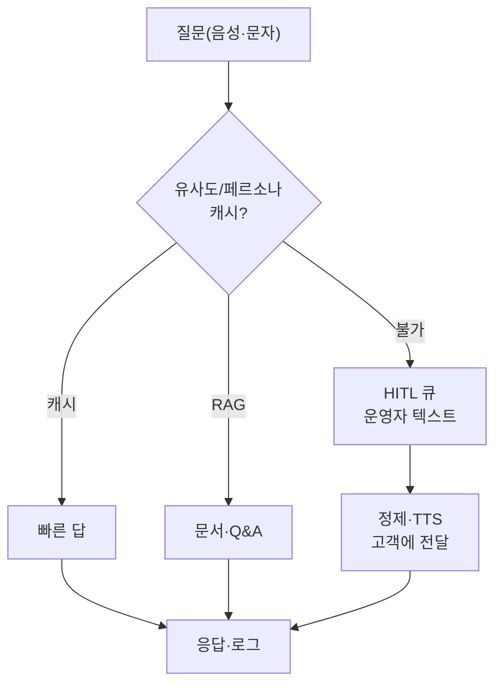

```mermaid
flowchart TB
  Q["질문(음성·문자)"] --> S{"유사도/페르소나\n캐시?"}
  S -->|캐시| F1["빠른 답"]
  S -->|RAG| F2["문서·Q&A"]
  S -->|불가| H["HITL 큐\n운영자 텍스트"]
  H --> F3["정제·TTS\n고객에 전달"]
  F1 --> R["응답·로그"]
  F2 --> R
  F3 --> R
```
