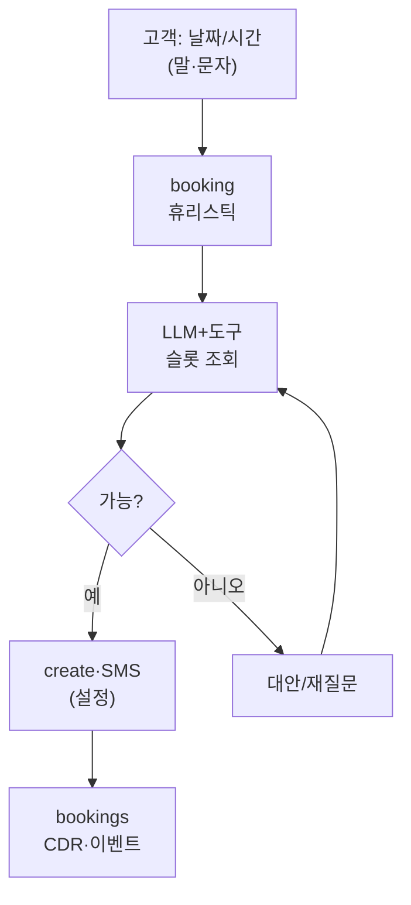

```mermaid
flowchart TB
  U["고객: 날짜/시간\n(말·문자)"] --> H["booking\n휴리스틱"]
  H --> L["LLM+도구\n슬롯 조회"]
  L --> C{"가능?"}
  C -->|예| M["create·SMS\n(설정)"]
  C -->|아니오| S["대안/재질문"]
  M --> E["bookings\nCDR·이벤트"]
  S --> L
```
