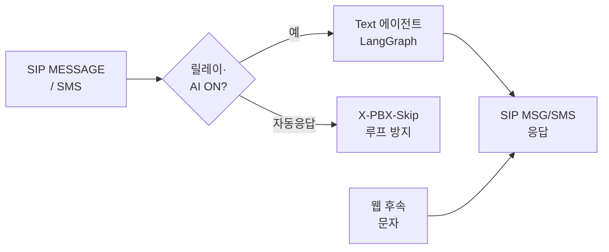

```mermaid
flowchart LR
  M["SIP MESSAGE\n/ SMS"] --> C{"릴레이·\nAI ON?"}
  C -->|예| T["Text 에이전트\nLangGraph"]
  C -->|자동응답| X["X-PBX-Skip\n루프 방지"]
  T --> R["SIP MSG/SMS\n응답"]
  P["웹 후속\n문자"] --> R
```
