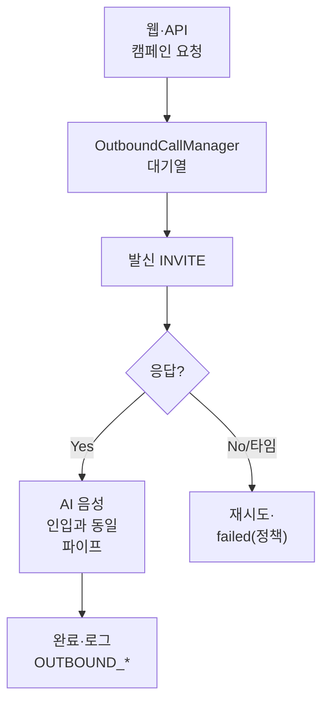

```mermaid
flowchart TB
  W["웹·API\n캠페인 요청"] --> Q["OutboundCallManager\n대기열"]
  Q --> I["발신 INVITE"]
  I --> A{"응답?"}
  A -->|Yes| P["AI 음성\n인입과 동일\n파이프"]
  A -->|No/타임| R["재시도·\nfailed(정책)"]
  P --> E["완료·로그\nOUTBOUND_*"]
```
