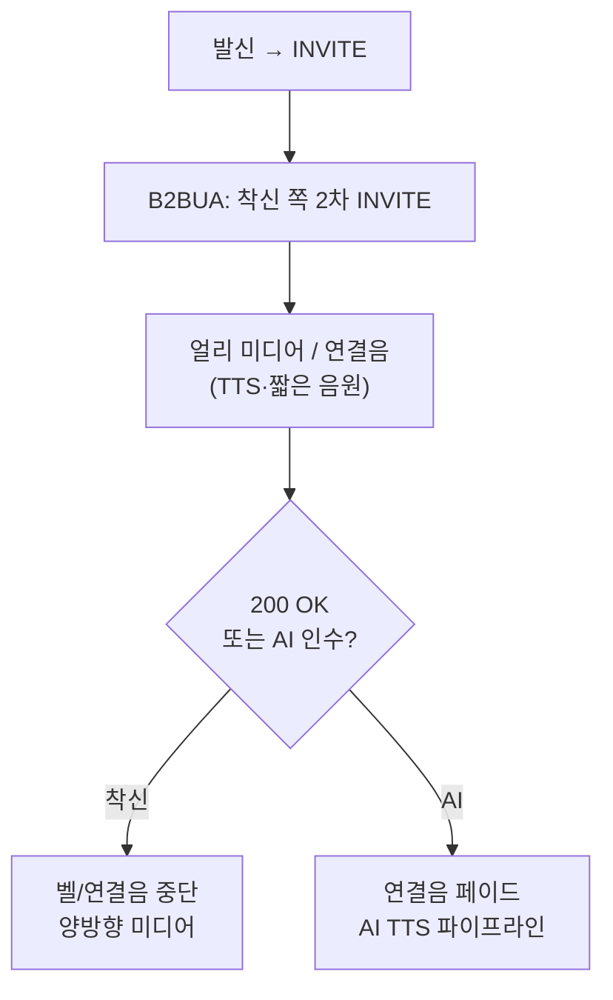

```mermaid
flowchart TB
  A["발신 → INVITE"] --> B["B2BUA: 착신 쪽 2차 INVITE"]
  B --> C["얼리 미디어 / 연결음\n(TTS·짧은 음원)"]
  C --> D{"200 OK\n또는 AI 인수?"}
  D -->|착신| E["벨/연결음 중단\n양방향 미디어"]
  D -->|AI| F["연결음 페이드\nAI TTS 파이프라인"]
```
