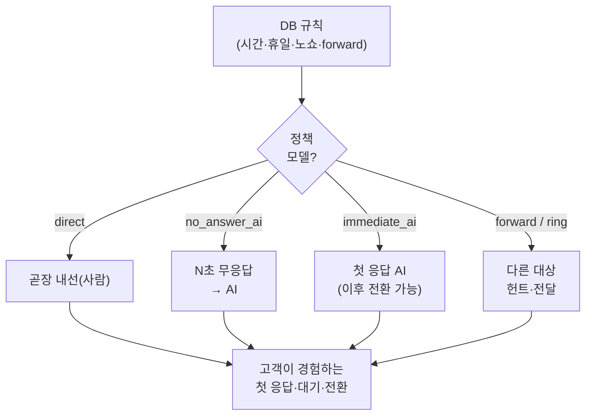

```mermaid
flowchart TB
  R["DB 규칙\n(시간·휴일·노쇼·forward)"] --> M{"정책\n모델?"}
  M -->|direct| H["곧장 내선(사람)"]
  M -->|no_answer_ai| T["N초 무응답\n→ AI"]
  M -->|immediate_ai| I["첫 응답 AI\n(이후 전환 가능)"]
  M -->|forward / ring| F["다른 대상\n헌트·전달"]
  H & T & I & F --> U["고객이 경험하는\n첫 응답·대기·전환"]
```
