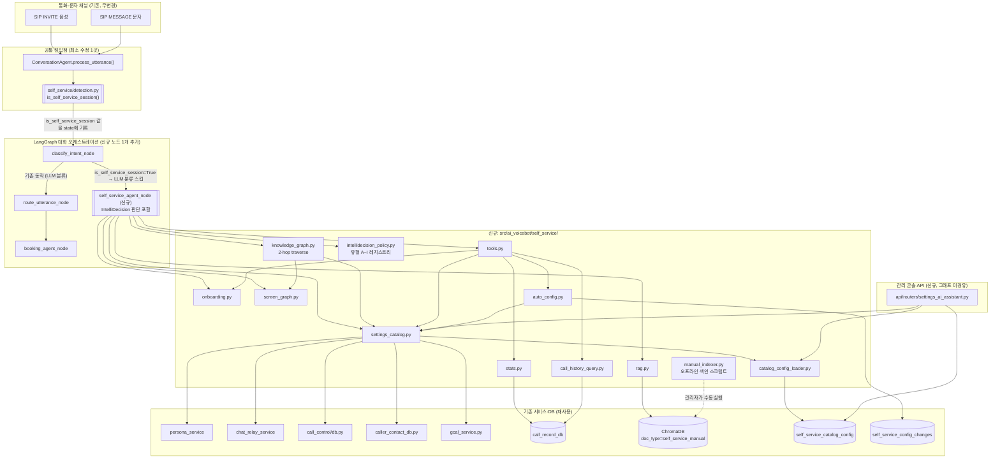
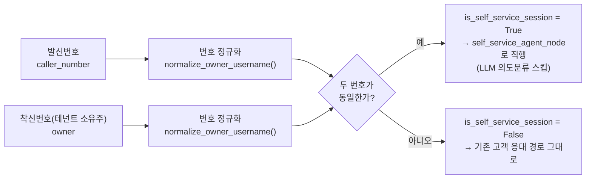
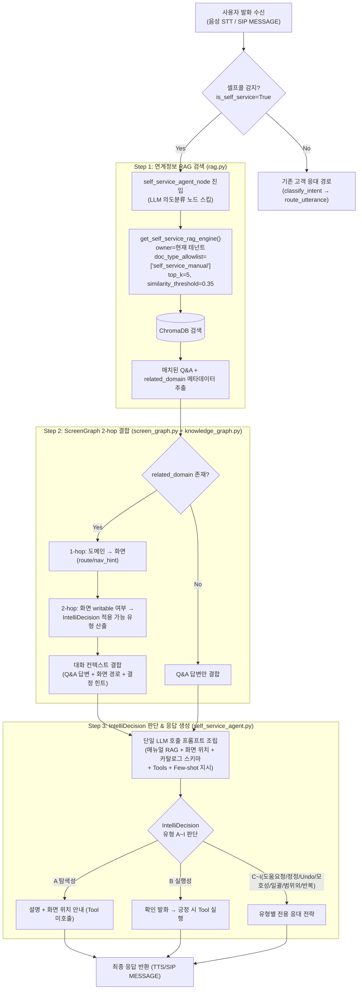
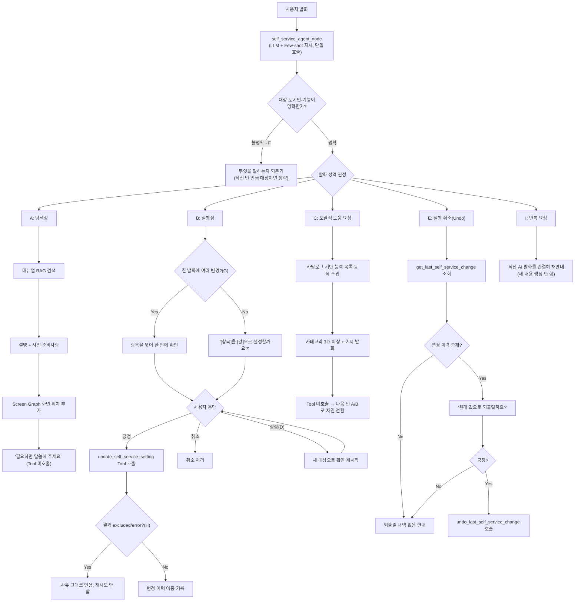
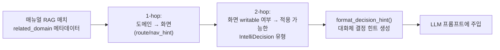
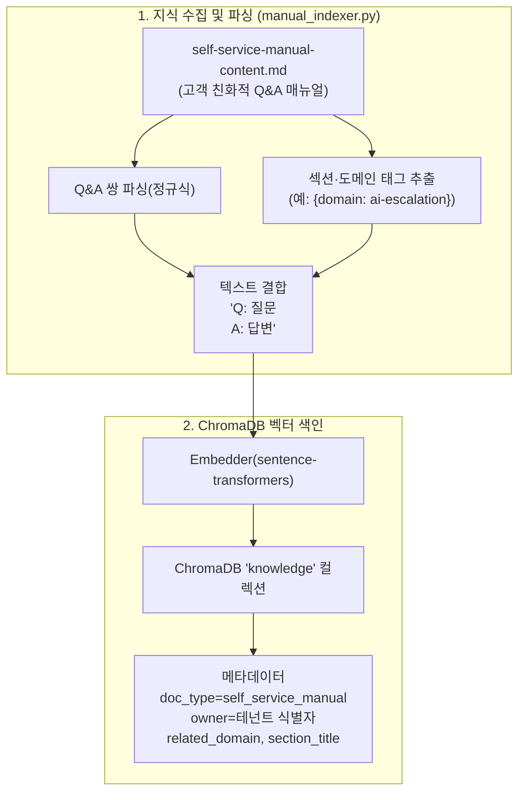
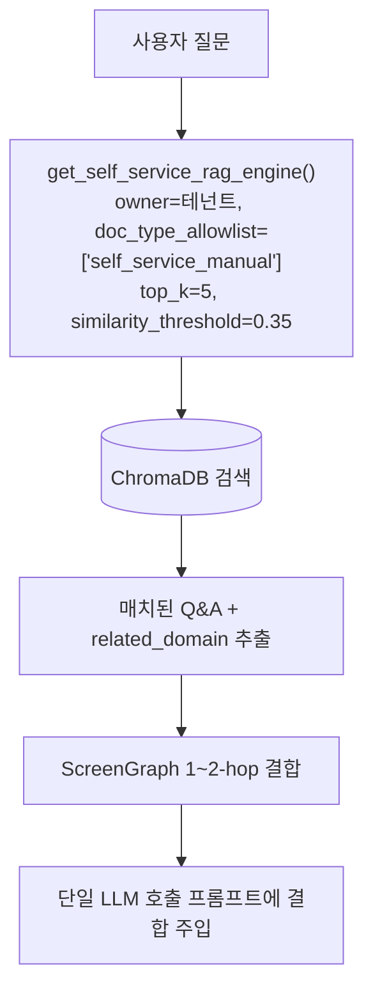

# 셀프서비스 AI 도우미 — 기능 소개 자료

> **문서 기준**: Epic 1(Story 1.1~1.18) + Epic 2(Story 2.1~2.8) 전체 완료 + Epic 3/6(음성 지연) 일부 완료 기준
> **대상 독자**: 관련 엔지니어(백엔드/AI 파이프라인/프론트엔드), 이해관계자, 제품 담당자, 운영팀
> **범위**: 셀프서비스 AI 도우미 기능 자체(구현 완료) + 플랫폼 전반 응답 품질 개선(음성 지연·턴테이킹,
> 일부 완료·일부 계획 중) — 각 항목마다 **구현 상태(완료/진행 중/계획)**를 명시한다.

---

## 0. Executive Summary

**셀프서비스 AI 도우미**는 테넌트 관리자(고객사 담당자) 본인이 자신의 번호로 전화하거나
문자를 보내면, AI가 **설정 조회·변경·통계 확인·사용법 안내**까지 대화만으로 처리해 주는
기능이다. 신규 인프라 없이 기존 AI SIP PBX 플랫폼(LangGraph 대화 오케스트레이션, ChromaDB
RAG, 멀티테넌트 격리)을 그대로 재사용하는 **Brownfield 확장**으로 구현했다.

| 핵심 질문               | 답                                                                                                                                                                                                                    |
| ----------------------- | --------------------------------------------------------------------------------------------------------------------------------------------------------------------------------------------------------------------- |
| **왜 만들었나**         | 관리자가 대시보드를 찾아 헤매거나 CS에 반복 문의하는 비용이 컸다                                                                                                                                                      |
| **무엇을 하나**         | 설정 조회/변경, 온보딩 안내, 통계·통화이력 조회, 화면 위치 안내, 실행취소                                                                                                                                             |
| **어떻게 판단하나**     | **IntelliDecision**(9개 유형 의도 판단) + **ScreenGraph**(도메인↔화면 지식) + **연계정보 RAG**(매뉴얼 검색)가 한 번의 LLM 호출 안에서 결합 동작                                                                       |
| **무엇이 달라지는가**   | 대시보드 접속 없이 24/7 전화·문자만으로 완결, 반복 CS 문의 절감, 온보딩 완료율 향상                                                                                                                                   |
| **투입 비용**           | 신규 서버·DB·모델 없음(기존 스택 재사용), 신규 코드는 `self_service/` 패키지 하나로 격리                                                                                                                              |
| **함께 진행 중인 개선** | 음성 응답 지연(TTFT) 개선·스마트 턴테이킹 재정비 — 셀프서비스와 무관하게 플랫폼 전체 통화 품질에 적용(6장 참고), Gemini thinking 비활성화로 chitchat 응답 지연 **9.6~9.75초 → 1.05~3.02초(약 70~89% 감소)** 실측 완료 |

> **한 줄 요약**: *"설정 화면을 뒤질 필요 없이, 내 번호로 전화 한 통이면 AI가 사용법을
> 알려주고 원하는 대로 설정까지 바꿔준다."*

### 0.1 구현 상태 총괄표

| 트랙                                                | 범위                                                                                                | 상태                                                                |
| --------------------------------------------------- | --------------------------------------------------------------------------------------------------- | ------------------------------------------------------------------- |
| Epic 1 — 셀프서비스 AI 도우미 코어                  | 셀프콜 감지, 매뉴얼 RAG, 온보딩, 설정 조회/변경, 통계, 통화이력 NLQ, Undo, IntelliDecision 유형 A~I | ✅ **완료**(Story 1.1~1.18 Done)                                     |
| Epic 2 — 설정 카탈로그·ScreenGraph 동적화           | DB 우선/정적 폴백, 내보내기/가져오기/버전 롤백, 매뉴얼 도메인 태깅                                  | ✅ **완료**(Story 2.1~2.8 Done)                                      |
| IntelliDecision 정책 레지스트리 + ScreenGraph 2-hop | `intellidecision_policy.py`, `knowledge_graph.py::traverse()`                                       | ✅ **완료**(Story 1.18 Done, 2026-07-28)                             |
| Epic 6 — Gemini SDK 마이그레이션(thinking 비활성화) | `google-genai` 전환, TTFT 실측 개선                                                                 | ✅ **완료**(Story 6.1~6.4 Done)                                      |
| Epic 3 — 응답 지연 계측·SLA 가드레일                | 지연 로깅, 원인 자동 태깅, 5초 초과 정책                                                            | 🟡 **일부 완료**(3.1/3.2/3.4 Done, 3.3 대기)                         |
| Epic 4 — 진짜 TTFT 파이프라인 전환                  | LLM 스트림 조기 문장 전송                                                                           | 🔵 **설계만 완료, 구현 보류**(4.1 Done, 재판단 후 4.2/4.3 착수 예정) |
| Epic 5 — 스마트 턴테이킹 재정비                     | Smart Turn/바지인 필터 정비                                                                         | 🔵 **조사·설계만 완료, 구현 미착수**(5.1 Done, 5.2~5.4 대기)         |

---

## 1. 배경 — 왜 필요했는가

### 1.1 기존 서비스의 구조적 공백

SmartPBX AI는 원래 **고객(발신자)이 테넌트(착신자)에게 문의**하는 시나리오만 처리했다.
정작 이 시스템을 설정·운영하는 **테넌트 관리자 자신을 위한 셀프서비스 채널은 없었다** —
관리자가 자기 설정을 확인하거나 바꾸려면 항상 프론트엔드 대시보드에 로그인해야 했다.

### 1.2 고객센터(CS) 문의가 몰리는 구조

| 문제 영역              | 구체적 불편                                                        | 결과                                   |
| ---------------------- | ------------------------------------------------------------------ | -------------------------------------- |
| **설정 채널 단절**     | 페르소나·착신전환·알림 변경 시 대시보드 직접 접근 필수             | 이동 중·통화 중에는 설정 자체가 불가능 |
| **매뉴얼-사용자 괴리** | `USER_MANUAL.md`가 개발자 관점(API, 시스템 요구사항)으로 작성      | 비기술 관리자가 이해하기 어려움        |
| **통계 확인 진입장벽** | "이번 달 AI가 몇 번 응대했나?" 같은 단순 질문도 대시보드 탐색 필요 | 즉답 불가 → CS에 대신 물어봄           |
| **신기능 발견 저조**   | 새 기능이 추가돼도 관리자가 몰라서 안 씀                           | 기능 투자 대비 활용률 저하             |

**결과적으로 CS에 몰리는 문의 유형**은 대부분 "설정을 어떻게 바꾸나요", "이게 왜 이렇게
되어 있나요", "이번 달 통계 좀 알려주세요"처럼 **본질적으로 자동화 가능한 반복 질문**이었다.
이 문의들은 사람이 응대할 필요 없이 AI가 즉시 답할 수 있는 성격이라는 점이 이번 기능의
출발점이다.

### 1.3 파급 효과

- 초기 온보딩 실패율 증가 → 이탈(churn) 위험
- 반복적 FAQ성 CS 문의 집중 → CS 리소스 낭비
- 신기능 활용률 저하 → 제품 투자 대비 사용률 저하

---

## 2. Ideation — 기존 방식과 우리가 선택한 해법

### 2.1 검토했던 기존/대안 방식과 기각 이유

새 채널을 만들 때 일반적으로 고려되는 방식들을 먼저 검토했다.

| 대안                                           | 내용                                         | 기각/보류 이유                                                                                                                              |
| ---------------------------------------------- | -------------------------------------------- | ------------------------------------------------------------------------------------------------------------------------------------------- |
| **별도 챗봇/헬프데스크 SaaS 도입**             | Zendesk 등 외부 CS 툴 연동                   | 이미 통화·문자 채널과 대화 오케스트레이션(LangGraph)이 구축돼 있어 중복 투자, 신규 인프라·계약 필요                                         |
| **정적 FAQ 페이지 + 검색**                     | 매뉴얼을 프론트엔드에 게시                   | 관리자가 "지금 내 설정이 뭔지" 같은 개인화된 질문에는 답을 못 함(정적 문서의 한계)                                                          |
| **Full GraphRAG(그래프 DB + 엔터티 자동추출)** | 지식을 그래프DB로 관리, Leiden 클러스터링 등 | 도메인 노드가 100개 미만이고 관계가 이미 알려진 소규모 지식이라 과설계 — ChromaDB 벡터검색 + 경량 정적 그래프로 충분(2차례 리서치로 재확인) |
| **완전 노코드 설정 엔진**                      | 관리자가 임의 로직까지 웹에서 정의           | DB에 저장된 문자열이 임의 코드를 실행하게 되면 RCE 위험 — 대신 "이름 문자열 → 화이트리스트 콜러블" 레지스트리만 동적화                      |

### 2.2 우리가 선택한 해법의 핵심 아이디어

1. **기존 채널 재사용**: SIP INVITE(음성)/SIP MESSAGE(문자) 두 채널이 공통으로 거치는
   `ConversationAgent.process_utterance()`에 **발신번호=착신번호(자기 자신) 판별 한 줄만
   추가**해 셀프서비스 세션을 감지한다. SIP 레이어는 전혀 건드리지 않는다.
2. **새 LLM 호출을 추가하지 않는다**: 의도 분류용 LLM을 별도로 부르지 않고, 응답을
   생성하는 **동일한 LLM 호출 안에서 few-shot 지시로 판단**한다(지연 예산 보호).
3. **지식은 "정적 매뉴얼(RAG)"과 "동적 메타데이터(카탈로그/화면 그래프)" 두 축으로 분리**한다.
   문장으로 설명해야 하는 지식은 RAG로, 코드가 알아야 하는 스키마 정보는 레지스트리로
   분리해 유지보수 부담을 낮췄다.
4. **쓰기 작업은 항상 "확인 발화 → 긍정 응답 → 실행" 2단계**를 강제한다(기존 예약
   `booking_agent`와 동일 원칙 재사용 — 새로운 안전 패턴을 발명하지 않음).
5. **완전 노코드는 지향하지 않는다**: 새 설정 도메인 자체를 추가하려면 여전히 코드
   배포가 필요하다. 동적화 대상은 "이미 존재하는 함수를 어떻게 노출할지"(라벨, 허용값,
   화면 안내 문구, writable 여부)로 명확히 한정해 보안과 유연성의 균형을 맞췄다.

### 2.3 핵심 가치 제안

> **"설정 화면을 뒤질 필요 없이, 내 번호로 전화 한 통이면 AI가 사용법을 알려주고
> 원하는 대로 설정까지 바꿔준다."**

---

## 3. 아키텍처

### 3.1 전체 구성 개요

셀프서비스 AI 도우미는 기존 AI SIP PBX 플랫폼 위에 **추가 인프라 없이** 구현된 Brownfield
Enhancement다. 기존 시스템의 LangGraph 대화 오케스트레이션, ChromaDB RAG, 멀티테넌트
격리 구조를 그대로 재사용하며, **신규 코드는 최소 변경**으로 통합된다.



### 3.2 신규 컴포넌트 목록

| 컴포넌트                                   | 역할                                           | 핵심 특징                                                    |
| ------------------------------------------ | ---------------------------------------------- | ------------------------------------------------------------ |
| `self_service/detection.py`                | 셀프콜/셀프문자 판별                           | 순수 함수, O(1) 문자열 비교                                  |
| `self_service/settings_catalog.py`         | 7개 설정 도메인 레지스트리                     | 조회·변경 함수 + 스키마 등록, DB 우선/정적 폴백 하이브리드   |
| `self_service/onboarding.py`               | 온보딩 체크리스트 판정                         | 카탈로그 조회 기반, 단일 진실 소스                           |
| `self_service/intellidecision_policy.py`   | IntelliDecision 유형 A~I 메타데이터 레지스트리 | `applicable_types_for_domain(domain, writable=)`가 핵심      |
| `self_service/knowledge_graph.py`          | 도메인→화면→적용 가능 유형 2-hop 그래프 순회   | `traverse()`, `format_decision_hint()`                       |
| `self_service/tools.py`                    | LangGraph Tool 래퍼                            | booking_tools.py와 동일 패턴(Gemini 네이티브 FC로 연동)      |
| `self_service/auto_config.py`              | 설정 값 실제 적용(쓰기)                        | 카탈로그 update_fn 호출 + 변경 이력 기록                     |
| `self_service/stats.py`                    | 통화·AI 응대 통계 집계                         | `call_record_db` 재조회, 신규 집계 테이블 없음               |
| `self_service/call_history_query.py`       | 통화 이력 자연어 질의                          | `call_record_db` 구조화 검색, 새 임베딩 없음                 |
| `self_service/rag.py`                      | 셀프서비스 매뉴얼 RAG 엔진 래퍼                | `call_context`의 embedder/vector_db 재사용, 신규 인프라 없음 |
| `self_service/screen_graph.py`             | 도메인↔화면 경량 지식 그래프                   | 정적/DB 하이브리드 레지스트리, 그래프DB 불필요               |
| `self_service/manual_indexer.py`           | 매뉴얼 문서 → ChromaDB 색인                    | 오프라인 스크립트(관리자가 수동 실행, 대화 흐름과 무관)      |
| `self_service/catalog_config_loader.py`    | 카탈로그 메타데이터 캐시 로더                  | in-memory 캐시, 버전 비교 기반 자동 무효화(핫 리로드)        |
| `langgraph/nodes/self_service_agent.py`    | 셀프서비스 LLM+Tool 루프                       | booking_agent_node 병렬 구조, IntelliDecision 판단 로직 포함 |
| `common/self_service_catalog_config_db.py` | 카탈로그 설정 DB CRUD                          | 버전 관리 + 롤백 지원                                        |
| `common/self_service_config_change_db.py`  | 설정 변경 이력 DB CRUD                         | 실행 취소(Undo) 조회·복원의 기반                             |
| `api/routers/settings_ai_assistant.py`     | 카탈로그 내보내기/가져오기/활성화              | 검증 → diff 미리보기 → 원자적 적용(그래프와 별개 REST 경로)  |

### 3.3 기술 스택

| 레이어              | 기술                  | 비고                                                              |
| ------------------- | --------------------- | ----------------------------------------------------------------- |
| 백엔드              | Python 3.11+, FastAPI | 기존과 동일                                                       |
| 대화 오케스트레이션 | LangGraph             | 신규 노드 1개 + state 필드 1개 추가                               |
| RAG                 | ChromaDB              | 신규 `doc_type=self_service_manual` 추가                          |
| DB                  | SQLite                | 신규 테이블 2개 추가                                              |
| LLM                 | Gemini 계열           | 기존 동일(Gemini 네이티브 function calling), 별도 분류기 LLM 없음 |
| 프론트엔드          | Next.js(App Router)   | 신규 페이지 1개 추가                                              |
| **신규 인프라**     | **없음**              | 기존 스택만으로 구현                                              |

### 3.4 셀프콜 감지 메커니즘

SIP 레이어를 전혀 수정하지 않고, 음성·문자 두 채널이 공통으로 거치는
`ConversationAgent.process_utterance()` 최상단에서 **딱 한 번, 전화번호 문자열 비교만으로**
판별한다.



| 항목                | 내용                                                                      |
| ------------------- | ------------------------------------------------------------------------- |
| **판별 로직**       | 발신번호와 착신번호(테넌트 소유주 번호)를 정규화 후 문자열 일치 비교      |
| **판별 위치**       | `ConversationAgent.process_utterance()` 최상단 1곳(신규 함수 호출만 추가) |
| **감지 지연**       | 1ms 미만(문자열 비교 1회 수준)                                            |
| **SIP 레이어 변경** | 없음(회귀 위험 구조적으로 최소화)                                         |
| **적용 채널**       | 음성(SIP INVITE) + 문자(SIP MESSAGE) 모두 동일 경로 재사용                |

---

## 4. 핵심 기능

### 4.1 기능 목록 한눈에 보기

| 기능                      | 한 줄 설명                                     | Tool 호출 여부                 |
| ------------------------- | ---------------------------------------------- | ------------------------------ |
| 사용법 안내(매뉴얼 RAG)   | 서비스 이용 방법을 자연어 질문에 답변          | 미호출(순수 검색+생성)         |
| 온보딩 체크리스트         | 세션 시작 시 미완료 초기 설정 자동 안내        | 조회만                         |
| 설정 조회                 | 7개 도메인 현재 설정값 즉시 안내               | 조회 Tool                      |
| 이용 통계 조회            | 통화량·AI 응대율·HITL 건수 대화로 확인         | 조회 Tool                      |
| 실행취소(Undo)            | 직전 변경을 "원래대로"로 되돌림                | 조회+쓰기 Tool 2종             |
| 자동설정(쓰기)            | 확인 발화 후 실제 설정 변경                    | 쓰기 Tool                      |
| 화면 안내(Screen Graph)   | 기능 설명 + 실제 프론트엔드 화면 위치까지 안내 | 미호출(RAG+그래프 결합)        |
| 통화 이력 자연어 질의     | "오늘 못 받은 전화 알려줘" 등 구조화 검색      | 조회 Tool                      |
| 변경 이력 프론트엔드 열람 | AI가 바꾼 모든 설정 이력을 대시보드에서 확인   | 프론트엔드 전용(그래프 미경유) |

### 4.2 전체 동작 Flow (한 발화가 처리되는 과정)



> 이 Flow는 **여러 LLM 호출로 나뉘어 있지 않다** — RAG 검색과 ScreenGraph 조회는 코드
> 레벨 전처리이고, 실제 "무슨 의도인지 → 어떻게 답할지" 판단은 **응답을 생성하는 단
> 한 번의 LLM 호출** 안에서 few-shot 지시로 이뤄진다. 그래서 별도 분류기 호출로 인한
> 지연이 추가되지 않는다.

### 4.3 User Story 예제

> 아래는 실제 대화 예시를 **Given–When–Then** 형식의 사용자 스토리로 정리한 것이다.

**Story 1 — 온보딩 미완료 안내**
> Given 테넌트 관리자가 AI 에스컬레이션 방식을 아직 설정하지 않은 상태에서
> When 관리자가 자기 번호로 전화를 걸면
> Then AI는 인사말 직후 미완료 항목("AI 에스컬레이션 방식 미설정", "착신 규칙 0개")을
> 먼저 안내하고 바로 설정할지 묻는다.

```
관리자: (전화 연결)
AI: 안녕하세요! 아직 완료되지 않은 초기 설정이 있습니다.
    - AI 에스컬레이션 방식이 설정되지 않았습니다.
    - 착신 규칙이 1개도 생성되지 않았습니다.
    지금 바로 설정해 드릴까요?
```

**Story 2 — 설정 조회(Tool)**
> Given 관리자가 채팅 자동응답을 이미 켜둔 상태에서
> When "지금 채팅 자동응답 설정이 어떻게 되어 있어?"라고 물으면
> Then AI는 조회 Tool을 호출해 현재 값·마지막 저장 시각을 그대로 안내한다.

```
관리자: 지금 채팅 자동응답 설정이 어떻게 되어 있어?
AI: 현재 채팅 자동응답 설정입니다.
    - SIP MESSAGE 자동응답: 활성화
    - 자동응답 접두사: [AI 자동응답]
    - 마지막 저장: 2026-07-15 14:32
```

**Story 3 — 설정 변경(확인 후 실행, IntelliDecision 유형 B)**
> Given 관리자가 AI 에스컬레이션을 끄고 싶어할 때
> When "AI가 에스컬레이션 안 하도록 설정해줘"라고 말하면
> Then AI는 즉시 실행하지 않고 부작용을 포함한 확인 발화를 먼저 하고, 긍정 응답 후에만
> 실제로 값을 바꾼다.

```
관리자: AI가 에스컬레이션 안 하도록 설정해줘.
AI: AI가 에스컬레이션하지 않도록 설정할까요?
    이 경우 고객이 먼저 '상담원 연결해 주세요'라고
    명시적으로 요청하면 그때만 별도 처리됩니다.
관리자: 응, 해줘.
AI: 설정 완료했습니다. 에스컬레이션 방식을 '에스컬레이션 안 함'으로 변경했습니다.
```

**Story 4 — 화면 안내형 응대(연계정보 RAG + ScreenGraph, 유형 A)**
> Given 관리자가 기능은 알지만 어디서 설정하는지 모를 때
> When "AI가 모르는 질문 받으면 나한테 전화 오게 할 수 있어?"라고 물으면
> Then AI는 매뉴얼 RAG로 기능을 설명하고, ScreenGraph로 실제 화면 경로까지 함께
> 안내하며, 사전 준비사항(내선 등록 필요 등)도 함께 알려준다.

```
관리자: AI가 모르는 질문 받으면 나한테 전화하게 해줄 수 있어?
AI: 상담원 직접 연결(호전환) 방식이 있습니다.
    이 방식을 쓰려면 설정 > 착신 제어에서
    호전환 대상 내선을 미리 등록해 둬야 합니다.
    설정이 필요하다면 말씀해주세요.
```

**Story 5 — 실행취소(Undo)**
> Given 관리자가 방금 채팅 자동응답을 껐는데 마음이 바뀌었을 때
> When "아, 방금 바꾼 거 원래대로 해줘"라고 말하면
> Then AI는 직전 변경 이력을 조회해 원래 값을 확인 발화로 제시하고, 긍정 시에만
> 기존 쓰기 경로로 원래 값을 재적용한다.

```
관리자: 채팅 자동응답 꺼줘.
AI: 채팅 자동응답을 끌까요?
관리자: 응.
AI: 설정 완료했습니다.

관리자: 아, 방금 바꾼 거 원래대로 해줘.
AI: 채팅 자동응답을 원래 값인 '켜짐'으로 되돌릴까요?
관리자: 응, 그렇게 해줘.
AI: 되돌렸습니다.
```

**Story 6 — 통화 이력 자연어 조회**
> Given 관리자가 오늘 놓친 전화를 확인하고 싶을 때
> When "오늘 수신 못한 번호 알려줘"라고 물으면
> Then AI는 신규 임베딩 없이 기존 `call_records` 테이블을 구조화 검색해 목록으로 답한다.

```
관리자: 오늘 수신받지 못한 번호 알려줘.
AI: 오늘 수신하지 못한 통화입니다.
    1. 010-1234-5678 (오전 9:32)
    2. 010-9876-5432 (오후 2:15)
    3. 02-123-4567   (오후 4:08)
    총 3건입니다. 확인 후 연락해 드리시겠어요?
```

### 4.4 동작 원리 투명 공개 — IntelliDecision

#### 4.4.1 개념

**IntelliDecision**은 설정 관련 발화·대화 흐름을 **9가지 유형**으로 구분해 각기 다른
응대 전략을 적용하는 판단 체계다. 별도의 분류용 LLM 호출 없이, 응답을 생성하는
동일한 LLM 호출 안에서 few-shot 지시만으로 유형을 판단한다(지연 예산 보호).

| 유형                     | 정의                                           | 예시 발화                                               |
| ------------------------ | ---------------------------------------------- | ------------------------------------------------------- |
| **A — 탐색성**           | 기능을 몰라서 물어보는 발화                    | "AI가 모르는 질문 받으면 나한테 전화하게 해줄 수 있어?" |
| **B — 실행성**           | 명확히 변경을 요청하는 발화                    | "AI가 에스컬레이션 안 하도록 설정해줘."                 |
| **C — 포괄적 도움 요청** | 특정 기능을 지정하지 않고 전반적으로 묻는 발화 | "너 뭘 할 수 있어?"                                     |
| **D — 정정**             | 확인 발화 중 다른 대상으로 정정하는 발화       | "아니 그거 말고, 페르소나 설명을 바꿔줘."               |
| **E — 실행 취소(Undo)**  | 직전 변경을 되돌리고 싶어하는 발화             | "방금 바꾼 거 원래대로 해줘."                           |
| **F — 모호성 해소**      | 대상 도메인·기능이 특정되지 않은 발화          | "그거 설정 좀 바꿔줘."                                  |
| **G — 일괄 처리**        | 한 발화에 여러 설정 변경이 섞여 있는 경우      | "알림도 끄고 페르소나 설명도 바꿔줘."                   |
| **H — 범위 외 설명**     | 정책상 변경 불가능한 항목을 요청하는 발화      | "착신 규칙도 대화로 바꿔줘."                            |
| **I — 반복 요청**        | 직전 AI 응답을 다시 듣고 싶어하는 발화         | "다시 말해줘."                                          |

#### 4.4.2 판단 원리(왜 이렇게 동작하는지)

- **판단 근거는 레지스트리 데이터**: `intellidecision_policy.py`가 유형 A~I의 메타데이터를
  코드가 아닌 데이터 형태로 보유하고, `applicable_types_for_domain(domain, writable=)`가
  "이 도메인·이 화면에서 지금 어떤 유형이 성립 가능한지"를 계산한다. 프롬프트는 이
  레지스트리를 그대로 반영해 조립되므로, 유형을 추가/조정해도 프롬프트 구조 전체를
  다시 쓸 필요가 없다.
- **최종 판단은 LLM**: "의도 분류는 키워드 매칭보다 LLM 판단을 우선한다"는 프로젝트
  원칙에 따라, 정규식/키워드 힌트는 모두 제거했다. 과거 종결 어미 기반 힌트
  (`intent_tier.py`)를 실험적으로 도입했었으나, 제거 전/후 비교 QA에서 회귀가 없음이
  확인되어 완전히 삭제했다 — LLM이 대화 맥락만으로 동일하게 정확히 판단했다.
- **분류기 LLM을 추가로 호출하지 않는다**: 유형 D/F/G/H/I는 기본 시스템 프롬프트·Tool
  사용 지시의 규칙만으로 구현되어 있고, 유형 E(Undo)만 전용 Tool 2개(조회+되돌리기)를
  쓴다. 어떤 유형도 별도 분류 LLM 호출을 추가하지 않는다.
- **유형 C(포괄적 도움 요청)의 동적 구성**: 능력 안내 문구는 하드코딩이 아니라 매 대화마다
  `settings_catalog`를 그대로 조회해 조립한다. 새 설정 도메인이 추가되면 이 안내도 코드
  수정 없이 자동으로 최신화된다. 카탈로그 조회가 비거나 예외가 발생하면 즉시 고정
  폴백 문구로 대체해 회귀를 방지한다.

#### 4.4.3 판단 Flow



### 4.5 동작 원리 투명 공개 — ScreenGraph(화면 지식 그래프)

#### 4.5.1 왜 필요한가

매뉴얼 RAG가 "무엇을(기능 설명)"을 답한다면, ScreenGraph는 "어디서(실제 화면 위치)"를
답한다. 이 둘을 분리하지 않으면 관리자는 기능은 이해했지만 "그래서 어디서 바꾸나요?"를
다시 물어야 한다.

#### 4.5.2 구조 — 정적/DB 하이브리드 + 2-hop 순회

- **저장 방식**: 완전한 그래프 DB가 아니라, `설정 도메인 ↔ 화면(route, nav_hint, UI 요소)`
  관계를 담은 **경량 정적 레지스트리**(`screen_graph.py`)다. 규모(도메인 100개 미만, 관계가
  이미 알려짐)에 비해 Full GraphRAG는 과설계라는 판단에 따라 의도적으로 단순화했다.
- **1-hop**: 매뉴얼 RAG가 반환한 `related_domain` 메타데이터로 해당 도메인의 화면
  정보(라우트, 화면 명칭, UI 위치)를 조회한다.
- **2-hop(신규 확장)**: 1-hop으로 찾은 화면이 "쓰기 가능(writable)"한지 확인한 뒤,
  `knowledge_graph.py::traverse()`가 그 결과를 **IntelliDecision의 어떤 유형이 이 화면에
  적용 가능한지**(예: writable=false면 유형 H로 안내)로 한 번 더 연결한다. 즉 "화면 →
  writable 여부 → 적용 가능한 응대 유형"까지 이어지는 2단계 지식 확장이다.
- **DB 우선/정적 폴백**: 화면 메타데이터는 `self_service_catalog_config` SQLite 테이블에
  버전 관리되며, `catalog_config_loader.py`가 in-memory로 캐싱하고 버전 변경 시 자동
  무효화(핫 리로드)한다. DB에 값이 없으면 코드 내 정적 레지스트리로 폴백해 항상 동작을
  보장한다.
- **투명성 원칙**: AI가 사용자에게 말로 안내하는 내용에는 절대 URL/API 경로 원문을
  노출하지 않는다(`route` 필드는 프론트엔드 "화면 안내" 탭 전용, `nav_hint` 필드는
  대화체 안내 전용으로 분리) — 전화로 대화 중인 사용자에게 URL은 무의미하기 때문이다.



### 4.6 동작 원리 투명 공개 — 연계정보 RAG(매뉴얼 지식 검색)

#### 4.6.1 지식 수집 및 색인 (Ingestion)



- **소스**: `docs/product/self-service-manual-content.md`(Q&A 형식 마크다운, 고객 친화적
  문구로 개발자 매뉴얼과 분리)
- **파싱**: `**Q: ...**`/`A: ...` 구문을 정규식으로 자동 분리, 섹션 헤더의 명시적 태그
  (`{domain: ai-escalation}`) 우선, 없으면 키워드 매칭으로 `related_domain` 태깅
- **테넌트 격리**: `doc_type="self_service_manual"` + `owner` 필터로 검색 시 강제
  차단 — 테넌트 고객용 지식(customer-facing KB)과 완전히 분리된 컬렉션 네임스페이스를
  공유하되 메타데이터로 논리적 격리

#### 4.6.2 검색 및 응답 결합 (Retrieval)



- **폴백**: 매뉴얼에 없는 질문 → "제가 알지 못하는 내용입니다"로 정직하게 안내(허위 생성
  방지)
- **신규 인프라 없음**: 임베더·벡터DB 핸들 모두 기존 `call_context`(ContextVar)를 그대로
  재사용 — 셀프서비스 전용 별도 RAG 파이프라인을 새로 구축하지 않았다.

#### 4.6.3 3개 엔진이 결합되는 실제 예시 (Step-by-Step)

> **관리자 발화**: *"AI가 질문 못 알아들으면 나한테 전화 오게 하는 법이랑 어디서
> 설정하는지 화면 알려줘."*

1. **RAG 검색**: 질문이 벡터화되어 `owner="9003"`, `doc_type="self_service_manual"`
   조건으로 검색 → *"상담원 직접 연결(호전환) 방식은 무엇인가요?"* Q&A 매치,
   `related_domain="ai-escalation"` 획득
2. **ScreenGraph 1-hop**: `ai-escalation` 도메인의 화면 정보(`/settings/ai-escalation`,
   "설정 > AI 에스컬레이션", 라디오 버튼 위치) 조회
3. **ScreenGraph 2-hop(IntelliDecision 결합)**: 해당 화면이 writable임을 확인 →
   유형 A(탐색성)로 응대 가능함을 결정 힌트로 생성
4. **LLM 판단**: "~하는 법이랑 화면 알려줘" 발화 패턴을 유형 A로 최종 판단 → Tool
   미호출, 설명+화면 안내로 응답 조립

```
AI: "AI가 모르는 질문을 받았을 때 전화로 연결하는 방식은 '상담원 직접 연결(호전환)'입니다.

   📌 화면 위치:
   - 메뉴: 설정 > AI 에스컬레이션 (/settings/ai-escalation)
   - 조작: 에스컬레이션 방식 선택에서 '상담원 직접 연결' 라디오 버튼을 선택하시면 됩니다.

   ⚠️ 사전 준비사항:
   이 방식을 사용하시려면 '설정 > 착신 제어' 메뉴에서 호전환을 받을 상담원 내선 번호가 미리 등록되어 있어야 합니다.

   지금 바로 이 설정으로 변경해 드릴까요?"
```

### 4.7 이용 방법 요약

- **진입**: 별도 설정 불필요 — 관리자 본인 번호로 자기 자신에게 전화/문자를 보내면
  시스템이 자동 인식(발신번호=착신번호)
- **음성/문자 동일 기능**: 두 채널 모두 동일한 `self_service_agent_node`를 거치며,
  문자는 텍스트 기반이라 더 상세한 정보 교환에 유리
- **설정 메타데이터 편집(Epic 2)**: `설정 > AI 도우미 > 도움말 > 설정 관리` 탭에서
  내보내기(JSON) → 편집 → 업로드 → 자동 검증 → diff 미리보기 → 확정 적용까지 코드
  배포 없이 수행, 서버 재시작 없이 즉시 반영(핫 리로드), 버전별 롤백 가능
  - **완전 노코드는 아님**: 새로운 설정 도메인(새 서비스 로직) 자체를 추가하려면
    여전히 코드 배포가 필요하다. 동적 편집 범위는 이미 등록된 함수의 노출 방식
    (라벨, 허용값, writable 여부, 화면 안내 문구)으로 한정된다.

---

## 5. 도입 후 개선사항

### 5.1 Before / After 비교

| 항목                     | 도입 전                                | 도입 후                                                                                                                             |
| ------------------------ | -------------------------------------- | ----------------------------------------------------------------------------------------------------------------------------------- |
| **설정 확인·변경 채널**  | 프론트엔드 대시보드 로그인 필수        | 전화/문자만으로 24/7 가능                                                                                                           |
| **이동 중·통화 중 설정** | 불가능                                 | 가능(음성 통화로 즉시 변경)                                                                                                         |
| **매뉴얼 접근성**        | 개발자 관점 문서(API, 시스템 요구사항) | 고객 친화적 Q&A + AI가 대화로 직접 설명                                                                                             |
| **통계 확인**            | 대시보드 탐색 필요                     | "이번 달 몇 번 응대했어?" 한 마디로 즉답                                                                                            |
| **통화 이력 조회**       | 필터 UI 조작 필요                      | "오늘 못 받은 전화 알려줘" 자연어 질의                                                                                              |
| **기능 발견**            | 신기능을 몰라서 활용 못 함             | 유형 C(포괄적 도움 요청)로 능력을 스스로 안내, 카탈로그 갱신 시 자동 최신화                                                         |
| **잘못 바꾼 설정 복구**  | 이전 값을 기억해서 다시 입력해야 함    | "원래대로 해줘" 한 마디로 실행취소                                                                                                  |
| **설정 스키마 변경**     | 코드 배포·재시작 필요                  | 브라우저에서 JSON 업로드로 즉시 반영(핫 리로드), 버전 롤백 지원                                                                     |
| **의도 판단 정확도**     | (해당 없음, 신규 기능)                 | 유형 A/B만 다루던 초기 설계에서 정정·Undo·모호성·일괄처리·범위외·반복까지 9개 유형으로 확장, 별도 분류 LLM 호출 없이 지연 예산 유지 |
| **CS 문의 부담**         | 반복 FAQ성 문의가 CS에 집중            | AI가 1차로 처리, CS는 예외 케이스에 집중 가능                                                                                       |

### 5.2 기대 효과

- **24/7 셀프서비스 채널 확보**: 대시보드 없이 전화·문자만으로 설정 확인·변경 완결
- **온보딩 완료율 향상**: AI가 미완료 초기 설정을 세션 시작 시점에 자동 감지·안내
- **CS 문의 절감**: 반복 FAQ를 AI가 1차로 대화 처리
- **실시간 운영 현황 파악**: 통화량·HITL 건수를 대화로 즉시 확인
- **설정 투명성 확보**: AI가 변경한 모든 설정 이력을 프론트엔드에서 확인 가능
- **운영 유연성 확보**: 설정 메타데이터를 코드 배포 없이 브라우저에서 관리(Epic 2)

### 5.3 KPI 지표

| KPI                    | 측정 방법                                       |
| ---------------------- | ----------------------------------------------- |
| **셀프서비스 세션 수** | `self_service_session_started` 이벤트 월간 집계 |
| **자동설정 성공률**    | `self_service_auto_config_applied` / 시도 건수  |
| **정보 안내 정확도**   | HITL 전환율·사용자 재질문율                     |
| **CS 문의 절감률**     | 도입 전후 반복 FAQ 문의 비교                    |

---

## 6. 플랫폼 전반 성능 개선 — 음성 응답 지연(TTFT)과 스마트 턴테이킹

> 이 장은 셀프서비스 AI 도우미 기능 자체는 아니지만, **같은 대화 파이프라인(LangGraph +
> Gemini + Pipecat)을 공유하는 플랫폼 전체 개선 작업**이라 엔지니어 대상 소개자료에는 반드시
> 포함되어야 한다는 판단으로 추가했다. Epic 3~6(`voice-latency-turn-taking-prd.md`,
> `gemini-genai-migration-prd.md`) 진행 상황을 기준으로 한다.

### 6.1 배경 — 왜 함께 다루는가

셀프서비스 AI 도우미를 포함한 모든 대화(고객 응대·예약·셀프서비스)는 동일한
`self.model.generate_content(...)` 경로와 동일한 Pipecat 음성 파이프라인을 공유한다. 따라서
이 경로의 지연·턴테이킹 품질을 개선하면 셀프서비스 세션에도 동일하게 이득이 적용되고,
반대로 이 경로에 회귀가 생기면 셀프서비스도 함께 영향을 받는다.

### 6.2 완료된 개선 — Gemini SDK 마이그레이션과 TTFT 실측 효과 (Epic 6, ✅ 완료)

**근본 원인**: 음성 chitchat 응답이 평균 8~9초씩 걸리는 문제를 조사한 결과,
`LLMClient._thinking_off()`가 `ThinkingConfig(thinking_budget=0)`로 Gemini 2.5 Flash의
"thinking"(내부 사고 과정)을 끄도록 설계되어 있었으나, 설치되어 있던 **구 SDK
(`google-generativeai==0.8.6`, 이미 deprecated)에는 이 타입 자체가 존재하지 않아**
`AttributeError`가 조용히 무시되며(`except (AttributeError, TypeError): pass`) **thinking이
단 한 번도 꺼진 적이 없었다.**

- **조치**: `google-generativeai` → `google-genai`(신 SDK)로 전면 마이그레이션(Story
  6.1~6.4). `LLMClient`는 얇은 어댑터(`_GenAIModelAdapter`)로 감싸 기존 8개 공개 메서드
  호출부를 한 줄도 바꾸지 않고 SDK만 교체했고, Tool-calling(`booking_gemini_fc.py`)도
  protobuf(glm) 방식에서 pydantic(`google.genai.types`) 방식으로 재구현했다.
- **실서버 실측 결과**(`call_data_record_*.log` 원본 로그 cross-check로 검증):

  | 시나리오                          | 개선 전(thinking 켜짐) | 개선 후(thinking 꺼짐)                | 개선폭         |
  | --------------------------------- | ---------------------- | ------------------------------------- | -------------- |
  | chitchat 응답                     | 9.6~9.75초             | **1.05~3.02초**(평균 약 2.0초)        | 약 70~89% 감소 |
  | booking/self_service Tool-calling | 6~9초대                | 유사 폭 개선(실서버 cross-check 완료) | —              |

- **범위**: `LLMClient` 전체 8개 메서드 + `booking_gemini_fc.py`(Tool-calling) +
  knowledge/ 4개 모듈(entity_extractor/hallucination_checker/qa_extractor/summarizer) +
  `call_history.py`/`ringback_service.py`. `google-generativeai` 패키지는 venv에서
  완전히 제거됐고 저장소 전체에서 참조 0건(Story 6.4 Done).
- **부수 발견·수정**: `ringback_service.py`/`call_history.py`가 하드코딩했던
  `gemini-2.0-flash(-lite)` 모델이 계정에서 이미 404로 폐지된 상태였음을 발견해 시스템
  전역 `LLMClient` 싱글턴과 동일 모델을 쓰도록 즉시 수정.

### 6.3 진행 중/계획 — 남은 병목과 다음 단계 (Epic 3~5)

thinking 비활성화 이후 재측정한 결과 **새로운 병목 구조**가 드러났다 — chitchat 응답
(평균 2초) 중 `classify_intent`(3차 LLM 의도 분류)가 약 2초, `generate_response`가 약
1초로 **classify_intent가 generate_response와 맞먹는 비중**을 차지한다. 이는 아직
thinking과 무관한 "LLM 호출 2회 순차 실행" 구조 자체의 비용이다.

| Epic                                   | 목표                                                            | 상태                                                                                     | 다음 단계                                                                                                                                                                                                                  |
| -------------------------------------- | --------------------------------------------------------------- | ---------------------------------------------------------------------------------------- | -------------------------------------------------------------------------------------------------------------------------------------------------------------------------------------------------------------------------- |
| **Epic 3** — 지연 계측·SLA 가드레일    | 응답 지연 로깅, 5초 초과 원인 자동 태깅                         | 🟡 Story 3.1/3.2/3.4 Done, **3.3(5초 초과 시 정책 결정)은 운영 데이터 확보 후 착수 대기** | Story 3.2 cross-check를 새 지연 프로파일(thinking 꺼진 상태)로 재실행                                                                                                                                                      |
| **Epic 4** — 진짜 TTFT 파이프라인 전환 | LLM 스트림을 `rag_processor.py`가 직접 구독해 첫 문장 조기 전송 | 🔵 Story 4.1(설계 결정)만 Done, **구현(4.2/4.3)은 보류**                                  | thinking 개선으로 전체 지연이 이미 3초 이내로 줄어 한계효용이 작아짐 — (a) 현 수준 충분으로 보류 (b) `classify_intent` 자체 단순화·병렬화로 방향 전환 (c) 원안(TTFT 전환) 그대로 진행 3가지 중 **사용자 의사결정 대기 중** |
| **Epic 5** — 스마트 턴테이킹 재정비    | 자연스러운 발화 종료·바지인(끼어들기) 판단                      | 🔵 Story 5.1(실사용 감사)만 Done, **5.2~5.4 미착수**                                      | 아래 6.4 참고                                                                                                                                                                                                              |

**Epic 4 안전장치 설계(이미 확정, 구현 대기)**: TTFT 조기 전송을 적용하면 안 되는 3가지
충돌 시나리오를 코드 확인으로 미리 특정해 두었다 — ① HITL 오버라이드(`hitl_alert_node`가
응답 생성 이후 전체를 덮어쓸 수 있음) ② 아웃바운드 JSON 파싱(스트리밍 청크가 파싱 전
JSON 파편이라 TTS 불가) ③ 오류/미상 응답 폴백(전체 응답이 안내 문구로 교체될 수 있음).
이 3가지가 해당하지 않는 안전한 경로에서만 조기 전송을 적용하는 점진적 롤아웃 전략으로
설계했다.

### 6.4 스마트 턴테이킹(Smart Turn-Taking) — 현재 실제 동작과 재정비 계획

#### 실제 동작 중인 것 (조사로 확정, ✅ 운영 중)

- 발화 종료 판단: **Google STT 자체 스트리밍 엔드포인팅**에 전적으로 의존
- 바지인(끼어들기): legacy WebRTC `VADDetector`(`trigger_threshold=0.5`) +
  `MinWordsUserTurnStartStrategy(min_words=3)` + Pipecat 내장 `allow_interruptions=True`
- LLM 사고 중 발화 합산(FR7): `rag_processor.py`의 **Supersede/Coalesce** 메커니즘(STT
  텍스트 레벨 병합)으로 이미 충족

#### 죽은 코드로 확인된 것 (⚠️ 문서상 "구현됨"으로 서술돼 있었으나 실제로는 파이프라인에 연결 안 됨)

- `SmartTurnProcessor`(grammar/tone/pace 기반 턴 완료 판단) — 어디에도 연결 안 됨
- `SmartBargeInStrategy`/`SmartBargeInProcessor`(3단계 키워드/단어수/LLM 판단 바지인) —
  어디에도 import 안 됨

> **교훈**: 파일이 존재하고 잘 작성되어 있다는 것이 실제 파이프라인에 연결되어 있다는
> 뜻은 아니다 — `Pipeline([...])` 조립 코드와 `import` 전수 검색으로 반드시 재확인해야
> 한다(Story 3.4의 `streaming_tts_processor.py` 사례에 이어 두 번째로 발견된 동일 패턴).

#### 다음 단계 (계획, 사용자 의사결정 필요)

1. **Story 5.3(저위험, 우선 착수 가능)**: FR7이 이미 Supersede/Coalesce로 충족되고 있음을
   실서버 로그(`stt_turn_superseded`)로 재현·검증만 수행(코드 변경 없음)
2. **Story 5.2**: "죽은 코드(Smart Turn/바지인 필터)를 되살릴지" vs "현재 활성 필터
   (VAD+MinWords)의 임계값만 튜닝할지" 방향 결정 — 사용자가 **부활 방향으로 확정**,
   설계 문서(`voice-latency-turn-taking-architecture.md` §2.3.1)까지 작성 완료
   - 권고안: `SmartBargeInProcessor`(구형 프레임 후킹)를 그대로 쓰지 않고
     `SmartBargeInStrategy`의 판단 로직만 추출해 `MinWordsUserTurnStartStrategy`와 동일한
     Pipecat `user_turn_strategies` API로 통합
   - `min_words=3` 조건이 기존 필터와 완전히 중복되므로 부활 시 제거/비활성화 필요
3. **Story 5.4(미착수)**: 위 설계를 바탕으로 실제 구현 + 실통화 A/B 검증(실트래픽 영향 있어
   사용자 승인 필요). 구현 전 리스크 체크리스트(Smart Turn 모델 추론 지연이 Epic 6 개선분을
   새로 상쇄할 위험, Pipecat 프레임 API 호환성)를 이미 정리해 둠.

---

## 부록: 관련 문서

| 문서                                                                                                                                                        | 설명                                                                |
| ----------------------------------------------------------------------------------------------------------------------------------------------------------- | ------------------------------------------------------------------- |
| [self-service-ai-assistant-architecture.md](../architecture/self-service-ai-assistant-architecture.md)                                                      | 컴포넌트·통합 지점·소스 트리(Brownfield Architecture)               |
| [self-service-ai-assistant-prd.md](../product/self-service-ai-assistant-prd.md)                                                                             | 기능 요구사항(FR/NFR/CR) + Epic 1~2 Story 목록                      |
| [self-service-ai-assistant-brief.md](../product/self-service-ai-assistant-brief.md)                                                                         | Project Brief — 배경, 목표, MVP 범위                                |
| [self-service-manual-content.md](../product/self-service-manual-content.md)                                                                                 | RAG 지식 소스 — 관리자용 서비스 이용 매뉴얼                         |
| [SELF_SERVICE_INTELLIDECISION_KNOWLEDGE_STRUCTURING_RESEARCH.md](../design/SELF_SERVICE_INTELLIDECISION_KNOWLEDGE_STRUCTURING_RESEARCH.md)                  | IntelliDecision/ScreenGraph 구조화 리서치(GraphRAG 검토 배경)       |
| [self-service-ai-assistant-master-qa.md](../qa/self-service-ai-assistant-master-qa.md)                                                                      | 통합 QA 케이스 문서(Branch A~L)                                     |
| [SYSTEM_OVERVIEW.md §4.11](../SYSTEM_OVERVIEW.md)                                                                                                           | 시스템 전체 개요 내 셀프서비스 섹션                                 |
| [voice-latency-turn-taking-prd.md](../product/voice-latency-turn-taking-prd.md)                                                                             | 음성 지연·턴테이킹 개선 PRD(Epic 3~5)                               |
| [gemini-genai-migration-prd.md](../product/gemini-genai-migration-prd.md)                                                                                   | Gemini SDK 마이그레이션 PRD(Epic 6)                                 |
| [2026-07-27_post_thinking_fix_latency_remeasurement.md](../reports/2026-07/2026-07-27_post_thinking_fix_latency_remeasurement.md)                           | thinking 비활성화 후 TTFT 재측정 리포트(실측 수치 출처)             |
| [2026-07-27_epic3_to_6_status_review_and_forward_plan.md](../reports/2026-07/2026-07-27_epic3_to_6_status_review_and_forward_plan.md)                       | Epic 3~6 현황 정리 + 향후 계획(6장 근거)                            |
| [2026-07-24_voice_latency_epic4_5_story_4.1_5.1_design_decisions.md](../reports/2026-07/2026-07-24_voice_latency_epic4_5_story_4.1_5.1_design_decisions.md) | Epic 4 TTFT 대안 결정 + Epic 5 턴테이킹 실사용 감사(죽은 코드 발견) |

---

*최종 업데이트: 2026-07-28*
