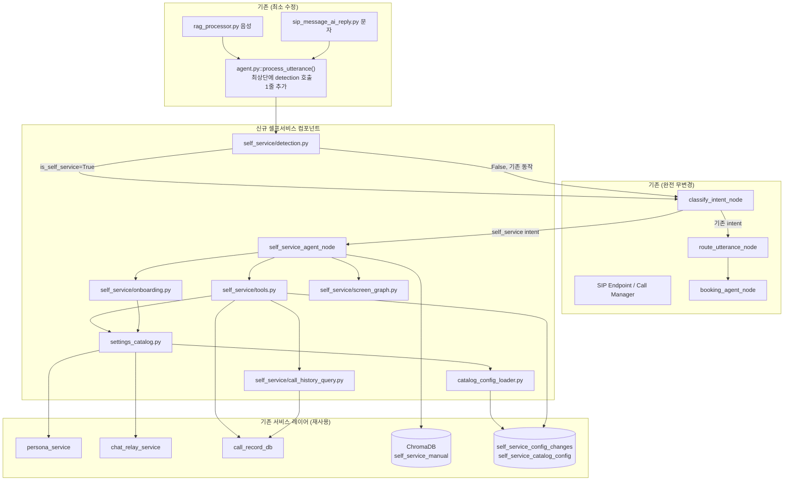
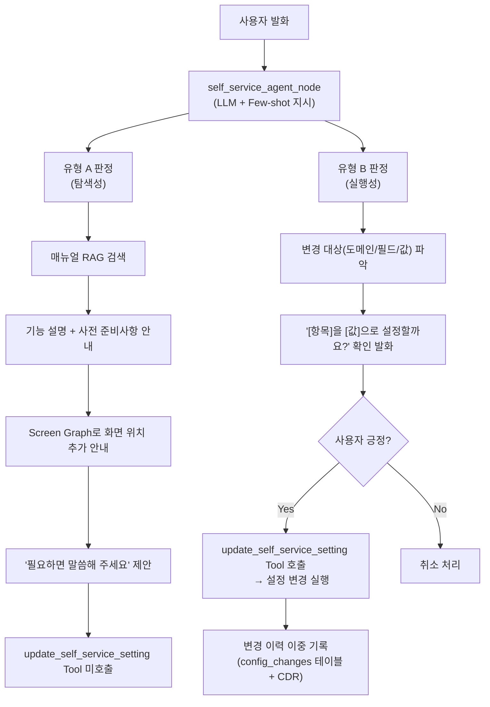
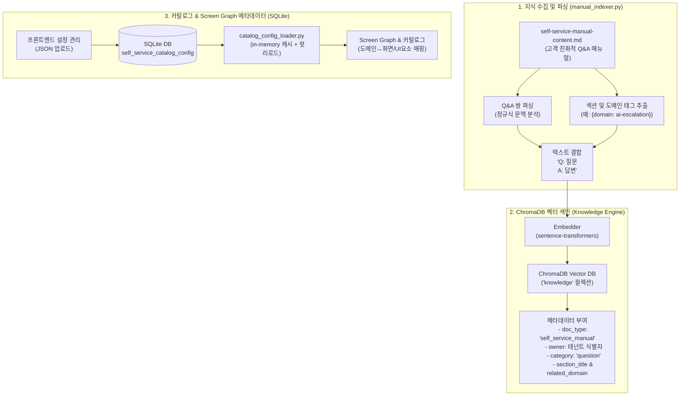
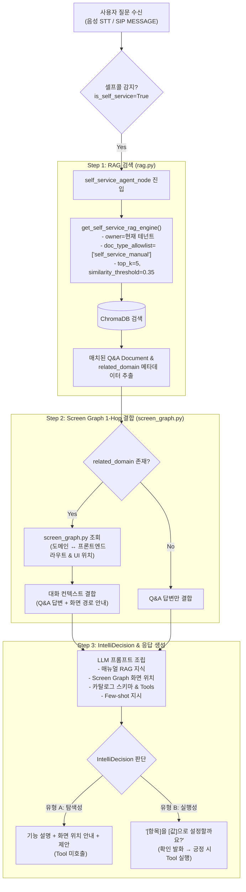

# 셀프서비스 AI 도우미 — 기능 소개 자료

> **문서 기준**: Epic 1(Story 1.1~1.14) + Epic 2(Story 2.1~2.8) 전체 완료 기준  
> **대상 독자**: 이해관계자, 제품 담당자, 운영팀

---

## 1. 시스템 아키텍처

### 1.1 전체 구성 개요

셀프서비스 AI 도우미는 기존 AI SIP PBX 플랫폼 위에 **추가 인프라 없이** 구현된 Brownfield Enhancement다. 기존 시스템의 LangGraph 대화 오케스트레이션, ChromaDB RAG, 멀티테넌트 격리 구조를 그대로 재사용하며, **신규 코드는 최소 변경**으로 통합된다.



### 1.2 신규 컴포넌트 목록

| 컴포넌트 | 역할 | 핵심 특징 |
|---|---|---|
| `self_service/detection.py` | 셀프콜/셀프문자 판별 | 순수 함수, O(1) 문자열 비교 |
| `self_service/settings_catalog.py` | 7개 설정 도메인 레지스트리 | 조회·변경 함수 + 스키마 등록 |
| `self_service/onboarding.py` | 온보딩 체크리스트 판정 | 카탈로그 조회 기반, 단일 진실 소스 |
| `self_service/tools.py` | LangGraph Tool 래퍼 | booking_tools.py와 동일 패턴 |
| `self_service/screen_graph.py` | 도메인↔화면 경량 지식 그래프 | 정적 레지스트리, 그래프DB 불필요 |
| `self_service/call_history_query.py` | 통화 이력 자연어 질의 | SQL 구조화 검색, 새 임베딩 없음 |
| `catalog_config_loader.py` | 카탈로그 메타데이터 캐시 로더 | in-memory 캐시, 핫 리로드 지원 |
| `langgraph/nodes/self_service_agent.py` | 셀프서비스 LLM+Tool 루프 | booking_agent_node 병렬 구조 |
| `common/self_service_catalog_config_db.py` | 카탈로그 설정 DB CRUD | 버전 관리 + 롤백 지원 |
| `api/routers/settings_ai_assistant.py` | 설정 내보내기/가져오기 API | 검증 → 원자적 적용 |

### 1.3 기술 스택

| 레이어 | 기술 | 비고 |
|---|---|---|
| 백엔드 | Python 3.11+, FastAPI | 기존과 동일 |
| 대화 오케스트레이션 | LangGraph | 신규 노드 1개 + state 필드 1개 추가 |
| RAG | ChromaDB | 신규 `doc_type=self_service_manual` 추가 |
| DB | SQLite | 신규 테이블 2개 추가 |
| LLM | Gemini 계열 | 기존 동일 (Gemini 네이티브 function calling) |
| 프론트엔드 | Next.js (App Router) | 신규 페이지 1개 추가 |
| **신규 인프라** | **없음** | 기존 스택만으로 구현 |

### 1.4 셀프콜 감지 메커니즘

SIP 레이어를 전혀 수정하지 않고, 음성·문자 두 채널이 공통으로 거치는 `ConversationAgent.process_utterance()` 최상단에서 1회 호출로 감지한다.

```python
# src/ai_voicebot/self_service/detection.py
def is_self_service_session(caller_number: str, owner: str) -> bool:
    a = normalize_owner_username(caller_number)
    b = normalize_owner_username(owner)
    return bool(a) and bool(b) and a == b
```

- **감지 지연**: < 1ms (문자열 비교 1회 수준)
- **SIP 레이어 변경**: 없음 (회귀 위험 구조적 최소화)
- **채널**: 음성(SIP INVITE) + 문자(SIP MESSAGE) 모두 동일 경로

---

## 2. 왜 필요하며 무엇이 개선되는가

### 2.1 현재 상태의 문제점

SmartPBX AI는 기존에 **고객(발신자)이 테넌트(착신자)에게 문의**하는 시나리오만 처리했으며, **테넌트 관리자 자신을 위한 셀프서비스 채널은 없었다.**

| 문제 영역 | 구체적 불편 | 영향 |
|---|---|---|
| **설정 채널의 단절** | 페르소나, 착신전환, 알림 등 변경 시 프론트엔드 대시보드 직접 접근 필수 | 이동 중·통화 중 설정 불가 |
| **매뉴얼·사용자 경험 불일치** | `USER_MANUAL.md`가 개발자 관점(API, 시스템 요구사항 등)으로 작성 | 비기술 관리자 이해 어려움 |
| **통계 확인 진입장벽** | AI 응대 통계, HITL 건수 등 확인에 대시보드 탐색 필요 | "지난주 AI 응대 몇 건?" 즉답 불가 |
| **신규 기능 발견 어려움** | 새 기능이 추가되어도 관리자가 인지하지 못하면 활용도 저조 | 신기능 activation 저조 |

**문제의 파급 효과:**
- 초기 온보딩 실패율 증가 → 이탈(churn) 위험
- 반복적 FAQ성 CS 문의 집중 → CS 리소스 낭비
- 신기능 활용률 저하 → 제품 투자 대비 사용률 저하

### 2.2 핵심 가치 제안

> **"설정 화면을 뒤질 필요 없이, 내 번호로 전화 한 통이면 AI가 사용법을 알려주고 원하는 대로 설정까지 바꿔준다."**

### 2.3 도입 후 개선사항

| 개선 항목 | 상세 내용 |
|---|---|
| **24/7 셀프서비스 채널** | 대시보드 없이 전화/문자만으로 설정 확인·변경 |
| **온보딩 완료율 향상** | AI가 미완료 초기 설정을 자동 감지·안내 |
| **CS 문의 절감** | 반복 FAQ를 AI가 대화로 처리 |
| **실시간 운영 현황 파악** | 통화량·HITL 건수를 대화로 즉시 확인 |
| **통화 이력 자연어 조회** | 복잡한 필터 없이 "오늘 수신 못한 번호 알려줘"로 조회 |
| **설정 투명성** | AI가 변경한 모든 설정의 이력을 프론트엔드에서 확인 |
| **설정 동적 관리** | 코드 배포 없이 브라우저에서 설정 메타데이터 편집·적용 |

### 2.4 KPI 지표

| KPI | 측정 방법 |
|---|---|
| **셀프서비스 세션 수** | `self_service_session_started` 이벤트 월간 집계 |
| **자동설정 성공률** | `self_service_auto_config_applied` / 시도 건수 |
| **정보 안내 정확도** | HITL 전환율·사용자 재질문율 |
| **CS 문의 절감률** | 도입 전후 반복 FAQ 문의 비교 |

---

## 3. 제공 기능 및 예제

### 3.1 사용법 안내 (매뉴얼 RAG)

**개요**: 서비스 이용 매뉴얼을 ChromaDB에 색인하여 자연어 질문에 정확히 답변한다.

| 예제 질문 | AI 응답 방식 |
|---|---|
| "AI가 모를 때 어떻게 되나요?" | 매뉴얼 RAG 검색 → 에스컬레이션 방식 3가지 설명 |
| "착신 규칙 우선순위가 어떻게 되나요?" | 매뉴얼의 동작 메커니즘 Q&A 검색 → 단계별 안내 |
| "예약 슬롯은 어떻게 만들어요?" | 예약 관리 섹션 검색 → 일괄 생성 방법 안내 |

- **격리**: `doc_type=self_service_manual` + `owner` 필터 — 테넌트 고객용 지식과 완전 분리
- **폴백**: 매뉴얼에 없는 질문 → "제가 알지 못하는 내용입니다" 안내

---

### 3.2 온보딩 체크리스트

**개요**: 세션 시작 시 미완료 초기 설정 항목을 자동으로 감지하여 안내한다.

```
관리자: (전화 연결)
AI: 안녕하세요! 아직 완료되지 않은 초기 설정이 있습니다.
    - AI 에스컬레이션 방식이 설정되지 않았습니다.
    - 착신 규칙이 1개도 생성되지 않았습니다.
    지금 바로 설정해 드릴까요?
관리자: 네, 해주세요.
AI: AI 에스컬레이션 방식부터 설정해 드릴게요.
    '운영자 알림', '상담원 직접 연결', '에스컬레이션 안 함' 중 어떤 방식을 원하시나요?
```

- 단일 진실 소스: 설정 카탈로그의 조회 함수만 사용 (별도 완료 여부 저장소 없음)
- 모든 초기 설정 완료 시 체크리스트 안내 생략 → 일반 질의응답 진행

---

### 3.3 설정 조회 Tool (7개 도메인 전체)

**개요**: "현재 내 설정이 어떻게 되어 있나요?" 질문에 대시보드 접속 없이 즉시 답변.

| 조회 가능 도메인 | 설명 |
|---|---|
| `persona` | AI 페르소나 설정 (이름, 응답 톤, 에스컬레이션 방식 등) |
| `ai-escalation` | AI가 모를 때의 처리 방식 |
| `call-control` | 착신 규칙, 시간 조건, 발신자 필터 |
| `chat-relay` | 문자 자동응답 설정 |
| `contacts` | 연락처/폴더 |
| `general` | Google 캘린더 연동 등 일반 설정 |
| `integrations` | 외부 연동 |

```
관리자: 지금 채팅 자동응답 설정이 어떻게 되어 있어?
AI: 현재 채팅 자동응답 설정입니다.
    - SIP MESSAGE 자동응답: 활성화
    - 자동응답 접두사: [AI 자동응답]
    - 마지막 저장: 2026-07-15 14:32
```

---

### 3.4 이용 통계 조회

**개요**: 대시보드 없이 대화로 운영 현황을 즉시 파악.

```
관리자: 이번 달 AI가 몇 번 응대했어?
AI: 이번 달(7월 1일~오늘) 통계입니다.
    - 총 통화 수: 142건
    - AI 평균 confidence: 0.87
    - HITL 발생 건수: 12건 (8.5%)
```

---

### 3.5 자동설정 Tool (범용 — 확인 발화 후 실행)

**개요**: 확인 발화(confirmation) 후 실제 설정을 변경. `booking_agent`와 동일한 확인 원칙.

```
관리자: AI가 에스컬레이션 안 하도록 설정해줘.
AI: AI가 에스컬레이션하지 않도록 설정할까요?
    이 경우 고객이 먼저 '상담원 연결해 주세요'라고
    명시적으로 요청하면 그때만 별도 처리됩니다.
관리자: 응, 해줘.
AI: 설정 완료했습니다. 에스컬레이션 방식을 '에스컬레이션 안 함'으로 변경했습니다.
```

| 도메인 | 쓰기 가능 | 비고 |
|---|---|---|
| `persona` | ✅ | 이름, 응답 톤, 에스컬레이션 방식 등 |
| `ai-escalation` | ✅ | 에스컬레이션 방식 변경 |
| `chat-relay` | ✅ | 자동응답 on/off, 접두사 변경 |
| `call-control` | ❌ | 목록형 데이터, 제외 목록 처리 |
| `contacts` | ❌ | 제외 목록 처리 |
| `general` | ❌ | 제외 목록 처리 |
| `integrations` | ❌ | 제외 목록 처리 |

- 제외 목록: `config/self_service_exclusions.yaml` — 코드 배포 없이 항목 추가/제거 가능
- 변경 이력: `self_service_config_changes` 테이블 + `call_data_record` 이중 기록

---

### 3.6 화면 안내형 응대 (Screen Graph)

**개요**: 기능을 묻는 질문에 매뉴얼 설명과 함께 실제 프론트엔드 화면 위치까지 안내.

```
관리자: AI가 모르는 질문 받으면 나한테 전화하게 해줄 수 있어?
AI: 상담원 직접 연결(호전환) 방식이 있습니다.
    이 방식을 쓰려면 설정 > AI 에스컬레이션 화면에서
    '상담원 직접 연결'을 선택하고, 설정 > 착신 제어에서
    호전환 대상 내선을 미리 등록해 둬야 합니다.
    설정이 필요하다면 말씀해주세요.
```

- 구현: Full GraphRAG(그래프 DB) 없이 정적 레지스트리 패턴 — 추가 인프라 불필요
- 매뉴얼 RAG → `related_domain` → Screen Graph 1-hop 확장 (GraphRAG Local Search 패턴 재현)

---

### 3.7 통화 이력 자연어 질의 (Call History NLQ)

**개요**: 통화 이력 화면을 직접 뒤지지 않고 자연어로 원하는 정보 즉시 조회.

| 질의 유형 | 예제 | 반환 정보 |
|---|---|---|
| **키워드 검색** | "예약 관련으로 얘기한 통화 찾아줘" | 발신번호, 통화시각, 요약 |
| **Top 발신자 집계** | "한 달 내에 제일 많이 전화한 번호 알려줘" | 상위 번호별 통화 건수 |
| **오늘 미응답 조회** | "오늘 수신받지 못한 번호를 알려줘" | 발신번호, 시각 목록 |

```
관리자: 오늘 수신받지 못한 번호 알려줘.
AI: 오늘 수신하지 못한 통화입니다.
    1. 010-1234-5678 (오전 9:32)
    2. 010-9876-5432 (오후 2:15)
    3. 02-123-4567   (오후 4:08)
    총 3건입니다. 확인 후 연락해 드리시겠어요?
```

- 새 벡터 임베딩 파이프라인 없음 — 기존 `call_records`(SQLite) 구조화 검색만 활용

---

### 3.8 자동설정 변경 이력 프론트엔드 페이지

**개요**: AI가 대화로 변경한 모든 설정을 프론트엔드에서 확인·신뢰 가능.

- **경로**: `설정 > AI 도우미 변경 이력` (`/settings/ai-assistant`)
- **표시 정보**: 변경 도메인·필드, 이전값→새값, 변경 시각, 관련 call_id
- **API**: `GET /api/self-service/config-changes`

---

## 4. IntelliDecision — 핵심 의도 판단 엔진

### 4.1 개념

IntelliDecision은 설정 변경 관련 발화를 두 가지 유형으로 구분하여 응대 방식을 결정하는 판단 체계다.

| 유형 | 정의 | 예시 발화 |
|---|---|---|
| **유형 A — 탐색성** | 기능을 몰라서 물어보는 발화 | "AI가 모르는 질문 받으면 나한테 전화하게 해줄 수 있어?" |
| **유형 B — 실행성** | 명확히 변경을 요청하는 발화 | "AI가 에스컬레이션 안 하도록 설정해줘." |

### 4.2 판단 원칙

> **"의도 분류는 키워드 매칭보다 LLM 판단을 우선한다."** (`.github/copilot-instructions.md`)

LLM이 대화 맥락과 few-shot 지시를 바탕으로 **최종 판단**을 내린다. 별도의 분류기 LLM 호출은 추가하지 않아 응답 지연에 영향 없다.

> **Epic 2(Story 2.6) 완료**: 초기에 도입했던 정규식 종결 어미 기반 힌트(`intent_tier.py`)를 **완전 제거**했다. 제거 전/후 IntelliDecision QA 16건 비교 결과 회귀 없음이 확인되었으며, LLM이 힌트 없이도 대화 맥락만으로 동일하게 정확히 판단함이 실증되었다.

### 4.3 판단 플로우



### 4.4 응대 예시 비교

**유형 A — 탐색성 발화**

```
Q: "AI가 모르는 질문 받으면 나한테 전화하게 해줄 수 있어?"
A: "상담원 직접 연결(호전환) 방식이 있습니다.
   이 방식을 쓰려면 설정 > 착신 제어에서
   호전환 대상 내선을 미리 등록해 둬야 합니다.
   설정이 필요하다면 말씀해주세요."

→ 이 턴에서 설정 변경 Tool 미호출
→ 화면 위치 안내 포함 (Screen Graph)
→ 다음 행동 제안으로 마무리
```

**유형 B — 실행성 발화**

```
Q: "AI가 에스컬레이션 안 하도록 설정해줘."
A: "AI가 에스컬레이션하지 않도록 설정할까요?
   이 경우 고객이 먼저 '상담원 연결해 주세요'라고
   명시적으로 요청하면 그때만 별도 처리됩니다."

→ 즉시 확인 발화 (매뉴얼의 부작용 정보 포함)
→ 사용자 긍정 후 Tool 호출
→ 실제 설정 변경 + 이력 기록
```

### 4.5 설계 결정 이력

| 버전 | 결정 사항 | 근거 |
|---|---|---|
| Story 1.10 도입 | 정규식 종결 어미 힌트(`intent_tier.py`) 도입 | LLM 판단 보조용 참고 신호로만 활용 |
| Story 2.6 제거 | `intent_tier.py` **완전 삭제** | STT 오인식 취약 + QA 실증으로 힌트 불필요 확인 |
| **현재 상태** | **LLM 단독 판단** | Few-shot 지시만으로 동등 이상의 정확도 달성 |

---

## 5. 이용 방법

### 5.1 셀프서비스 모드 진입 (관리자 기준)

**별도 설정 불필요** — 관리자 본인의 번호로 자기 자신에게 전화를 걸거나 문자를 보내면 시스템이 자동으로 인식하여 셀프서비스 모드로 응답한다.

```
일반 고객 통화: 고객 번호 → 테넌트 번호  ⟹ 기존 AI 고객 응대
셀프서비스:     관리자 번호 → 관리자 번호  ⟹ 셀프서비스 AI 도우미
```

### 5.2 음성 통화로 이용하기

1. 본인 등록 내선 번호로 발신
2. AI 인사말 및 온보딩 체크리스트 안내 수신
3. 자연어로 질문 또는 설정 요청

**예시 시나리오:**
```
1단계: "안녕하세요" → AI 인사 + 미완료 초기 설정 안내
2단계: "지금 내 에스컬레이션 설정이 어떻게 되어 있어?" → 현재 설정값 조회
3단계: "에스컬레이션 방식을 운영자 알림으로 바꿔줘" → 확인 발화 + 설정 변경
4단계: "이번 달 통화량 알려줘" → 통계 조회
5단계: "오늘 수신 못한 번호 알려줘" → 통화 이력 조회
```

### 5.3 문자(SIP MESSAGE)로 이용하기

음성 통화와 동일한 기능을 문자로도 이용할 수 있다. 텍스트 기반으로 더 상세한 정보를 주고받기에 유리하다.

### 5.4 프론트엔드 확인 화면 이용하기

AI가 변경한 설정 이력과 설정 구성을 프론트엔드에서 확인하려면:

1. **변경 이력 확인**: `설정 > AI 도우미 변경 이력` (`/settings/ai-assistant`)
2. **화면 안내 확인**: `설정 > AI 도우미 > 도움말 > 화면 안내` 탭 — Screen Graph의 도메인별 화면 라우트·UI 요소 연결 정보를 읽기 전용으로 열람
3. **설정 메타데이터 관리**: `설정 > AI 도우미 > 도움말 > 설정 관리` 탭

### 5.5 설정 메타데이터 편집 (Epic 2 신기능)

코드 배포 없이 브라우저에서 AI가 인식하는 설정 구성을 업데이트할 수 있다.

```
① 설정 관리 탭 접근
② 현재 설정 JSON 다운로드 (내보내기)
③ 설정 파일 편집 (필드명, 라벨, 허용값, 화면 안내 등)
④ 편집된 파일 업로드
⑤ 서버에서 자동 검증 (필수 키, 타입, 함수 화이트리스트 확인)
⑥ diff 미리보기 확인 후 확정 적용
⑦ 서버 재시작 없이 즉시 반영 (핫 리로드)
```

> [!IMPORTANT]  
> **완전 노코드는 아닙니다**: 완전히 새로운 설정 도메인(새 서비스 로직)을 추가하려면 여전히 코드 배포가 필요합니다. 동적 편집이 가능한 범위는 **이미 코드에 등록된 함수의 노출 방식**(라벨, 허용값, writable 여부, 화면 안내 문구)입니다.

### 5.6 버전 관리 및 롤백

- 업로드마다 버전이 자동 기록됨
- 설정 관리 탭의 버전 이력 표에서 이전 버전으로 즉시 롤백 가능
- 롤백 시 서버 재시작 불필요 (핫 리로드)

---

## 6. 지식베이스(KB) 구축 및 RAG 응대 파이프라인 (상세)

### 6.1 지식베이스(KB) 수집 및 저장 메커니즘 (Ingestion & Storage)

셀프서비스 AI 도우미의 지식베이스는 **정적 매뉴얼 문서**와 **동적 카탈로그/Screen Graph 메타데이터** 두 가지 축으로 구성된다.



#### 1) 매뉴얼 수집 및 파싱 (`manual_indexer.py`)
- **소스**: `docs/product/self-service-manual-content.md` (Q&A 형식 마크다운)
- **Q&A 파싱**: `**Q: ...**`와 `A: ...` 구문을 정규식으로 자동 분리
- **도메인 메타데이터 태깅**: 섹션 헤더의 명시적 태그(예: `## 3. AI 에스컬레이션 설정 {domain: ai-escalation}`) 또는 키워드 매칭을 통해 각 Q&A에 `related_domain`과 `section_title`을 태깅한다.

#### 2) ChromaDB 색인 및 테넌트 격리
- **컨텐츠 결합**: `Q: 질문\nA: 답변` 형태로 결합하여 Vector DB 검색 시 질문과 답변 맥락이 모두 유지되도록 한다.
- **메타데이터 저장**:
  - `doc_type`: `"self_service_manual"` (테넌트 일반 지식과 상호 분리)
  - `owner`: 테넌트 식별자 (RAGEngine이 검색 시 `owner` 필터로 강제 차단하여 타 테넌트와 격리)
  - `related_domain`: 해당 Q&A가 다루는 설정 도메인 (`ai-escalation`, `call-control` 등)

#### 3) 동적 카탈로그 & Screen Graph 메타데이터 (SQLite DB)
- **저장소**: SQLite `self_service_catalog_config` 테이블에 버전별로 JSON 메타데이터(설정 라벨, 허용값, 화면 라우트, UI 버튼 정보)를 저장
- **핫 리로드**: `catalog_config_loader.py`가 in-memory에 캐싱하며, UI에서 파일 수정/업로드 시 서버 재시작 없이 메모리 캐시를 즉시 무효화 및 반영

---

### 6.2 RAG 검색 및 AI 응대 흐름 (Retrieval & Generation Flow)

사용자가 발화(음성 STT / 문자)하면 세션을 감지하고 전용 RAG Engine과 Screen Graph를 1-Hop으로 결합하여 응답을 조립한다.



---

### 6.3 예시 Flow (Step-by-Step 시나리오)

#### 📌 시나리오
> **관리자 발화**: *"AI가 질문 못 알아들으면 나한테 전화 오게 하는 법이랑 어디서 설정하는지 화면 알려줘."*

#### 1단계: RAG 지식 검색 (`rag.py`)
1. 관리자 질문 텍스트가 임베더를 거쳐 벡터화됨
2. ChromaDB에서 `owner="9003"`, `doc_type="self_service_manual"` 조건으로 벡터 유사도 검색 실행
3. 검색 결과 매칭:
   - **질문**: *"상담원 직접 연결(호전환) 방식은 무엇인가요?"*
   - **답변**: *"AI가 판단이 어려운 경우 자동으로 통화를 상담원 내선으로 돌려 실시간 음성 통화로 연결합니다. 이 방식을 쓰려면 설정 > 착신 제어에서 호전환 대상 내선을 미리 등록해 둬야 합니다."*
   - **메타데이터**: `related_domain = "ai-escalation"`

#### 2단계: Screen Graph 1-Hop 확장 (`screen_graph.py`)
1. 메타데이터의 `related_domain: "ai-escalation"` 식별
2. Screen Graph 정적 레지스트리/DB에서 해당 도메인 정보 조회:
   - **화면 라우트**: `/settings/ai-escalation`
   - **화면 명칭**: `설정 > AI 에스컬레이션`
   - **UI 위치**: `에스컬레이션 방식 옵션 중 '상담원 직접 연결' 라디오 버튼`

#### 3단계: LLM 프롬프트 조립 & IntelliDecision 판단
- LLM에 제공되는 컨텍스트:
  - **검색 지식**: 매뉴얼 Q&A 내용
  - **화면 안내**: `설정 > AI 에스컬레이션` 라우트 및 라디오 버튼 정보
  - **발화 유형 판단**: 질문이 `~하는 법이랑 화면 알려줘` 형태이므로 **유형 A(탐색성)**로 판단
- **Tool 호출 생략**: 탐색성이므로 `update_self_service_setting` 도구를 호출하지 않음

#### 4단계: 최종 AI 응답 생성
```
AI: "AI가 모르는 질문을 받았을 때 전화로 연결하는 방식은 '상담원 직접 연결(호전환)'입니다.

   📌 화면 위치:
   - 메뉴: 설정 > AI 에스컬레이션 (/settings/ai-escalation)
   - 조작: 에스컬레이션 방식 선택에서 '상담원 직접 연결' 라디오 버튼을 선택하시면 됩니다.

   ⚠️ 사전 준비사항:
   이 방식을 사용하시려면 '설정 > 착신 제어' 메뉴에서 호전환을 받을 상담원 내선 번호가 미리 등록되어 있어야 합니다.

   지금 바로 이 설정으로 변경해 드릴까요?"
```

---

## 부록: 관련 문서

| 문서 | 설명 |
|---|---|
| [self-service-ai-assistant-architecture.md](../architecture/self-service-ai-assistant-architecture.md) | 컴포넌트·통합 지점·소스 트리 (Brownfield Architecture) |
| [self-service-ai-assistant-prd.md](../product/self-service-ai-assistant-prd.md) | 기능 요구사항(FR/NFR/CR) + Epic 1~2 Story 목록 |
| [self-service-ai-assistant-brief.md](../product/self-service-ai-assistant-brief.md) | Project Brief — 배경, 목표, MVP 범위 |
| [self-service-manual-content.md](../product/self-service-manual-content.md) | RAG 지식 소스 — 관리자용 서비스 이용 매뉴얼 |
| [self-service-ai-assistant-master-qa.md](../qa/self-service-ai-assistant-master-qa.md) | 통합 QA 케이스 문서 (Branch A~L) |
| [SYSTEM_OVERVIEW.md §4.11](../SYSTEM_OVERVIEW.md) | 시스템 전체 개요 내 셀프서비스 섹션 |

---

*작성 기준: 2026-07-22 / Epic 1(Story 1.1~1.14) + Epic 2(Story 2.1~2.8) 전체 완료 상태*

