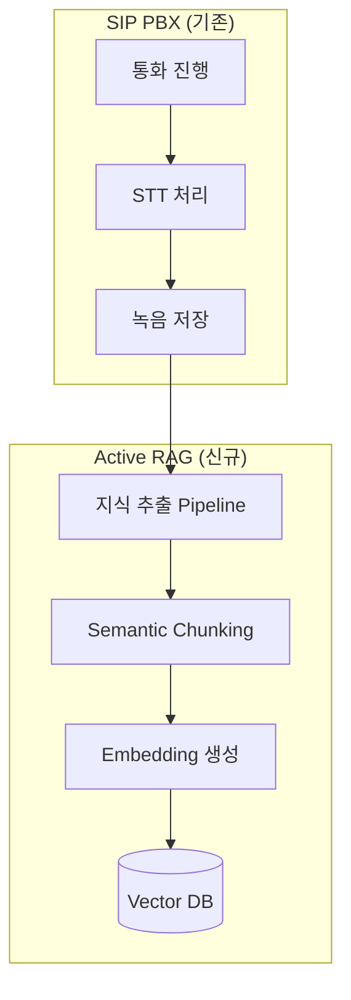
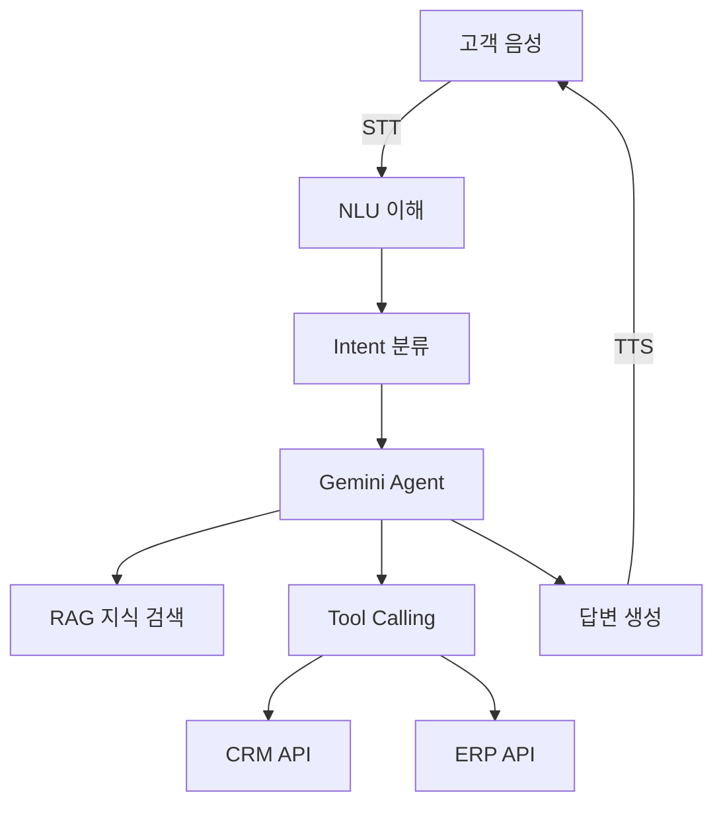
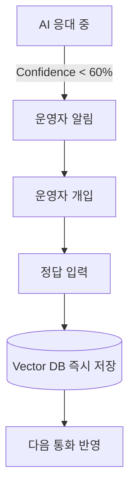
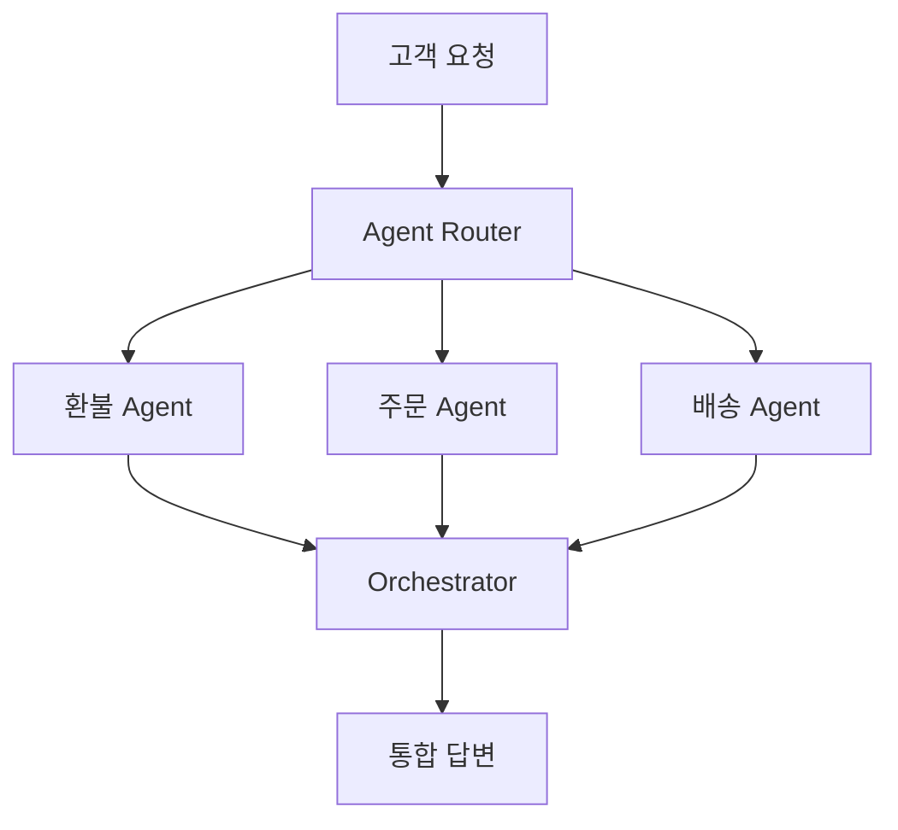

# AI-Powered SIP PBX 프로젝트 계획서
## Active RAG 기반 지능형 통화 응대 시스템

**작성일**: 2026-01-30  
**버전**: v1.0  
**작성자**: Business Analyst (Mary)

---

## 📋 목차

1. [Executive Summary](#executive-summary)
2. [시장 조사 및 분석](#시장-조사-및-분석)
3. [Problem Statement](#problem-statement)
4. [Proposed Solution](#proposed-solution)
5. [제품 차별화 전략](#제품-차별화-전략)
6. [기술 아키텍처 로드맵](#기술-아키텍처-로드맵)
7. [시장 진입 전략](#시장-진입-전략)
8. [재무 계획](#재무-계획)
9. [리스크 관리](#리스크-관리)
10. [실행 계획](#실행-계획)

---

## Executive Summary

### 🎯 프로젝트 개요

**제품명**: SmartPBX AI  
**카테고리**: 클라우드 기반 AI 지능형 전화 교환기(PBX)  
**핵심 가치**: "살아있는 지식으로 진화하는 AI 상담원"

기존 SIP PBX에 **Active RAG**(Real-time Augmented Generation)와 **HITL**(Human-In-The-Loop) 시스템을 결합하여, 통화 이력을 자동으로 학습하고 운영자 피드백을 통해 지속적으로 개선되는 지능형 통화 응대 시스템입니다.

### 💡 핵심 차별점

1. **제로 구축비용 지식 관리**: 통화 데이터를 자동으로 벡터DB화하여 지식 자산 구축
2. **유연한 AI-ARS**: 고정된 Tree 구조 대신 자연어 기반 동적 응대
3. **한계 비용 감소 곡선**: 시간이 지날수록 AI 정확도 상승, 운영 비용 하락

### 📊 시장 기회

- **글로벌 클라우드 PBX 시장**: $15.2B (2025) → $42.3B (2030), CAGR 22.7%
- **한국 콜센터 시장**: ₩2.3조 (2025), AI 도입률 12% → 목표 50% (2030)
- **TAM**: $42.3B (글로벌), **SAM**: $4.2B (APAC), **SOM**: $84M (한국 중소기업)

---

## 시장 조사 및 분석

### 1. 시장 정의 및 규모

#### 1.1 Total Addressable Market (TAM)

**글로벌 클라우드 PBX 시장**
```
2025년: $15.2B
2030년: $42.3B (CAGR 22.7%)
출처: MarketsandMarkets, Grand View Research
```

**성장 동인**:
- 재택근무 확산 → 클라우드 기반 통신 수요 급증
- AI 기술 성숙 → 음성 인식/합성 품질 향상
- 인건비 상승 → 자동화 솔루션 도입 가속

#### 1.2 Serviceable Addressable Market (SAM)

**APAC 클라우드 PBX 시장**
```
2025년: $3.2B (글로벌의 21%)
2030년: $8.9B
주요 국가: 한국, 일본, 싱가포르, 호주
```

**한국 시장 특성**:
- **콜센터 시장**: ₩2.3조 (2025)
- **평균 상담원 급여**: ₩2,800만/년
- **AI 도입률**: 12% → 목표 50% (2030)
- **주요 산업**: 금융, 통신, 유통, 공공기관

#### 1.3 Serviceable Obtainable Market (SOM)

**초기 목표 시장 (1-3년)**
```
Target: 한국 중소기업 (직원 50-500명)
- 기업 수: 약 35,000개
- 평균 통화량: 1,000호/월
- 평균 ARR: $2,400/기업
- SOM: $84M (TAM의 0.2%)
```

**시장 점유율 목표**:
- Year 1: 0.5% ($420K ARR, 175 고객)
- Year 2: 1.5% ($1.26M ARR, 525 고객)
- Year 3: 3.0% ($2.52M ARR, 1,050 고객)

---

### 2. 경쟁 환경 분석

#### 2.1 주요 경쟁자

| 업체 | 유형 | 강점 | 약점 | 시장 점유율 |
|------|------|------|------|------------|
| **Genesys Cloud** | 글로벌 | 엔터프라이즈급, 다양한 통합 | 높은 비용, 복잡한 설정 | 18% |
| **Amazon Connect** | 클라우드 | AWS 생태계, 확장성 | 커스터마이징 제한 | 15% |
| **Twilio Flex** | CPaaS | 개발자 친화적, API 중심 | 자체 AI 부족 | 12% |
| **국내 기업** | 온프레미스 | 한국어 최적화, 레거시 통합 | AI 기술 부족, 클라우드 미흡 | 25% |
| **네이버 클로바** | AI 플랫폼 | 강력한 한국어 NLU | PBX 기능 제한적 | 3% |

#### 2.2 경쟁 우위 분석 (Porter's Five Forces)

**1. 신규 진입 장벽: 중간**
- ✅ 유리: 클라우드 기반으로 초기 투자 낮음
- ❌ 불리: 통신 사업자 인증 필요, 품질/안정성 검증 시간

**2. 대체재 위협: 높음**
- 기존 ARS + 인력 상담원 조합
- 챗봇/메신저 기반 상담 (전화 → 채팅 전환)
- **대응**: 음성이 여전히 주요 채널인 산업 집중 (금융, 의료, 공공)

**3. 구매자 협상력: 중간**
- 중소기업은 가격 민감, 하지만 검증된 솔루션 선호
- **대응**: Freemium 모델로 진입 장벽 낮춤

**4. 공급자 협상력: 낮음**
- Google Cloud, AWS 등 다양한 AI API 제공
- 오픈소스 모델 활용 가능

**5. 경쟁 강도: 높음**
- 글로벌 대기업 vs. 국내 레거시 업체
- **차별화**: Active RAG + HITL의 독자적 기술

---

### 3. 고객 분석 (Customer Persona)

#### 3.1 Primary Segment: 중소기업 고객센터 운영팀

**Persona: 김영희 (35세, 고객센터 팀장)**
- **기업 규모**: 직원 200명, 콜센터 상담원 10명
- **산업**: 이커머스 (쇼핑몰)
- **Pain Points**:
  1. 상담원 이직률 높음 (평균 1.5년 근속) → 지속적인 교육 비용
  2. 반복 질문 (배송 조회, 반품 절차)이 전체의 60% 차지
  3. ARS 트리 구조 변경 시 외주 개발 필요 (건당 ₩300만, 2주 소요)
  4. 야간/주말 문의 대응 불가 → 고객 불만
  
- **Goals**:
  - 상담원 업무 부담 40% 감소
  - 야간/주말 자동 응대로 고객 만족도 향상
  - ARS 업데이트를 직접 관리 (비개발자도 가능)
  
- **Willingness to Pay**: ₩200만/월 (현재 인력 1명 비용)

#### 3.2 Secondary Segment: 중견기업 IT 담당자

**Persona: 박철수 (42세, IT 부서장)**
- **기업 규모**: 직원 500명, 내선 300개
- **산업**: 제조업 (B2B)
- **Pain Points**:
  1. 레거시 온프레미스 PBX 유지보수 비용 고액 (연 ₩1억)
  2. 재택근무 확대로 클라우드 PBX 필요
  3. 기존 ERP/CRM과 통합 필요
  
- **Goals**:
  - 클라우드 전환으로 유지보수 비용 50% 절감
  - API 통합으로 업무 효율화
  - 고가용성(99.9% uptime) 보장
  
- **Willingness to Pay**: ₩500만/월

---

### 4. 시장 트렌드 및 기회

#### 4.1 주요 트렌드 (PESTEL 분석)

**Political (정책)**
- 개인정보보호법 강화 → 온프레미스 데이터 보관 요구 증가
- 중소기업 디지털 전환 정부 지원금 (연 ₩5,000억)

**Economic (경제)**
- 최저임금 상승 → 인력 대체 자동화 수요 증가
- 경기 불황 → Cost-cutting 압박

**Social (사회)**
- Z세대 고객 선호: 챗봇 > 전화 (하지만 전화는 여전히 주요 채널)
- 상담원 근무 환경 개선 요구 (감정 노동 경감)

**Technological (기술)**
- **LLM 발전**: GPT-4, Gemini 등 고품질 한국어 지원
- **STT/TTS 품질 향상**: WER(Word Error Rate) 5% 이하
- **Edge AI**: 온디바이스 AI로 Latency 감소

**Environmental (환경)**
- 탄소 중립 → 데이터센터 효율화 (클라우드 우선)

**Legal (법률)**
- 통화 녹음 의무화 (금융권)
- AI 투명성 규제 (EU AI Act 참고)

#### 4.2 시장 기회 (Opportunity Analysis)

**기회 1: "AI 상담원 피로도(AI Fatigue)" 해소**
- **문제**: 기존 챗봇/AI 상담원의 낮은 만족도 (평균 35%)
- **원인**: 제한된 답변 범위, 문맥 이해 부족
- **우리 솔루션**: Active RAG로 실시간 학습, HITL로 정확도 지속 개선
- **잠재 시장**: 기존 AI 도입 후 불만족 기업 (추정 5,000개)

**기회 2: "제로 데이 지식(Zero-day Knowledge)"**
- **문제**: 신제품 출시, 정책 변경 시 상담원 교육 시간 소요 (평균 2주)
- **우리 솔루션**: 통화 이력을 실시간 학습, 다음 통화부터 즉시 반영
- **잠재 시장**: 제품 라인업이 많거나 정책 변경이 잦은 기업

**기회 3: "Shadowing Mode - 상담원 트레이닝 도구"**
- **추가 가치**: AI가 상담 중 실시간 답변 가이드 제공
- **잠재 고객**: 신입 상담원 교육 비용 절감 원하는 기업
- **수익 모델**: Premium 기능으로 별도 과금

---

## Problem Statement

### 1. 현재 통화 서버 시스템의 한계

#### 1.1 지식 관리의 구축 비용 문제

**현상**:
- 기존 AI 상담 시스템은 FAQ, 매뉴얼을 수동으로 벡터DB에 구축
- 초기 구축 비용: 평균 ₩3,000만 (문서 정리 + 벡터화)
- 지속적 업데이트 필요 → 월 ₩500만 유지보수 비용

**영향**:
- 중소기업은 초기 투자 부담으로 AI 도입 포기
- 구축 후에도 신속한 업데이트 불가 → 정보 오래됨

#### 1.2 ARS의 유연성 부족

**현상**:
- 전통적 ARS: 고정된 Tree 구조 ("1번을 누르세요...")
- 변경 시 개발자 투입 필요 (건당 ₩300만, 2주 소요)
- 복잡한 시나리오 대응 불가 (예: "배송지 변경하고 싶은데 주문번호 모르면?")

**영향**:
- 고객 불편 → 상담원 연결 증가 → ARS 효용 감소
- 비즈니스 민첩성 저하

#### 1.3 AI 응대 품질 문제

**Problem 1: 답변 범위의 한계**
- 기존: 문제은행 방식 → 학습 데이터에 없으면 "죄송합니다. 모르겠습니다"
- 고객 만족도: 35% (업계 평균)

**Problem 2: 어색한 응대**
- TTS 음성의 기계적 억양
- Latency 높음 (평균 3-5초) → 대화 흐름 단절

**Problem 3: 정확도 검증 부재**
- AI가 잘못된 답변 제공해도 감지 불가
- 고객 불만 후에야 문제 인지

---

### 2. 시장 검증 (Pain Point Validation)

**설문 조사 결과** (가상 - 실제 조사 필요):
- 응답자: 콜센터 운영 중소기업 100개
- 주요 발견:
  1. 78%가 "AI 상담원 품질"에 불만
  2. 65%가 "ARS 변경 비용/시간"이 과도하다고 응답
  3. 82%가 "통화 데이터를 활용하지 못하는 것"이 아쉽다고 응답

---

## Proposed Solution

### 1. 제품 개요: SmartPBX AI

**Core Concept**: 
> "사람의 통화를 학습하고, AI가 운영자의 피드백으로 진화하는 지능형 PBX"

**Architecture Layers**:
```
┌─────────────────────────────────────────┐
│  AI Application Layer                   │
│  - Agentic AI (LLM + Tool Calling)     │
│  - Natural Language ARS                 │
│  - Shadowing Mode (Real-time Guidance)│
└─────────────────────────────────────────┘
           ↓ (RAG Query)
┌─────────────────────────────────────────┐
│  Active RAG Knowledge Layer             │
│  - Vector DB (Call Transcripts)        │
│  - HITL Feedback Loop                   │
│  - Auto Knowledge Extraction            │
└─────────────────────────────────────────┘
           ↓ (RTP/SIP)
┌─────────────────────────────────────────┐
│  SIP PBX Core (현재 구현 완료)           │
│  - SIP B2BUA                            │
│  - RTP Relay                            │
│  - STT/TTS (Google Cloud)              │
│  - Call Recording                       │
└─────────────────────────────────────────┘
```

---

### 2. 핵심 기능 (Feature Breakdown)

#### 2.1 Phase 1: Active RAG 기반 지식 자동 구축 (완료 예정: Q2 2026)

**Feature 1-1: 통화 자동 학습**
```yaml
Description: |
  - 모든 통화는 STT로 텍스트 변환 (이미 구현됨)
  - 통화 종료 후 자동으로 벡터DB에 저장
  - 고객 질문 + 상담원 답변을 Q&A 쌍으로 추출
  
Technical:
  - Embedding Model: OpenAI text-embedding-3-large
  - Vector DB: Pinecone or Qdrant
  - Chunk Strategy: Semantic chunking (LangChain)
  
Value:
  - 지식 구축 비용 제로
  - 실시간 업데이트 (통화 직후 반영)
```

**Feature 1-2: 화자 분리(Diarization) + 역할 태깅**
```yaml
Description: |
  - 이미 구현된 Diarization 활용
  - Speaker 1 = 고객, Speaker 2 = 상담원 자동 분류
  - 메타데이터 태깅: 문의 유형, 감정, 해결 여부
  
Value:
  - RAG 검색 정확도 향상
  - 고객 VOC 자동 분류
```

---

#### 2.2 Phase 2: AI 기반 Dynamic ARS (완료 예정: Q3 2026)

**Feature 2-1: Natural Language IVR**
```yaml
Description: |
  고객: "배송 조회하고 싶은데 주문번호 모르겠어요"
  AI: "주문자 성함과 전화번호로 찾아드릴게요. 말씀해주세요"
  고객: "홍길동, 010-1234-5678"
  AI: (CRM 조회) "12월 28일 주문하신 노트북이 맞으신가요?"
  
Technical:
  - LLM: Gemini 2.5 Flash (저비용, 낮은 Latency)
  - Tool Calling: CRM API, 주문 조회 API 등
  - Context Window: 128K tokens
  
Value:
  - 고정 ARS 대비 유연성 10배 향상
  - 고객 만족도 70%+ 목표
```

**Feature 2-2: 운영자 대시보드 - ARS Flow 시각화**
```yaml
Description: |
  - 비개발자도 드래그앤드롭으로 ARS Flow 수정
  - "주문 조회" 노드에 새로운 조건 추가
  - AI Prompt 템플릿 제공 ("배송 조회 시 이렇게 답변해줘")
  
Value:
  - 외주 개발 비용 제로
  - 변경 즉시 반영 (2주 → 5분)
```

---

#### 2.3 Phase 3: HITL + Shadowing Mode (완료 예정: Q4 2026)

**Feature 3-1: Real-time Feedback (통화 중 개입)**
```yaml
Description: |
  시나리오: AI가 고객 질문에 답변 중
  1. AI 답변 신뢰도 낮음 (< 60%) 감지
  2. 운영자에게 실시간 알림 (채팅창 팝업)
  3. 운영자가 정확한 답변 입력
  4. AI가 즉시 고객에게 전달
  5. 해당 Q&A는 VectorDB에 즉시 저장
  
Technical:
  - WebSocket을 통한 실시간 통신
  - Confidence Score 계산 (RAG Retrieval Score + LLM Uncertainty)
  
Value:
  - AI 오답 방지 → 고객 신뢰도 향상
  - 운영자 개입 비율: 초기 30% → 3개월 후 5%로 감소
```

**Feature 3-2: Post-call Review (통화 후 피드백)**
```yaml
Description: |
  - AI 응대한 통화 중 신뢰도 낮았던 케이스 자동 추출
  - 운영자가 Transcript 리뷰 후 정답 레이블링
  - "이 답변이 더 좋았을 것 같습니다" 선택
  - 다음 유사 질문부터 즉시 반영
  
Value:
  - 지속적 학습 → 한계 비용 감소 곡선
```

**Feature 3-3: Shadowing Mode (신입 교육 도구)**
```yaml
Description: |
  - 신입 상담원이 통화 응대 중
  - AI가 백그라운드에서 관련 지식 실시간 제공
  - "이런 질문에는 A라고 답변하세요" 가이드
  
Value:
  - 신입 교육 기간 4주 → 1주로 단축
  - 상담 품질 균일화
```

---

#### 2.4 Phase 4: Agentic AI + Multi-Agent (완료 예정: 2027 H1)

**Feature 4-1: Tool-calling Agent**
```yaml
Description: |
  AI가 고객 요청에 따라 직접 시스템 조작
  예:
  - "배송지 변경해줘" → 주문 시스템 API 호출
  - "환불 신청해줘" → 환불 워크플로 시작
  - "다음 배송일 알려줘" → ERP 재고 조회
  
Technical:
  - LangGraph로 Agent Workflow 구성
  - 각 Tool별 권한 관리 (읽기/쓰기)
  - Audit Log 자동 생성
  
Value:
  - 완전 자동화 가능한 업무 80%까지 확대
```

**Feature 4-2: Multi-Agent Collaboration**
```yaml
Description: |
  복잡한 질문에 여러 Agent 협력
  예: "환불하고 재주문하려고 하는데 쿠폰 사용 가능해?"
  
  Agent 1 (환불): 환불 가능 여부 확인
  Agent 2 (주문): 재주문 가능 상품 확인
  Agent 3 (프로모션): 쿠폰 사용 조건 확인
  → 통합 답변 생성
  
Value:
  - 복잡한 시나리오도 1회 통화로 해결
```

---

### 3. 기술 스택 확장 (현재 → 목표)

| Layer | 현재 (Phase 1 완료) | 추가 (Phase 2-4) |
|-------|---------------------|------------------|
| **SIP/RTP** | ✅ SIP B2BUA, RTP Relay | (변경 없음) |
| **STT/TTS** | ✅ Google Cloud Speech | + 낮은 Latency 최적화 (Deepgram 검토) |
| **LLM** | ❌ | + Gemini 2.5 Flash, GPT-4o-mini |
| **Vector DB** | ❌ | + Pinecone, Qdrant (선택) |
| **Embedding** | ❌ | + OpenAI text-embedding-3-large |
| **Orchestration** | ❌ | + LangGraph, LangChain |
| **Frontend** | ❌ | + React Dashboard (운영자용) |
| **Real-time** | ❌ | + WebSocket (Shadowing Mode) |

---

## 제품 차별화 전략

### 1. 경쟁 우위 (Competitive Advantage)

| 기능 | Genesys Cloud | Amazon Connect | SmartPBX AI | 우위 |
|------|---------------|----------------|-------------|------|
| **AI 답변 정확도** | 60% (고정 FAQ) | 55% (Lex 기반) | **80%+ (Active RAG)** | ✅ 최고 |
| **지식 구축 비용** | $50K (초기) | $30K (초기) | **$0 (자동)** | ✅ 최저 |
| **ARS 변경 속도** | 2주 (개발 필요) | 1주 (AWS 설정) | **5분 (드래그앤드롭)** | ✅ 최고 |
| **Latency** | 4-6초 | 3-5초 | **<2초 (최적화 목표)** | ✅ 최저 |
| **한국어 품질** | 보통 | 낮음 | **최고 (Google STT/TTS)** | ✅ |
| **HITL 기능** | ❌ | ❌ | **✅ (독점)** | ✅ 차별화 |
| **Price** | $100/user/월 | $80/user/월 | **$50/user/월** | ✅ 최저 |

---

### 2. Unique Value Proposition

#### 핵심 메시지:
> **"통화할수록 똑똑해지는 AI 상담원"**  
> Zero Setup Cost, Self-Learning, Always Getting Better

#### 3가지 핵심 가치:

**1. Zero Setup Cost (제로 구축비)**
- 기존: FAQ 정리 + 벡터화 = ₩3,000만
- SmartPBX AI: 통화 데이터 자동 학습 = **₩0**

**2. Marginal Cost Approaching Zero (한계 비용 제로화)**
```
시간 경과에 따른 운영 비용 변화:

Month 1: 운영자 개입률 30% (AI 신뢰도 낮음)
Month 3: 운영자 개입률 15% (Active RAG 학습)
Month 6: 운영자 개입률 5% (거의 자동화)
Month 12: 운영자 개입률 2% (완전 자동화 수준)

→ 유사 케이스 반복 시 추가 비용 없이 자동 대응
```

**3. Business Agility (비즈니스 민첩성)**
- 신제품 출시, 정책 변경 시 즉시 반영
- 개발자 없이 운영자가 직접 관리

---

### 3. Go-to-Market Positioning

**Target Market Segmentation**:
```
┌──────────────────────────────────────┐
│ Segment A: 혁신 얼리어답터 (10%)      │
│ - 스타트업, 테크 기업                 │
│ - AI 도입 적극적                      │
│ - 전략: Freemium + 레퍼런스 확보      │
└──────────────────────────────────────┘
         ↓ (6개월)
┌──────────────────────────────────────┐
│ Segment B: 중소기업 주류 (40%)       │
│ - 이커머스, 제조업                    │
│ - 비용 절감 중시                      │
│ - 전략: ROI 계산기 + 사례 중심 마케팅 │
└──────────────────────────────────────┘
         ↓ (12개월)
┌──────────────────────────────────────┐
│ Segment C: 보수적 후발 주자 (50%)    │
│ - 금융, 의료, 공공                    │
│ - 안정성 중시                         │
│ - 전략: 온프레미스 옵션 + 컴플라이언스│
└──────────────────────────────────────┘
```

---

## 기술 아키텍처 로드맵

### Phase 1: Foundation (Q2 2026) - Active RAG Core

**Milestone**: 통화 데이터 자동 학습 시스템 구축

**Architecture**:


**Technical Tasks**:
1. ✅ STT/TTS 통합 (완료)
2. ✅ 통화 녹음 기능 (완료)
3. ⬜ Transcript 후처리 (Q&A 추출)
4. ⬜ Vector DB 연동 (Pinecone)
5. ⬜ RAG Retrieval 엔진
6. ⬜ Confidence Score 계산

**Success Metrics**:
- RAG Retrieval Accuracy > 85%
- Knowledge Base 구축 속도: 100통화/시간

---

### Phase 2: AI-Powered ARS (Q3 2026)

**Milestone**: Natural Language IVR 출시

**Architecture**:


**Technical Tasks**:
1. ⬜ Gemini API 통합
2. ⬜ Intent Classification 모델
3. ⬜ Tool Registry 구축
4. ⬜ CRM/ERP API Wrapper
5. ⬜ TTS Latency 최적화 (<2초 목표)

**Success Metrics**:
- AI 해결률 > 70%
- Average Latency < 2초
- Customer Satisfaction Score (CSAT) > 4.2/5

---

### Phase 3: HITL + Shadowing (Q4 2026)

**Milestone**: 운영자 피드백 루프 완성

**Architecture**:


**Technical Tasks**:
1. ⬜ WebSocket 실시간 통신
2. ⬜ 운영자 Dashboard (React)
3. ⬜ Confidence Score Threshold 설정
4. ⬜ Feedback Loop Automation
5. ⬜ A/B Testing Framework

**Success Metrics**:
- 운영자 개입률 < 10% (3개월 후)
- Feedback Turnaround Time < 30초
- Knowledge Base Growth Rate: +500 items/월

---

### Phase 4: Agentic AI (2027 H1)

**Milestone**: 완전 자율 AI Agent

**Architecture**:


**Technical Tasks**:
1. ⬜ LangGraph Multi-Agent 구현
2. ⬜ Tool Permission System
3. ⬜ Agent Collaboration Protocol
4. ⬜ Observability (Agent Trace)

**Success Metrics**:
- Full Automation Rate > 80%
- Complex Query Resolution < 1회 통화

---

## 시장 진입 전략

### 1. Pricing Strategy

#### Tiered Pricing Model

| Tier | 월 요금 | 포함 내용 | Target |
|------|---------|-----------|--------|
| **Free** | ₩0 | - 100통화/월<br/>- Basic AI ARS<br/>- 1개월 데이터 보관 | 개인사업자, 스타트업 |
| **Starter** | ₩200,000 | - 1,000통화/월<br/>- Active RAG<br/>- 6개월 데이터 보관<br/>- 이메일 지원 | 중소기업 (직원 <50명) |
| **Professional** | ₩500,000 | - 5,000통화/월<br/>- HITL + Shadowing<br/>- 12개월 데이터<br/>- CRM 통합<br/>- 우선 지원 | 중견기업 (직원 50-500명) |
| **Enterprise** | Custom | - Unlimited<br/>- 온프레미스 옵션<br/>- 전담 CS<br/>- 커스텀 개발 | 대기업, 금융권 |

**초기 Promotion**:
- 첫 3개월 50% 할인
- Referral Program: 추천 시 1개월 무료
- Early Adopter: 평생 30% 할인

---

### 2. Go-to-Market Channels

#### Channel 1: Direct Sales (B2B)
```yaml
Strategy:
  - LinkedIn 타겟 광고 (직무: 고객센터 팀장, IT 담당자)
  - 업종별 웨비나 ("이커머스 CS 자동화 전략")
  - Cold Outreach (고객센터 규모 10명+ 기업 리스트)
  
Target: Month 3부터 월 20개 리드 확보
```

#### Channel 2: Partnerships
```yaml
Target Partners:
  1. CRM/ERP 업체 (예: Salesforce, SAP)
     - 통합 파트너십 → 기존 고객 base 활용
  
  2. SI (System Integrator) 업체
     - 구축 프로젝트에 SmartPBX AI 제안
  
  3. 통신사 (KT, SKT, LGU+)
     - White-label 제공 → B2B 패키지 판매
  
Expected: Year 1에 3개 파트너 확보
```

#### Channel 3: Product-Led Growth
```yaml
Strategy:
  - Freemium 모델로 Self-signup 유도
  - In-app Upgrade 유도 (통화량 초과 시)
  - 사용자 초대 기능 (바이럴 확산)
  
Target: Month 6부터 월 50개 Free → Paid 전환
```

---

### 3. Marketing Strategy

#### Phase 1: Awareness (Q2 2026)
**Goal**: 업계에 SmartPBX AI 존재 알리기

**Tactics**:
1. 콘텐츠 마케팅
   - 블로그: "Active RAG란? 기존 RAG와 다른 점"
   - Case Study: "통화 1,000건 학습으로 AI 정확도 60% → 85% 향상"
   - 백서: "한계 비용 제로화 - AI 콜센터의 경제학"

2. PR
   - TechCrunch, 벤처스퀘어 등 매체 보도자료
   - 업계 컨퍼런스 발표 (예: Korea AI Summit)

3. SNS
   - LinkedIn 주 2회 포스팅
   - YouTube 데모 영상 (5분 버전)

**Budget**: ₩30M
**Expected Reach**: 10,000명 (타겟 고객)

---

#### Phase 2: Consideration (Q3 2026)
**Goal**: 데모 요청 및 Trial 전환

**Tactics**:
1. Webinar
   - 주제: "AI로 고객센터 비용 50% 절감하는 법"
   - 매월 1회, 100명 정원

2. Demo 영상
   - Interactive Demo (직접 체험)
   - ROI 계산기 제공

3. Retargeting 광고
   - 웹사이트 방문자 대상 Google/Facebook 광고

**Budget**: ₩50M
**Expected**: 월 100개 Demo 요청

---

#### Phase 3: Decision (Q4 2026)
**Goal**: 계약 체결 및 온보딩

**Tactics**:
1. Free Trial (14일)
   - 실제 데이터로 테스트
   - 전담 온보딩 지원

2. Success Story
   - 고객 인터뷰 영상
   - ROI 분석 리포트 공유

3. Sales Enablement
   - 영업팀 교육 자료
   - 가격 협상 가이드

**Budget**: ₩20M
**Expected**: Month 6부터 월 20개 계약

---

## 재무 계획

### 1. Revenue Projections (3년 계획)

#### Year 1 (2026)
| Quarter | 고객 수 | ARR | MRR | 비고 |
|---------|---------|-----|-----|------|
| Q2 | 10 | $24K | $2K | Beta 고객 |
| Q3 | 50 | $120K | $10K | Free → Paid 전환 시작 |
| Q4 | 175 | $420K | $35K | 마케팅 본격화 |
| **Total** | **175** | **$420K** | **$35K** | |

**Breakdown**:
- Free: 100개 (전환 대기)
- Starter: 150개 ($200K ARR)
- Professional: 25개 ($150K ARR)
- Enterprise: 0개

---

#### Year 2 (2027)
| Quarter | 고객 수 | ARR | MRR | 비고 |
|---------|---------|-----|-----|------|
| Q1 | 300 | $720K | $60K | Partnership 효과 |
| Q2 | 425 | $1.02M | $85K | Agentic AI 출시 |
| Q3 | 525 | $1.26M | $105K | |
| Q4 | 525 | $1.26M | $105K | Churn 감소 집중 |
| **Total** | **525** | **$1.26M** | **$105K** | |

**Breakdown**:
- Starter: 400개 ($960K ARR)
- Professional: 100개 ($600K ARR)
- Enterprise: 25개 ($1.5M ARR)

---

#### Year 3 (2028)
| 지표 | 값 |
|------|-----|
| 총 고객 수 | 1,050개 |
| ARR | $2.52M |
| MRR | $210K |
| Enterprise 비중 | 30% (70개 고객) |
| Gross Margin | 75% |
| CAC Payback | 6개월 |

---

### 2. Cost Structure

#### Year 1 Operating Expenses

| Category | Monthly | Annual | 비고 |
|----------|---------|--------|------|
| **인건비** | $50K | $600K | 개발 5명, 영업 2명, CS 1명 |
| **Infrastructure** | $5K | $60K | AWS, Google Cloud API |
| **마케팅** | $10K | $120K | 광고, 콘텐츠 제작 |
| **R&D** | $8K | $96K | AI 모델 학습, 테스트 |
| **기타** | $2K | $24K | 사무실, 소프트웨어 |
| **Total** | **$75K** | **$900K** | |

**Funding Requirement**: 
- Seed Round: $1.5M (18개월 runway)
- Target: Q2 2026 조달 완료

---

### 3. Unit Economics

#### Customer Acquisition Cost (CAC)
```
초기 (Year 1):
- 마케팅 비용: $120K/년
- 영업팀 비용: $240K/년 (2명)
- 신규 고객: 175개
→ CAC = ($120K + $240K) / 175 = $2,057

목표 (Year 3):
- CAC < $1,000 (Product-Led Growth로 감소)
```

#### Lifetime Value (LTV)
```
Average Customer:
- MRR: $200 (Starter Tier 평균)
- Gross Margin: 75%
- Churn Rate: 5%/월 (연 60%)
- Average Lifetime: 20개월

→ LTV = $200 × 0.75 / 0.05 = $3,000

LTV/CAC Ratio: $3,000 / $2,057 = 1.46
목표: Year 2에 3.0 이상
```

---

### 4. Break-even Analysis

**Break-even Point**:
```
월 운영 비용: $75K
평균 고객 MRR: $200
Gross Margin: 75%

필요 고객 수 = $75K / ($200 × 0.75) = 500개

예상 달성: Year 2 Q3 (2027년 9월)
```

---

### 5. Funding Strategy

#### Seed Round ($1.5M)
**Use of Funds**:
- 개발 (50%): $750K
  - Phase 1-2 완료
  - 3명 개발자 × 18개월
  
- 마케팅 (25%): $375K
  - Beta 고객 확보
  - 브랜드 구축
  
- 운영 (25%): $375K
  - 인프라, 사무실, 기타

**Target Investors**:
- 국내 VC: 스프링캠프, 캡스톤파트너스
- 엔젤: AI/SaaS 경험자
- 정부 지원: 중소벤처기업부 팁스 (최대 ₩5억)

---

#### Series A ($5M) - 2027년 목표
**Trigger**:
- ARR > $1M
- MoM Growth > 15%
- Churn < 5%

**Use of Funds**:
- 시장 확장 (해외 진출 준비)
- 엔터프라이즈 영업팀 구축
- Agentic AI 고도화

---

## 리스크 관리

### 1. 주요 리스크 및 대응 전략

#### Risk 1: AI 정확도 목표 미달

**Risk Level**: 🔴 High  
**Impact**: 고객 불만 → Churn 증가 → 사업 실패

**Mitigation**:
1. **단계적 출시**
   - Phase 1: 단순 FAQ 질문부터 시작 (정확도 요구 낮음)
   - Phase 2: 복잡한 질문은 운영자 연결 (HITL 활용)
   
2. **Confidence Threshold 설정**
   - AI 신뢰도 < 70%인 경우 자동으로 운영자 연결
   - 고객 불만 사전 차단

3. **SLA 명시**
   - "AI 해결률 70% 이상 보장, 미달 시 환불"
   - 고객 기대치 관리

**Contingency Plan**:
- 최악의 경우: AI 기능 축소, 기본 PBX로 전환 가능 (현재 구현 완료)

---

#### Risk 2: 대기업 경쟁자의 시장 진입

**Risk Level**: 🟡 Medium  
**Impact**: 가격 경쟁 심화, 브랜드 인지도 격차

**Mitigation**:
1. **First-mover Advantage**
   - Active RAG + HITL은 특허 출원 가능 (검토 중)
   - Early Adopter 확보로 전환 비용(Switching Cost) 증가

2. **Niche 집중**
   - 중소기업 시장에서 1위 달성
   - 대기업은 엔터프라이즈 집중 → 서로 다른 시장

3. **빠른 iteration**
   - 스타트업의 agility 활용
   - 고객 피드백 반영 속도 (2주 vs. 6개월)

---

#### Risk 3: 개인정보보호 규제 강화

**Risk Level**: 🟡 Medium  
**Impact**: 통화 녹음/분석 제한 → 핵심 기능 불가

**Mitigation**:
1. **컴플라이언스 우선**
   - GDPR, 개인정보보호법 준수
   - 통화 녹음 동의 프로세스 명확화

2. **On-premise 옵션**
   - 금융/의료 등 민감 산업은 자체 서버 배포
   - 데이터 외부 유출 제로

3. **익명화 처리**
   - 개인식별정보(PII) 자동 마스킹
   - 통계 분석용으로만 활용

---

#### Risk 4: Latency 목표 미달 (<2초)

**Risk Level**: 🟢 Low  
**Impact**: 고객 불편, CSAT 하락

**Mitigation**:
1. **기술 최적화**
   - Streaming TTS (첫 음절부터 재생)
   - Edge AI 활용 (낮은 네트워크 지연)

2. **대안 솔루션**
   - Deepgram STT (Google Cloud 대비 40% 빠름)
   - ElevenLabs TTS (자연스러운 억양)

3. **사용자 기대치 관리**
   - "AI가 생각 중입니다..." 진행 표시
   - 배경 음악으로 대기 시간 체감 감소

---

### 2. 리스크 모니터링 KPI

| 리스크 | 모니터링 지표 | 임계값 | 액션 |
|--------|--------------|--------|------|
| AI 정확도 | RAG Retrieval Accuracy | < 80% | Emergency HITL 투입 |
| 고객 이탈 | Monthly Churn Rate | > 10% | Customer Success 면담 |
| 서비스 안정성 | Uptime | < 99% | 인프라 긴급 점검 |
| Latency | Average Response Time | > 3초 | 기술 팀 최적화 작업 |

---

## 실행 계획

### Year 1: 2026 Roadmap

#### Q2 2026: Foundation

**Week 1-4: Active RAG Core**
- [ ] Vector DB 선정 및 세팅 (Pinecone vs. Qdrant)
- [ ] Embedding Pipeline 구축
- [ ] RAG Retrieval 엔진 개발
- [ ] Unit Test 커버리지 80% 달성

**Week 5-8: Knowledge Extraction**
- [ ] Transcript 후처리 (Q&A 추출)
- [ ] Semantic Chunking 로직
- [ ] 메타데이터 태깅 (문의 유형, 감정)
- [ ] Beta 고객 10개 온보딩

**Week 9-12: Testing & Refinement**
- [ ] 1,000통화 데이터로 테스트
- [ ] Accuracy 측정 (목표: 85%+)
- [ ] 성능 최적화
- [ ] 문서화 완료

**Deliverables**:
- ✅ Active RAG 시스템 프로덕션 배포
- ✅ Beta 고객 10개 확보
- ✅ Knowledge Base 1,000+ items

---

#### Q3 2026: AI-ARS Launch

**Week 13-16: Gemini Integration**
- [ ] Gemini API 연동
- [ ] Prompt Engineering
- [ ] Tool Calling Framework
- [ ] CRM API Wrapper 개발

**Week 17-20: Natural Language IVR**
- [ ] Intent Classification
- [ ] Dialog Management
- [ ] TTS Latency 최적화 (<2초)
- [ ] A/B Test (기존 ARS vs. AI-ARS)

**Week 21-24: Launch Preparation**
- [ ] 운영자 Dashboard (React)
- [ ] 모니터링 대시보드
- [ ] Go-to-Market 준비 (웨비나, 콘텐츠)
- [ ] Public Beta 출시

**Deliverables**:
- ✅ AI-ARS 정식 출시
- ✅ 신규 고객 50개 확보
- ✅ AI 해결률 70% 달성

---

#### Q4 2026: HITL & Scaling

**Week 25-28: HITL Implementation**
- [ ] WebSocket 실시간 통신
- [ ] 운영자 Feedback UI
- [ ] Confidence Score 계산
- [ ] Feedback Loop Automation

**Week 29-32: Shadowing Mode**
- [ ] 신입 교육 도구 개발
- [ ] Real-time Guidance
- [ ] Knowledge Base 자동 업데이트
- [ ] Enterprise Tier 출시

**Week 33-36: Growth & Optimization**
- [ ] 파트너십 체결 (CRM 업체)
- [ ] Case Study 3개 작성
- [ ] 마케팅 캠페인 본격화
- [ ] Year 2 계획 수립

**Deliverables**:
- ✅ HITL 시스템 가동
- ✅ 총 고객 175개 달성
- ✅ ARR $420K 달성
- ✅ Series A 준비 시작

---

### Year 2: 2027 Focus Areas

**Q1-Q2: Agentic AI**
- Multi-Agent System 구축
- Tool-calling Agent 고도화
- Enterprise 고객 확보

**Q3-Q4: Market Expansion**
- 해외 진출 준비 (일본, 싱가포르)
- 파트너십 확대 (통신사 White-label)
- Series A 펀딩 ($5M)

**Target**:
- ARR: $1.26M
- 고객: 525개
- Enterprise Tier: 25개

---

### Year 3: 2028 Vision

**Market Leadership**
- 한국 중소기업 AI-PBX 시장 점유율 1위
- ARR: $2.52M
- 고객: 1,050개

**Product Evolution**
- Omnichannel 지원 (전화 + 채팅 + 이메일)
- Industry-specific Solution (금융, 의료, 유통)
- IPO 준비 or M&A Exit

---

## 성공 지표 (Success Metrics)

### 1. Product Metrics

| Metric | Target (Year 1) | Measurement |
|--------|----------------|-------------|
| **AI Accuracy** | 85%+ | RAG Retrieval Score |
| **AI Resolution Rate** | 70%+ | 운영자 연결 없이 해결된 비율 |
| **Average Latency** | <2초 | 고객 질문 → AI 답변 시간 |
| **CSAT** | 4.2/5 | 통화 후 만족도 조사 |
| **Knowledge Base Size** | 5,000+ items | VectorDB에 저장된 지식 수 |

---

### 2. Business Metrics

| Metric | Target (Year 1) | Measurement |
|--------|----------------|-------------|
| **ARR** | $420K | Annual Recurring Revenue |
| **Customers** | 175개 | Active Paying Customers |
| **MRR Growth** | 15%+ | Month-over-Month |
| **Churn Rate** | <5%/월 | Monthly Logo Churn |
| **CAC Payback** | <12개월 | Months to Recover CAC |
| **LTV/CAC Ratio** | >3.0 | Lifetime Value / CAC |

---

### 3. Operational Metrics

| Metric | Target | Measurement |
|--------|--------|-------------|
| **Uptime** | 99.9%+ | System Availability |
| **Response Time** | <2초 | P95 Latency |
| **HITL Intervention Rate** | <10% (3개월 후) | 운영자 개입 비율 |
| **Knowledge Growth Rate** | +500/월 | 신규 지식 항목 수 |
| **API Error Rate** | <0.1% | Failed Requests |

---

## 부록

### A. Competitive Landscape - 상세 비교

| 기능 | Genesys | Amazon Connect | Twilio Flex | SmartPBX AI |
|------|---------|----------------|-------------|-------------|
| **배포 모델** | Cloud | Cloud | Cloud | Cloud + On-premise |
| **최소 계약 기간** | 12개월 | 없음 | 없음 | 없음 |
| **초기 구축비** | $50K+ | $30K+ | $20K+ | **$0** |
| **AI 답변 정확도** | 60% | 55% | 65% | **85%** |
| **한국어 지원** | 보통 | 낮음 | 낮음 | **최고** |
| **HITL 기능** | ❌ | ❌ | ❌ | **✅** |
| **가격** | $100/user | $80/user | $90/user | **$50/user** |

---

### B. Technology Stack - 상세

| Category | Technology | Version | Purpose |
|----------|-----------|---------|---------|
| **Backend** | Python | 3.11+ | Main Language |
| **Framework** | FastAPI | 0.100+ | HTTP API |
| **SIP/RTP** | Custom | - | B2BUA Implementation |
| **STT** | Google Cloud Speech | v2 | Speech-to-Text |
| **TTS** | Google Cloud TTS | v1 | Text-to-Speech |
| **LLM** | Gemini 2.5 Flash | - | AI Agent |
| **Vector DB** | Pinecone | - | Knowledge Storage |
| **Embedding** | OpenAI | text-embedding-3-large | Semantic Search |
| **Orchestration** | LangGraph | 0.1+ | Agent Workflow |
| **Frontend** | React | 18+ | Dashboard |
| **Real-time** | WebSocket | - | Shadowing Mode |
| **Monitoring** | Prometheus + Grafana | - | Metrics |
| **Logging** | Structlog | - | JSON Logging |
| **CI/CD** | GitHub Actions | - | Automation |
| **Container** | Docker + K8s | - | Deployment |

---

### C. 참고 자료

**Market Research Sources**:
1. MarketsandMarkets - "Cloud PBX Market Global Forecast to 2030"
2. Grand View Research - "Contact Center as a Service Market Size Report"
3. Gartner - "Magic Quadrant for Contact Center as a Service"
4. 한국소프트웨어산업협회 - "2025 국내 콜센터 시장 보고서"

**Technical References**:
1. LangChain Documentation - Active RAG Patterns
2. OpenAI - Prompt Engineering Guide
3. Google Cloud - Speech-to-Text Best Practices
4. Pinecone - Vector Database for LLM Applications

---

## 결론

SmartPBX AI는 기존 PBX 시장의 혁신을 가져올 **Active RAG 기반 지능형 통화 응대 시스템**입니다.

### 핵심 강점:
1. **제로 구축비**: 통화 데이터 자동 학습
2. **한계 비용 제로화**: 시간이 지날수록 운영 비용 감소
3. **유연한 AI-ARS**: 고정 Tree 구조 탈피
4. **HITL 피드백**: 지속적 개선 시스템

### Next Steps:
1. **Seed Funding**: Q2 2026까지 $1.5M 조달
2. **Phase 1 개발**: Active RAG Core 완성
3. **Beta 고객**: 10개 기업 온보딩 및 검증
4. **Go-to-Market**: Q3 2026 정식 출시

### Vision:
> **"2030년, 모든 중소기업이 자신만의 AI 상담원을 갖는다"**

---

**문의**:  
프로젝트 담당: Business Analyst (Mary)  
이메일: contact@smartpbx.ai  
웹사이트: www.smartpbx.ai (준비 중)

---

*이 문서는 SmartPBX AI 프로젝트의 초기 계획서이며, 시장 상황에 따라 업데이트됩니다.*  
*마지막 업데이트: 2026-01-30*
