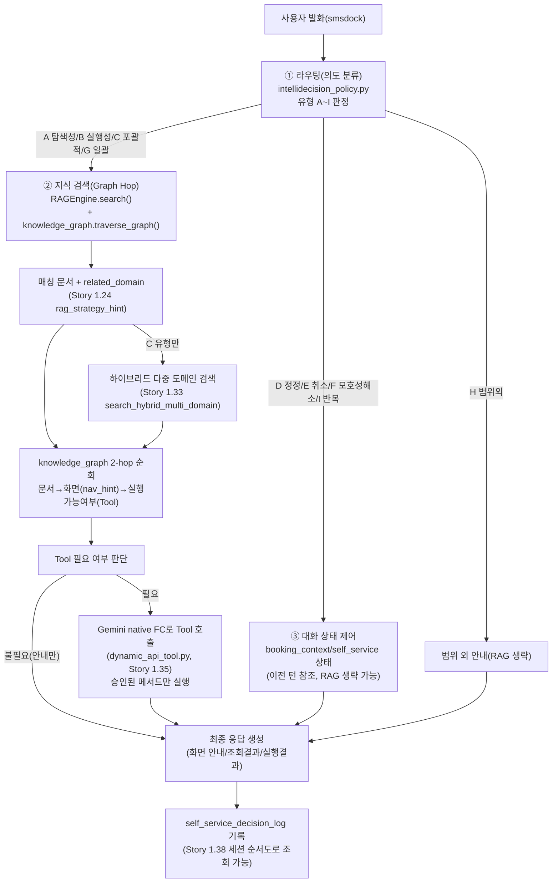

# AI 도우미(Self-Service) 정식 QA 테스트 계획 — 1001 테넌트 × 가상 의류판매 시뮬레이터

- 작성일: 2026-08-07
- 버전: v1.0
- 상태: Draft(실행 대기 — 사람이 직접 테스트 수행 예정)
- 관련 문서: [self-service-ai-assistant-master-qa.md](self-service-ai-assistant-master-qa.md),
  [self-service-ai-assistant-architecture.md](../architecture/self-service-ai-assistant-architecture.md),
  [self-service-ai-assistant-prd.md](../product/self-service-ai-assistant-prd.md),
  [SELF_SERVICE_RAG_INTELLIDECISION_ADVANCEMENT_RESEARCH.md](../design/SELF_SERVICE_RAG_INTELLIDECISION_ADVANCEMENT_RESEARCH.md)
- 픽스처: [clothing-store-assistant-manual.md](fixtures/clothing-store-assistant-manual.md)(자연어 매뉴얼,
  업로드용), `sip-pbx/scripts/qa_clothing_store_admin_simulator.py`(REST-API 시뮬레이터)

## 0. 목적 — 왜 이 QA가 필요한가

AI 도우미 기능의 근본 목적은 **"원격지에 있는, 내가 모르는 시스템이라도 자연어 매뉴얼 파일만
잘 만들어 업로드하면 서비스 이용 안내 + REST-API 설정변경 + REST-API 데이터조회 안내가 가능해야
한다"**는 것이다. 이 QA는 그 목적을 실제로 검증하기 위해, SIP PBX와 무관한 가상의 "의류 판매
관리자 사이트"를 대상으로 1001 테넌트에서 처음부터(clean 상태) 지식베이스를 구성하고, 사람이
smsdock(문자 채팅)으로 직접 문의하며 검증하는 절차를 정의한다.

## 1. 사전 준비 절차(테스트 실행자가 그대로 따라할 순서)

### Step 1 — 클린 상태 확보 (기존 도우미 지식 베이스 전량 삭제)

1. `/settings/ai-assistant/docs` → "지식 업로드" 탭 → "지식베이스 현황" 탭에서 1001 테넌트의
   기존 업로드 문서 전체 목록 확인.
2. 각 문서를 `DELETE /api/knowledge-base/documents/{id}` (프론트 삭제 버튼)로 전량 삭제.
3. 매뉴얼 Q&A(자동 색인분)도 함께 정리해야 한다면 `owner=1001`로 색인된 `self_service_manual`
   doc_type 청크도 확인·삭제(§7의 "재색인 전 정리" 참고 — 기본 매뉴얼은 온보딩용으로 남겨둘지
   여부를 팀과 사전 협의).
4. 검증: `GET /api/settings/ai-assistant/knowledge-base/inventory?owner=1001`의
   `total_chunks`/`auto_assembled` 항목이 0에 가깝게 초기화되었는지 확인.

### Step 2 — 시뮬레이터 서버 기동

```powershell
cd sip-pbx
python -m uvicorn scripts.qa_clothing_store_admin_simulator:app --port 8090 --reload
```

- 확인: `http://127.0.0.1:8090/health` → `{"status": "ok"}`
- OpenAPI 스펙 확보: `http://127.0.0.1:8090/openapi.json` (업로드용 원본)

⚠️ 포트 8090은 기존 서비스 포트(8000/8001)와 충돌하지 않는 별도 포트다. SIP PBX 본서버
(`start-all.ps1`)와 **별개 프로세스**로 기동해야 한다.

### Step 3 — 자연어 매뉴얼 업로드

1. `/settings/ai-assistant/docs` → "지식 업로드" 탭 → "tenant"(테넌트 지식 문서) 세그먼트.
2. `docs/qa/fixtures/clothing-store-assistant-manual.md` 파일을 업로드(owner=1001).
3. 업로드 후 "지식베이스 현황" 탭에서 청크 수(총 9개 Q&A, 7개 섹션)가 정확히 반영됐는지 확인.

### Step 4 — OpenAPI 스펙 업로드(REST-API Tool 연동)

1. 같은 "지식 업로드" 탭에서 Step 2의 `openapi.json`을 업로드(source_type=openapi,
   `base_url`은 자동 추출되지 않으면 `http://127.0.0.1:8090`으로 수동 입력).
2. 업로드 후 `PATCH /api/knowledge-base/documents/{id}/approve-methods`(프론트 "쓰기 승인" UI)로
   `PATCH /orders/{order_id}/status`, `PATCH /inventory/{sku}` 두 개의 쓰기 메서드를 명시적으로
   승인한다(Story 1.34 화이트리스트 원칙 — 승인 없이는 실제 쓰기 실행 안 됨).
3. "지식베이스 현황" 탭에서 `auto_assembled.setting_item_count`가 자동 분류되어 나타나는지 확인
   (Story 1.31 — 자연어 매뉴얼과 별개로 OpenAPI 메서드가 "설정 항목"으로 자동 구성되는지 검증).

### Step 5 — 테스트 진행

`GlobalSmsDock`(상시 최소화 상태로 떠 있는 채팅 패널, Story 1.39/1.44)을 통해 1001 테넌트
스스로에게 문자를 보내는 방식으로 아래 §3의 테스트 케이스를 순서대로 실행한다.

---

## 2. IntelliDecision 로직 이해 — 시각화 및 상세 설명

테스트를 진행하기 전에, 이 도우미가 "왜 그렇게 답하는지" 이해해야 정상/비정상 여부를 판단할 수
있다. 아래 3단계 로직을 먼저 숙지할 것.



### ① 라우팅(의도 분류) 상세

- `self_service_agent.py`가 매 턴마다 LLM에게 프롬프트(자동 렌더링, Story 1.19)로 유형 A~I 정의를
  주고 판정하게 한다. 키워드 사전 라우팅은 없음(2026-07-20 Story 2.6에서 의도적으로 제거,
  하이브리드 유형 C 사전 휴리스틱만 예외 — 아래 참고).
- 유형별 정의(요약, 전체는 `GET /intellidecision-policy` 또는 "AI 의사결정 로직" 탭 참고):

| 유형 | 이름              | 판정 기준(요약)                                   | RAG 사용                  | Tool 필요 가능성           |
| ---- | ----------------- | ------------------------------------------------- | ------------------------- | -------------------------- |
| A    | 탐색성            | "뭐가 있어?"류, 특정 기능 하나를 몰라서 묻는 질문 | O                         | 낮음(안내 위주)            |
| B    | 실행성            | "~해줘"류, 특정 설정 변경/실행 요청               | X(직접 Tool)              | 높음                       |
| C    | 포괄적 도움 요청  | "뭘 할 수 있어?"류, 범위가 넓은 질문              | O(하이브리드 다중 도메인) | 낮음                       |
| D    | 정정              | 직전 답변/설정을 정정하려는 요청                  | X                         | 중간(이전 컨텍스트 재사용) |
| E    | 실행 취소         | 방금 한 변경을 되돌리는 요청(Undo)                | X                         | 높음(직전 값 재적용)       |
| F    | 모호성 해소       | 이전 발화가 모호해 되묻는 대화                    | X                         | 낮음                       |
| G    | 일괄 처리         | 여러 항목을 한 번에 처리 요청                     | O                         | 높음                       |
| H    | 범위 외 이유 설명 | 이 도우미가 못 하는 일을 묻는 질문                | X                         | 없음                       |
| I    | 반복 요청         | 방금 답변을 다시 말해달라는 요청                  | X                         | 없음                       |

### ② 지식 검색(Graph Hop) 상세

- `knowledge_graph.py::traverse_graph()`가 "매칭 문서(1-hop) → 관련 화면(nav_hint, 2-hop) →
  해당 화면에서 실행 가능한 Tool 여부(3-hop, Story 1.35 이후 실제 실행 메타 포함)" 순으로
  그래프를 순회한다.
- 유형 C(포괄적 도움 요청)만 `looks_like_broad_help_query()` 휴리스틱이 참일 때
  `search_hybrid_multi_domain()`으로 여러 `related_domain`을 병렬 검색해 결과를 병합한다(Story
  1.33) — 이 QA 시나리오에서는 "order-management/inventory-management/sales-stats" 등 여러
  도메인에 걸친 질문(예: "관리자 사이트에서 뭘 할 수 있어?")으로 하이브리드 동작을 확인할 수 있다.
- **N홉 시나리오 검증 포인트**: §6/§7 매뉴얼 섹션(재고↔주문 연계, 통계↔재고 연계)이 실제로 2개
  이상의 `related_domain`을 넘나드는 hop_path를 만들어내는지 확인(아래 TC-HOP-01/02).

### ③ 대화 상태 제어 상세

- 정정(D)/취소(E)/모호성 해소(F)/반복(I) 유형은 RAG를 새로 실행하지 않고 **직전 턴의 상태**
  (`self_service_tool_messages`, 마지막 변경 값 등)를 참조한다.
- 취소(E)는 "가장 최근 변경의 old_value를 다시 흘려보내는" Undo 패턴(2026-07-23 설계)을 그대로
  쓰므로, 이번 시뮬레이터에서도 재고 수량을 바꾼 직후 "방금 한 거 취소해줘"로 되돌아가는지 검증
  가능하다(단, 이 패턴은 self_service_catalog_config 기반 설정에서 검증된 것이라 **동적 업로드
  문서 기반 Tool 실행에도 동일하게 적용되는지는 이번 QA의 확인 대상**, §5 갭 참고).

---

## 3. 테스트 케이스 — 유형별(N개 가짓수)

각 케이스는 "예상 동작"과 "실패 시 확인할 로그"를 함께 표기한다. 실제 판정 근거는
`logs/app.log`(구조화 로그)와 `GET /decision-log/sessions`(세션 순서도, Story 1.38)를 함께
확인할 것.

### 유형 A — 탐색성 (5건)

| #                                                                                    | 발화 예시                       | 예상 동작                                              | Hop 검증         |
| ------------------------------------------------------------------------------------ | ------------------------------- | ------------------------------------------------------ | ---------------- |
| A-1                                                                                  | "이 사이트에서 뭘 할 수 있어?"  | §1 소개 섹션 매칭, 3대 기능 요약 안내                  | 1-hop(단일 문서) |
| A-2                                                                                  | "주문 상태는 어떤 종류가 있어?" | §5 "주문 상태 값" Q&A 매칭                             | 1-hop            |
| A-3                                                                                  | "재고 부족한 상품 어떻게 봐?"   | §3 필터 안내 + 화면 경로("재고관리 화면") 언급         | 2-hop(문서→화면) |
| A-4                                                                                  | "매출 통계는 어디서 봐?"        | §4 통계 화면 안내                                      | 2-hop            |
| A-5                                                                                  | "주문 상태 바꾸는 API가 뭐야?"  | §5 API 목록 안내(URL을 사용자에게 그대로 노출하지 않고 |
| "주문 상태 변경 기능" 등 자연어로 순화하는지 확인 — 2026-07-20 nav_hint 원칙 재확인) | 2-hop                           |

### 유형 B — 실행성 (5건, Tool 실행 포함)

| #          | 발화 예시                                 | 예상 동작                                                | 사전 조건                   |
| ---------- | ----------------------------------------- | -------------------------------------------------------- | --------------------------- |
| B-1        | "ORD-1002 주문을 배송중으로 바꿔줘"       | 승인된 `PATCH /orders/{id}/status` 실행, 결과 확인 응답  | Step 4에서 메서드 승인 완료 |
| B-2        | "크루넥 니트 재고를 20개로 맞춰줘"        | `PATCH /inventory/{sku}` 실행(SKU 자동 매핑 또는 되묻기) | 승인 완료                   |
| B-3        | "재고를 -5개로 바꿔줘"(악의적/오류 유도)  | 422 오류를 사용자에게 안전하게 안내(원문 스택트레이스    |
| 노출 금지) | 승인 완료                                 |
| B-4        | "존재하지 않는 주문 ORD-9999 상태 바꿔줘" | 404를 안내하며 재시도/철회 유도                          | 승인 완료                   |
| B-5        | "재고 수량 바꿔줘"(SKU/수량 미지정)       | Tool 실행 대신 되묻기(유형 F로 전이 가능성) 확인         | -                           |

### 유형 C — 포괄적 도움 요청 (3건, 하이브리드 검증)

| #   | 발화 예시                                                | 예상 동작                                                           | Hop 검증         |
| --- | -------------------------------------------------------- | ------------------------------------------------------------------- | ---------------- |
| C-1 | "이 관리자 사이트에서 뭘 할 수 있는지 전체적으로 알려줘" | 주문/재고/통계 3개 `related_domain` 이상 매칭, 하이브리드 배지 노출 | multi-domain hop |
| C-2 | "재고랑 통계 관련해서 도와줄 수 있는 거 다 알려줘"       | inventory-management + sales-stats 2개 도메인 매칭                  | multi-domain hop |
| C-3 | "고객 응대할 때 참고할 수 있는 거 다 뭐가 있어?"         | 여러 섹션 요약 + "궁금한 부분 편하게 말씀해주세요" 마무리(규칙 7번) | multi-domain hop |

### 유형 D — 정정 (2건)

| #   | 시나리오                                                  | 예상 동작                                    |
| --- | --------------------------------------------------------- | -------------------------------------------- |
| D-1 | "ORD-1002를 배송중으로 바꿔줘" → "아니 배송완료로 바꿔줘" | 직전 대상(ORD-1002) 유지한 채 값만 정정 적용 |
| D-2 | "크루넥 니트 재고 20개로" → "20개 말고 15개로"            | 직전 대상(SKU) 유지, 값만 정정               |

### 유형 E — 실행 취소 (2건)

| #   | 시나리오                                  | 예상 동작             | 갭 확인                                                                |
| --- | ----------------------------------------- | --------------------- | ---------------------------------------------------------------------- |
| E-1 | 재고 수량 변경 직후 "방금 한 거 취소해줘" | 이전 값으로 롤백 실행 | **§5 갭 A** — 동적 업로드 Tool에 Undo 패턴이 실제 연결됐는지 확인 필요 |
| E-2 | 주문 상태 변경 직후 "되돌려줘"            | 이전 상태로 롤백      | 위와 동일                                                              |

### 유형 F — 모호성 해소 (2건)

| #   | 발화 예시                     | 예상 동작            |
| --- | ----------------------------- | -------------------- |
| F-1 | "그거 바꿔줘"(선행 맥락 없음) | 무엇을 바꿀지 되묻기 |
| F-2 | "재고 좀 바꿔줘"(상품 미특정) | 어떤 상품인지 되묻기 |

### 유형 G — 일괄 처리 (2건)

| #   | 발화 예시                                         | 예상 동작                                                                                      |
| --- | ------------------------------------------------- | ---------------------------------------------------------------------------------------------- |
| G-1 | "재고 부족한 상품들 전부 20개씩 채워줘"           | 다건 처리 시도 여부 확인(미지원이면 안내로 대체되는지, 임의 대량 실행 안 하는지 — 안전성 확인) |
| G-2 | "결제완료 상태 주문들 전부 배송준비중으로 바꿔줘" | 위와 동일                                                                                      |

### 유형 H — 범위 외 이유 설명 (2건)

| #   | 발화 예시                                      | 예상 동작                                                               |
| --- | ---------------------------------------------- | ----------------------------------------------------------------------- |
| H-1 | "환불 처리는 어떻게 해?" (매뉴얼에 없는 기능)  | "이 도우미는 해당 기능을 지원하지 않는다"고 명확히 안내(추측 답변 금지) |
| H-2 | "회원 등급을 VIP로 바꿔줘" (매뉴얼/API에 없음) | 위와 동일, Tool 오호출 없이 거부                                        |

### 유형 I — 반복 요청 (2건)

| #   | 발화 예시               | 예상 동작                     |
| --- | ----------------------- | ----------------------------- |
| I-1 | 답변 직후 "다시 말해줘" | 직전 응답 재출력(재검색 없음) |
| I-2 | "방금 뭐라고 했지?"     | 위와 동일                     |

### N홉 순회 전용 케이스 (§2 hop 검증 강화, 2건)

| #   | ID        | 발화 예시                                                                         | 예상 hop_path                                                                                      |
| --- | --------- | --------------------------------------------------------------------------------- | -------------------------------------------------------------------------------------------------- |
| 1   | TC-HOP-01 | "크루넥 니트 재고 얼마나 있어? 그리고 이 상품 주문 중에 아직 배송 안 된 거 있어?" | inventory-management → multi-hop-order-inventory → order-management (문서 간 relates_to 엣지 포함) |
| 2   | TC-HOP-02 | "요즘 베스트셀러가 뭐야? 그 상품 재고도 알려줘"                                   | sales-stats → multi-hop-stats-inventory → inventory-management                                     |

**총 케이스 수**: A(5)+B(5)+C(3)+D(2)+E(2)+F(2)+G(2)+H(2)+I(2)+HOP(2) = **27건**

---

## 4. 화면 안내 일치성 검증(§6-2 요구사항)

이번 QA 범위의 시뮬레이터는 **REST-API만 구현되어 있고 실제 웹 UI 화면은 구현하지 않았다**
(§5 갭 B 참고). 따라서 "도우미가 안내한 화면 경로가 실제 시뮬레이터 화면에 존재하는지"를
1:1로 시각 대조하는 것은 이번 라운드에서 **불가능**하다. 대안으로:

1. 매뉴얼(§2~§4)에 기술된 화면 구성(메뉴명, 버튼명, 필터명)과 도우미 응답에 언급되는 문구가
   **텍스트 수준에서 정확히 일치하는지** 사람이 대조하는 방식으로 대체 검증한다.
2. 향후 시각적 화면 대조까지 필요하면, 최소한의 정적 HTML 관리자 화면(주문/재고/통계 3개
   페이지, 상태 변경 없이 읽기 전용도 가능)을 추가로 만드는 후속 Story를 권장한다(§5 갭 B).

---

## 5. 기능 미비점(갭) — 다음 bmad 계획 대상

QA 케이스를 설계하며 코드를 확인한 결과 아래 갭을 발견했다:

- **갭 A — ✅ (2026-08-07) Story 1.51로 해소**: Story 1.35(`dynamic_api_tool.py`)의 실행기가
  `self_service_agent.py`의 LangGraph Tool-calling 3단계 폴백 루프에 연결되지 않았던 문제를
  [Story 1.51](../stories/1.51.dynamic-api-tool-agent-integration.story.md)에서 구현 완료(Status:
  Review). `build_dynamic_tools_for_owner()`가 owner의 승인된 OpenAPI 메서드를 LangChain Tool로
  변환해 정적 `SELF_SERVICE_TOOLS`와 함께 bind되므로, 유형 B(실행성) 테스트 케이스는 이제 실제
  REST-API 실행을 기대할 수 있다. **단, 실서버 IV(Task 4)는 아직 미실시** — 이번 QA 실행이 그
  검증을 겸한다.
- **갭 B**: 시뮬레이터에 실제 화면 UI가 없어 "화면안내 일치" 검증이 텍스트 대조로 제한됨(§4).
- **갭 C — ✅ (2026-08-07) Story 1.51로 해소**: 동적 업로드 문서 기반 Tool 실행에도 제네릭
  `_undo_last_dynamic_api_change` Tool이 연결되어, 유형 E(취소) 케이스도 동일하게 실제 Undo
  경로(PUT 역호출)를 기대할 수 있다. 마찬가지로 실서버 IV는 이번 QA 실행에서 처음 확인된다.
- **갭 D — ✅ (2026-08-07 같은 날 해소) 설정 카탈로그·화면 안내(screen_graph)가 owner-scoped가
  아니었던 문제**: DB(`self_service_catalog_config`에 owner 컬럼)·캐시(`catalog_config_loader`)·
  소비 함수(`settings_catalog.py`/`screen_graph.py`/`knowledge_graph.py`)·실제 호출부
  (`self_service_agent.py`/`hybrid_rag.py`/`tools.py`/API 라우터)까지 owner 전달을 완료해
  테넌트 커스텀 버전이 있으면 우선 사용, 없으면 전역 기본값으로 폴백하도록 구현·검증했다(조사·
  구현: [2026-08-07_catalog_screen_graph_tenant_scope_gap_and_plan.md](../reports/2026-08/2026-08-07_catalog_screen_graph_tenant_scope_gap_and_plan.md),
  [2026-08-07_catalog_screen_graph_tenant_scope_phase1_implementation.md](../reports/2026-08/2026-08-07_catalog_screen_graph_tenant_scope_phase1_implementation.md)).
  **단, 테넌트가 실제로 커스텀 카탈로그/screen_graph 버전을 만들 수 있는 프론트엔드 업로드·
  활성화 UI는 아직 없다(후속 Story)** — 그 UI가 추가되어야 "테넌트 A의 커스터마이즈가 테넌트
  B에 안 보이는지" 교차 검증 QA 케이스를 실제로 추가할 수 있다.

## 6. QA 실행 후 절차

1. 이 문서의 27개 케이스를 실행하며 각 케이스의 실제 결과(PASS/FAIL/N/A)와 근거 로그를
   `docs/reports/YYYY-MM/`에 실행 결과 리포트로 기록한다(이 문서는 계획, 결과는 별도 리포트).
2. 갭 A가 실제로 재현되면(Tool 미호출), 이는 이번 QA에서 발견된 결함이므로 §5의 우선순위대로
   bmad 절차(PRD 증분 → architecture → Story)를 밟아 "Story 1.35 LangGraph 통합" Story를
   신설해 보완 계획을 수립한다(이 문서와는 별도 산출물).
3. 시험 완료 후 시뮬레이터(port 8090)와 QA용 업로드 문서는 정리(삭제)하여 1001 테넌트를 다시
   클린 상태로 되돌린다.

*최종 업데이트: 2026-08-07*
