# TTS→RTP 송신 경로 구조 점검 (망 유실 가정 제외)

| 항목 | 내용 |
|------|------|
| **작성일** | 2026-03-26 |
| **상태** | 코드·로그 이벤트 기준 구조 검토 |
| **범위** | PBX 프로세스 **송신 측**: 주기 준수, 송신단 유실 가능성, 아키텍처 리스크 |
| **관련 코드** | `src/media/rtp_relay.py`, `src/ai_voicebot/pipecat/rtp_transport.py` |
| **관련 리포트** | [RTP_TTS_AUDIO_ISSUE_CALL_SESsPF16cQ.md](RTP_TTS_AUDIO_ISSUE_CALL_SESsPF16cQ.md) |

---

## 1. 송신 데이터 경로 (요약)

```mermaid
flowchart LR
  TTS[Pipecat TTS 서비스]
  OUT[SIPPBXOutputTransport]
  Q["queue.Queue PCM\nmax 150"]
  THR["전용 스레드\n_pcm_sender_thread_main"]
  UQ["queue.Queue RTP\n중간 버퍼"]
  DRAIN["_drain_tts_udp_out_queue\nasyncio Task"]
  UDP[caller_audio_transport.sendto]

  TTS -->|TTSAudioRawFrame| OUT
  OUT -->|send_audio_to_caller put_nowait| Q
  Q --> THR
  THR -->|20ms 패이싱·빌드| UQ
  UQ -->|call_soon_threadsafe| DRAIN
  DRAIN --> UDP
```

- **20 ms 패이싱·PCM→RTP 빌드**는 **전용 스레드** `_pcm_sender_thread_main` 가 담당한다(이벤트 루프와 분리).
- **UDP `sendto`**는 Windows Proactor 호환을 위해 **`async with _sendto_lock` + `DatagramTransport.sendto`** 를 **이벤트 루프**의 `_drain_tts_udp_out_queue` 에서 수행한다.
- TTS는 **가변 크기 PCM 청크**를 큐에 넣고, 루프가 청크를 꺼낸 뒤 **여러 개의 RTP 패킷**으로 쪼개 순차 전송한다.

---

## 2. 송신 측에서 말할 수 있는 “유실” 종류

망 구간은 제외하고, **이 프로세스 안에서만** 보면 다음이 가능하다.

| 메커니즘 | 로그·통계 | 의미 |
|----------|-----------|------|
| **PCM 큐 포화** | `pipecat_pcm_queue_full_dropping`, `stats["rtp_tts_packets_dropped"]` | `put_nowait` 실패 시 **청크 전체**가 버려짐. RTP 1패킷이 아니라 **수십~수백 ms 분량**이 한 번에 사라질 수 있음. |
| **UDP sendto 예외** | `rtp_sendto_failed`, `rtp_tts_send_errors` | 소켓/엔드포인트 문제 시 해당 패킷 미전송. |
| **RTP seq/ts 불연속** | `rtp_seq_discontinuity`, `rtp_timestamp_discontinuity` | 빌더 재생성·로직 버그·중복/누락 의심 시 확인용 (정상 스트림이면 거의 없어야 함). |

**정리:** 송신단 “패킷 유실”을 로그로 보려면 **`pipecat_pcm_queue_full_dropping` / `rtp_tts_packets_dropped` / `rtp_sendto_failed`** 를 우선 보면 된다.  
`rtp_interval_violation`만으로는 “패킷이 사라졌다”고 단정할 수 없다(아래 3절).

---

## 3. 로그에 이미 드러나는 문제: 간격 위반·스케줄 지연의 구조적 원인

### 3.1 절대시간 스케줄 + 늦었을 때 “따라잡기”

`_pcm_sender_thread_main`(스레드) + `_drain_tts_udp_out_queue`(루프)가 대략 다음을 한다 (`rtp_relay.py`).

- 목표 시각: `target_time = base + packet_index * 20ms`
- `sleep_needed < 0`이면 **`rtp_send_behind_schedule`** (스케줄보다 늦음)
- 그때는 sleep 없이 곧바로 전송에 가깝게 진행 → **직전 패킷과의 실제 간격이 20 ms가 아님**
  - 한 번 늦어지면 흔히 **한 번은 길게(예: 30 ms), 다음은 짧게(예: 10 ms)** 찍히는 식의 쌍이 된다.
- 로그의 **`rtp_interval_violation`**은 `INTERVAL_TOLERANCE_MS = 5` 로, **20 ms ± 5 ms 밖**이면 경고이므로, 위 “따라잡기” 패턴이 **구조적으로 대량 발생**할 수 있다.

즉, **간격 위반 로그의 상당 부분은 “UDP가 드롭했다”가 아니라 “송신 스케줄러가 지연 후 타임라인에 맞추려다 지터를 만든 것”**으로 해석하는 것이 맞다.

### 3.2 단일 이벤트 루프·다중 코루틴 경합

송신 루프는 **Pipecat 파이프라인·STT·LLM·기타 asyncio 작업과 같은 루프**에서 돈다.

- 다른 코루틴이 CPU·콜백을 오래 잡으면 `asyncio.sleep` 해상도·태스크 스케줄이 밀림 → **`behind_schedule` 증가**.
- LLM 대기 안내 TTS가 뜨는 구간은 **에이전트·RAG·TTS 동시에 바쁜 구간**이라, 로그 상으로 그때 `behind_schedule` / 윈도 통계가 악화되는 것과 **구조적으로 일치**한다.

### 3.3 Busy-wait

목표 시각까지 `while time.perf_counter() < target_time: pass` 로 **바쁜 대기**를 사용한다.

- 짧은 구간에서 타이밍은 맞추려 하지만, **CPU를 점유**해 같은 프로세스의 다른 작업(입력 RTP 처리, STT, 파이프라인)과 **간접 경합**을 일으킬 수 있다.
- 고부하 시 “정밀도”와 “전체 지연” 사이 트레이드오프가 된다.

### 3.4 녹음: 배치 큐 + 단일 워커 (2026-03)

`rtp_relay.py` 에서는 **`sip_recorder.enqueue_rtp_packet(...)`** (`put_nowait`) 로 인입한다. 소비는 `sip_call_recorder` 의 **단일** `_rtp_ingest_worker_loop` 가 큐에서 최대 64개씩 묶어 `_ingest_rtp_packet_sync` 로 처리한다.

- 과거: 패킷마다 `create_task(add_rtp_packet)` → 태스크 폭증·루프 부담 가능.  
- 상세·상수·폴백: `docs/reports/2026-03/RTP_RECORDING_BATCH_QUEUE_DESIGN.md` 참고.

### 3.5 PCM 큐 적체 (`pcm_queue_size` 상승)

`send_audio_to_caller`는 TTS 청크를 빠르게 넣고, 루프는 20 ms마다 조금씩만 깎아 쓴다.

- TTS가 **큰 청크를 연속**으로 밀어 넣으면 `pcm_chunk_queued`의 `queue_size_after`가 커지고, 로그의 **`rtp_tts_send_window_stats`의 `pcm_queue_size`** 와 합쳐져 보인다.
- 이는 **송신이 재생 실시간보다 뒤처져 버퍼가 쌓이는 상태**이며, 망이 아니라 **생산(TTS)·소비(20 ms 송신) 속도 차** 문제다.
- **maxsize=150 청크**에 도달하면 드롭(2절).

### 3.6 `tts_rtp_duration_mismatch` (파이프라인 순서)

`rtp_transport.py` 주석대로, **EndFrame이 먼저 처리**되고 뒤늦게 오디오 프레임이 오면 Notifier와 Output의 프레임·시간 합이 어긋난다.

- 이는 **송신 UDP 드롭이 아니라 파이프라인/프레임 순서·구간 경계** 이슈로 볼 여지가 크다.

---

## 4. 구조 점검 체크리스트 (송신 우선)

1. **주기**  
   - `rtp_tts_send_window_stats`의 `interval_avg_ms`가 ~20에 가깝더라도, `interval_max_ms` / `interval_min_ms`가 벌어지면 **단말 지터 버퍼 스트레스**는 남는다.  
   - “잘보내는지”는 **max/min·`behind_schedule_cumulative`**까지 같이 본다.

2. **송신단 유실**  
   - `pipecat_pcm_queue_full_dropping` 유무, `rtp_tts_packets_dropped` 추이.  
   - `rtp_sendto_failed` 유무.

3. **스케줄 지연 원인 후보**  
   - 동일 시각대 CPU·LLM·다른 asyncio 태스크 부하.  
   - (과거) 녹음 `create_task` 폭증 — **2026-03 이후 배치 큐·단일 워커로 완화**.  
   - Busy-wait와 다른 코루틴 간 경합.

4. **큐 적체**  
   - `pcm_queue_size`가 지속적으로 크면: TTS 청크 크기·생산 속도 vs 20 ms 송신 소비량 재검토.

---

## 5. 개선 방향 (개념만, 우선순위)

1. **스케줄 정책 재검토** — **구현됨 (2026-03)**  
   - 지연 시 “절대시간 따라잡기” 완화: **최소 패킷 간격(8ms)** + **22ms 이상 지연 시 `base_time` 소프트 재동기화** (`rtp_relay.py` `_pcm_sender_thread_main`).  
   - 상세: [RTP_SCHEDULE_SOFT_RESYNC_IMPLEMENTATION.md](RTP_SCHEDULE_SOFT_RESYNC_IMPLEMENTATION.md).

2. **송신 루프 격리** — **구현됨 (2026-03)**  
   - PCM 소비·20ms 대기·RTP 빌드는 `threading.Thread` (`_pcm_sender_thread_main`).  
   - `sendto`는 `queue.Queue` → `call_soon_threadsafe` → `_drain_tts_udp_out_queue` 에서 기존 `asyncio.Lock`으로 전송.  
   - AEC: `feed_reverse_stream`(스레드)와 `process_stream`(수신 경로)는 `threading.Lock`(`_aec_lock`)으로 직렬화.

3. **녹음 경로** — **구현됨 (2026-03)**  
   - `asyncio.Queue` + `_rtp_ingest_worker_loop`(배치 최대 64) + `enqueue_rtp_packet`; 워커 없음/종료 시 큐 drain 후 동기 인입.  
   - 문서: `docs/reports/2026-03/RTP_RECORDING_BATCH_QUEUE_DESIGN.md`.

4. **Busy-wait 완화**  
   - 짧은 구간만 busy-wait, 임계 이상이면 `asyncio.sleep` 위주로 돌려 CPU 여유 확보.

5. **백프레셔**  
   - PCM 큐가 임계 이상일 때 TTS/상위 파이프라인에 **흐름 제어**(pause / 작은 청크) 검토 — 단, 제품 정책과 바지인 동작과 맞춰야 함.

---

## 6. 한 줄 결론

**망을 제외하면, 현재 송신 경로는 “단일 asyncio 루프 위의 절대시간 20 ms 송신기 + PCM 큐” 구조이며, 로그의 간격 위반·스케줄 지연은 UDP 유실이라기보다 지연·따라잡기·루프 경합에서 오는 송신 지터로 해석하는 것이 맞다. 송신단 실유실은 `QueueFull` 드롭과 `sendto` 실패 로그로 먼저 확인해야 한다.**

---

*최종 업데이트: 2026-03-26*
