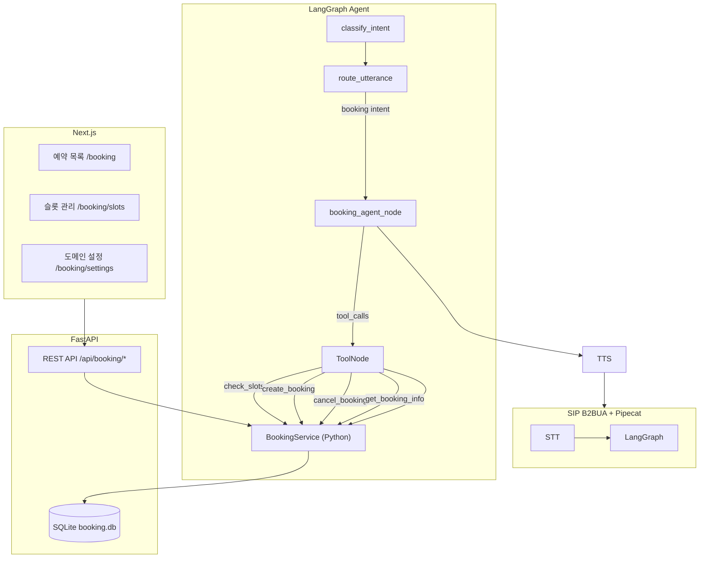

# AI Voicebot 예약 시스템 설계 및 구현 문서

| 항목 | 내용 |
|---|---|
| 작성일 | 2026-04-08 |
| 상태 | 구현 완료 |
| 관련 경로 | `sip-pbx/src/booking/`, `sip-pbx/src/api/routers/booking.py`, `sip-pbx/src/ai_voicebot/langgraph/` |

---

## 1. 개요

현재 AI SIP PBX 시스템(Pipecat + LangGraph + FastAPI + Next.js)에 **범용 예약 시스템**을 추가한다.
특정 도메인(레스토랑, 병원, 열차 등)에 종속되지 않고, 운영자가 Frontend 관리 페이지를 통해
도메인별 옵션(서비스명, 필드, 안내 메시지)을 설정할 수 있도록 설계한다.

### 핵심 요구사항

| # | 요구사항 |
|---|---|
| R-01 | REST API(CRUD)를 통한 예약 조회·생성·수정·취소 |
| R-02 | AI bot(LLM)이 function calling으로 REST API 직접 실행 |
| R-03 | SQLite 데이터베이스 사용 |
| R-04 | Frontend 웹 관리 페이지 |
| R-05 | 도메인 비종속 범용 구조 (옵션은 Frontend에서 설정) |

---

## 2. 전체 아키텍처



### 설계 원칙

- **도구 호출 방식**: LLM이 `ToolNode`를 통해 예약 서비스를 **직접 Python 함수 호출** (HTTP 오버헤드 없음)
- **의도 분류 우선순위**: 키워드 조기 분류 → LLM 분류 순서로 예약 의도 감지
- **동시성 제어**: SQLite `BEGIN IMMEDIATE` 트랜잭션으로 슬롯 중복 예약 방지 (낙관적 잠금)
- **테넌트 격리**: `owner`(SIP 착신 내선번호) 기준으로 모든 데이터 분리

---

## 3. DB 스키마 설계 (SQLite)

### 파일 위치
- `src/booking/database.py` — 연결·초기화
- `src/booking/models.py` — Pydantic 모델

### DB 파일
- 경로: 환경변수 `BOOKING_DB_PATH` (기본: `./data/booking.db`)
- 설정: WAL 모드, Foreign Key ON

### 테이블 구조

#### `booking_settings` — 테넌트별 도메인 설정

| 컬럼 | 타입 | 설명 |
|---|---|---|
| `owner` | TEXT PK | 테넌트 ID (SIP 착신번호) |
| `domain_type` | TEXT | `general` / `restaurant` / `hospital` / `hotel` 등 |
| `service_name` | TEXT | 서비스 표시명 (TTS 안내용) |
| `slot_duration_min` | INTEGER | 슬롯 단위(분) |
| `max_party_size` | INTEGER | 최대 예약 인원 |
| `require_phone` | INTEGER | 전화번호 필수 여부 |
| `require_name` | INTEGER | 이름 필수 여부 |
| `slot_label` | TEXT | 슬롯 표시 레이블 (테이블, 진료실 등) |
| `confirmation_msg` | TEXT | 예약 완료 TTS 메시지 템플릿 (`{booking_id}` 치환) |
| `extra_config` | TEXT | 도메인별 추가 설정 (JSON) |

**도메인별 `extra_config` 예시:**
```json
// 레스토랑
{
  "table_types": ["창가", "룸", "바"],
  "require_dietary_notes": true
}

// 병원
{
  "departments": ["내과", "외과", "소아과"],
  "require_symptom": true
}
```

#### `booking_slots` — 예약 가능 시간대

| 컬럼 | 타입 | 설명 |
|---|---|---|
| `slot_id` | TEXT PK | `sl_` 접두사 UUID |
| `owner` | TEXT | 테넌트 ID |
| `slot_date` | TEXT | 날짜 (YYYY-MM-DD) |
| `slot_time` | TEXT | 시각 (HH:MM) |
| `capacity` | INTEGER | 최대 예약 가능 수 |
| `booked_count` | INTEGER | 현재 예약 수 |
| `label` | TEXT | 슬롯 추가 설명 |
| `is_blocked` | INTEGER | 차단(예약 불가) 여부 |

- 인덱스: `(owner, slot_date)` — 날짜별 슬롯 조회 최적화
- UNIQUE 제약: `(owner, slot_date, slot_time)` — 동일 시간 중복 방지

#### `bookings` — 예약 내역

| 컬럼 | 타입 | 설명 |
|---|---|---|
| `booking_id` | TEXT PK | `bk_` 접두사 UUID |
| `owner` | TEXT | 테넌트 ID |
| `slot_id` | TEXT FK | 연결된 슬롯 (nullable) |
| `slot_date` | TEXT | 예약 날짜 |
| `slot_time` | TEXT | 예약 시각 |
| `customer_name` | TEXT | 예약자 이름 |
| `customer_phone` | TEXT | 예약자 전화번호 |
| `party_size` | INTEGER | 예약 인원 |
| `service_type` | TEXT | 서비스 종류 (도메인 의존) |
| `status` | TEXT | `confirmed` / `cancelled` / `no_show` / `completed` |
| `extra_data` | TEXT | 도메인별 추가 수집 데이터 (JSON) |
| `call_id` | TEXT | 연결된 통화 ID |
| `memo` | TEXT | 메모 |

#### `booking_schema_fields` — 도메인별 추가 수집 항목 정의

| 컬럼 | 타입 | 설명 |
|---|---|---|
| `field_id` | TEXT PK | `sf_` 접두사 UUID |
| `owner` | TEXT | 테넌트 ID |
| `field_key` | TEXT | 필드 키 (snake_case) |
| `field_label` | TEXT | UI 표시 레이블 |
| `field_type` | TEXT | `text` / `number` / `select` / `date` / `boolean` |
| `required` | INTEGER | 필수 여부 |
| `options` | TEXT | select 타입 선택지 (JSON 배열) |
| `sort_order` | INTEGER | 정렬 순서 |

---

## 4. REST API 설계

### 파일 위치
- `src/api/routers/booking.py` — FastAPI 라우터
- `src/services/booking_service.py` — 비즈니스 로직
- `src/api/main.py` — 라우터 등록 + `init_db()` 호출

### 엔드포인트 목록

#### 슬롯 관리

| 메서드 | 경로 | 설명 |
|---|---|---|
| `GET` | `/api/booking/slots?owner=&slot_date=` | 슬롯 목록 조회 |
| `POST` | `/api/booking/slots?owner=` | 슬롯 생성 |
| `PUT` | `/api/booking/slots/{slot_id}` | 슬롯 수정 (capacity, label, is_blocked) |
| `DELETE` | `/api/booking/slots/{slot_id}` | 슬롯 삭제 |

#### 예약 관리

| 메서드 | 경로 | 설명 |
|---|---|---|
| `GET` | `/api/booking?owner=&slot_date=&status=` | 예약 목록 조회 |
| `POST` | `/api/booking?owner=` | 예약 생성 |
| `GET` | `/api/booking/{booking_id}` | 예약 상세 조회 |
| `PUT` | `/api/booking/{booking_id}` | 예약 수정 |
| `DELETE` | `/api/booking/{booking_id}` | 예약 취소 (status=cancelled) |

#### 도메인 설정

| 메서드 | 경로 | 설명 |
|---|---|---|
| `GET` | `/api/booking/settings/{owner}` | 도메인 설정 조회 |
| `PUT` | `/api/booking/settings/{owner}` | 도메인 설정 저장 (UPSERT) |

#### 스키마 필드

| 메서드 | 경로 | 설명 |
|---|---|---|
| `GET` | `/api/booking/fields/{owner}` | 추가 수집 필드 목록 |
| `POST` | `/api/booking/fields/{owner}` | 필드 추가 |
| `PUT` | `/api/booking/fields/{owner}/{field_id}` | 필드 수정 |
| `DELETE` | `/api/booking/fields/{owner}/{field_id}` | 필드 삭제 |

### 동시성 처리 (예약 생성)

```
BEGIN IMMEDIATE  ←── WAL 모드에서 쓰기 잠금 즉시 획득
  SELECT * FROM booking_slots WHERE slot_id = ? AND is_blocked = 0
  IF booked_count >= capacity → ValueError (409 반환)
  UPDATE booking_slots SET booked_count = booked_count + 1
  INSERT INTO bookings ...
COMMIT
```

SQLite는 DB 파일 단위 잠금으로 단일 프로세스 내 동시성 보장.
수평 확장 시에는 Redis 분산 잠금 또는 PostgreSQL SELECT FOR UPDATE로 교체 필요.

---

## 5. LangGraph 연동 설계

### 파일 위치
- `src/ai_voicebot/langgraph/tools/booking_tools.py` — LangChain `@tool` 정의
- `src/ai_voicebot/langgraph/nodes/booking_agent.py` — 에이전트 노드
- `src/ai_voicebot/langgraph/nodes/classify_intent.py` — `booking` intent 추가
- `src/ai_voicebot/langgraph/nodes/route_utterance.py` — `booking` 라우팅 추가
- `src/ai_voicebot/langgraph/agent.py` — 노드/엣지 등록

### 의도 분류 흐름 (booking)

```
사용자 발화
    │
    ▼
[0차] 예약 키워드 조기 분류  ← ~2ms, LLM 스킵
  ("예약", "취소", "예약 가능", "빈 시간" 등 키워드 포함 시)
    │  매칭
    ▼
intent = "booking"  (confidence=0.95)
    │
    ▼
[1차] route_utterance  ← RAG/캐시 스킵 (rag_mode="skip")
    │
    ▼
booking_agent_node
    │
    ▼
LLM + BOOKING_TOOLS (bind_tools)
    │ tool_calls 있으면
    ▼
BookingService 직접 호출 (Python 함수, HTTP 없음)
    │ tool_calls 없으면 (최종 응답)
    ▼
update_state → END → TTS
```

### 등록된 Tool 목록

| Tool 이름 | 설명 |
|---|---|
| `check_available_slots` | 날짜·인원으로 가용 슬롯 조회 |
| `get_booking_info` | 예약번호로 예약 상세 조회 |
| `create_booking_tool` | 예약 생성 (confirmation_msg 치환 포함) |
| `cancel_booking_tool` | 예약 취소 |
| `get_booking_settings` | 도메인 설정 조회 (LLM 안내 메시지 구성용) |

### booking_agent_node 동작 방식

```python
# LLM에 tool 바인딩
llm_with_tools = raw_llm.bind_tools(BOOKING_TOOLS)

# function calling 루프 (최대 5라운드)
for round in range(MAX_TOOL_ROUNDS):
    ai_msg = await llm_with_tools.ainvoke(messages)
    if not ai_msg.tool_calls:
        # 최종 텍스트 응답 → TTS
        break
    # tool 실행 후 결과를 메시지에 추가
    for tc in ai_msg.tool_calls:
        result = execute_tool(tc.name, tc.args)
        messages.append(ToolMessage(result, tc.id))
```

**폴백**: `langchain_core` 미설치 또는 ChatModel 미지원 시, 오늘 슬롯 정보를 컨텍스트로 제공하는 단순 LLM 텍스트 응답으로 대체.

### StateGraph 변경 사항 (schema version: 5 → 6)

```
[기존 그래프]
classify_intent → route_utterance → check_cache → ...

[추가된 경로]
classify_intent → route_utterance
                        │
                   (intent=booking)
                        ↓
                  booking_agent ──────→ update_state → END
```

---

## 6. Frontend UI 설계

### 파일 위치
- `frontend/app/booking/page.tsx` — 예약 목록
- `frontend/app/booking/slots/page.tsx` — 슬롯 관리
- `frontend/app/booking/settings/page.tsx` — 도메인 설정
- `frontend/components/AppHeader.tsx` — 네비게이션 추가
- `frontend/types/index.ts` — 타입 정의 추가

### 페이지 구성

#### `/booking` — 예약 목록

- 날짜 / 상태 / 전화번호 필터 검색
- 예약 테이블: 예약번호, 날짜·시간, 예약자, 인원, 서비스, 상태, 메모
- 상태 변경 액션: `확정 → 완료`, `확정 → 취소`, `확정 → 노쇼`
- 상태별 컬러 배지 표시

#### `/booking/slots` — 슬롯 관리

- 날짜별 그룹핑 뷰
- 슬롯 생성 폼 (날짜, 시간, 최대 인원, 레이블)
- 예약 현황 진행바 (예약 수 / 최대 수)
- 슬롯 차단/해제 토글
- 슬롯 삭제

#### `/booking/settings` — 도메인 설정

**기본 설정 섹션:**
- 도메인 타입 선택 (general / restaurant / hospital / hotel / beauty / fitness)
- 서비스 이름, 슬롯 단위(분), 최대 인원, 슬롯 레이블
- 이름/전화번호 필수 여부 체크박스
- 예약 완료 안내 메시지 템플릿 (`{booking_id}` 치환 지원)

**추가 수집 필드 섹션:**
- 도메인별 커스텀 필드 추가/삭제
- 필드 타입: text / number / select / date / boolean
- select 타입: 선택지 쉼표 구분 입력
- 필수 여부 설정, 정렬 순서 설정

### 타입 정의 (`frontend/types/index.ts` 추가)

```typescript
interface Booking { booking_id, owner, slot_id, slot_date, slot_time,
  customer_name, customer_phone, party_size, service_type,
  status, extra_data, call_id, memo, created_at, updated_at }

interface BookingSlot { slot_id, owner, slot_date, slot_time,
  capacity, booked_count, available, label, is_blocked, ... }

interface BookingSettings { owner, domain_type, service_name,
  slot_duration_min, max_party_size, require_phone, require_name,
  slot_label, confirmation_msg, extra_config, updated_at }

interface SchemaField { field_id, owner, field_key, field_label,
  field_type, required, default_value, options, sort_order, created_at }
```

---

## 7. 구현된 파일 목록

| 파일 | 종류 | 설명 |
|---|---|---|
| `src/booking/__init__.py` | 신규 | 패키지 초기화 |
| `src/booking/database.py` | 신규 | SQLite 연결·초기화·DDL |
| `src/booking/models.py` | 신규 | Pydantic Request/Response 모델 |
| `src/services/booking_service.py` | 신규 | CRUD 비즈니스 로직 |
| `src/api/routers/booking.py` | 신규 | FastAPI 라우터 (14개 엔드포인트) |
| `src/api/main.py` | 수정 | 라우터 등록, `init_db()` 호출 추가 |
| `src/ai_voicebot/langgraph/tools/__init__.py` | 신규 | 패키지 초기화 |
| `src/ai_voicebot/langgraph/tools/booking_tools.py` | 신규 | 5개 LangChain Tool |
| `src/ai_voicebot/langgraph/nodes/booking_agent.py` | 신규 | 예약 에이전트 노드 |
| `src/ai_voicebot/langgraph/nodes/classify_intent.py` | 수정 | `booking` intent, 키워드 조기 분류 추가 |
| `src/ai_voicebot/langgraph/nodes/route_utterance.py` | 수정 | `booking` 직행 라우팅 추가 |
| `src/ai_voicebot/langgraph/agent.py` | 수정 | `booking_agent` 노드/엣지 등록, schema v6 |
| `src/ai_voicebot/langgraph/state.py` | 수정 | `booking_context` 상태 필드 추가 |
| `frontend/app/booking/page.tsx` | 신규 | 예약 목록 관리 페이지 |
| `frontend/app/booking/slots/page.tsx` | 신규 | 슬롯 관리 페이지 |
| `frontend/app/booking/settings/page.tsx` | 신규 | 도메인 설정 페이지 |
| `frontend/components/AppHeader.tsx` | 수정 | '예약 관리' 네비 추가 |
| `frontend/types/index.ts` | 수정 | 예약 관련 타입/상수 추가 |

---

## 8. 주요 설계 결정 사항

### 8-1. LLM Tool Use 방식 선택

**결정**: LLM function calling / tool use 방식 (`ToolNode` + `bind_tools`)

**이유**:
- 고정 노드 방식(intent → 고정 API 호출)은 수집 정보가 부족할 때 대화 루프 구현이 복잡
- Tool Use 방식은 LLM이 대화 맥락에 따라 필요한 정보를 자연스럽게 추가 질문하며 수집 가능
- Progressive Slot Filling (정보 수집 단계별 진행)이 자동으로 처리됨

### 8-2. 슬롯 소스 방식 선택

**결정**: 운영자가 Frontend에서 직접 슬롯을 사전 등록하는 방식

**이유**:
- 자동 생성 방식(설정값으로 슬롯 동적 생성)보다 운영자 제어권이 명확
- 특정 날짜 차단, 용량 변경 등 예외 처리가 용이
- 슬롯 레이블로 물리적 자원(테이블 번호, 진료실 등) 매핑 가능

### 8-3. BookingService 직접 호출

**결정**: Tool → HTTP REST API가 아닌 Python 함수 직접 호출

**이유**:
- HTTP 오버헤드 제거 (~수십ms 절감)
- 동일 프로세스 내 SQLite 트랜잭션 일관성 보장
- 인증/네트워크 복잡도 감소

### 8-4. 범용 설정 구조

**결정**: `booking_settings.extra_config` (JSON) + `booking_schema_fields` 테이블 이중 구조

**이유**:
- `extra_config`: 도메인별 단순 설정값 (테이블 타입 목록, 진료과 목록 등)
- `booking_schema_fields`: 예약 시 수집할 추가 필드를 동적으로 정의 (필드명·타입·필수 여부 등)
- 두 구조 조합으로 코드 변경 없이 신규 도메인 온보딩 가능

---

## 9. 확장 포인트

| 확장 항목 | 현재 | 향후 |
|---|---|---|
| 예약 알림 | 없음 | SMS/카카오 알림 연동 (confirmation_msg 기반) |
| 캘린더 연동 | 없음 | Google Calendar API 슬롯 동기화 |
| 반복 슬롯 생성 | 수동 | 주기 설정으로 자동 생성 (예: 매주 월-금 09:00~18:00) |
| 분산 잠금 | SQLite 단일 | Redis 분산 잠금 (수평 확장 시) |
| 예약 이력 검색 | 단순 필터 | Elasticsearch 전문 검색 |
| 다국어 지원 | 한국어 | confirmation_msg 언어별 템플릿 |

---

## 10. 테스트 시나리오 (주요 케이스)

### AI Bot 예약 대화 예시

```
고객: 내일 오후 두시에 두 명 예약하고 싶어요.

[classify_intent] booking 키워드 매칭 → booking intent (2ms, LLM 스킵)
[booking_agent] LLM → get_booking_settings() 호출 → 서비스명 확인
             → check_available_slots(owner, "2026-04-09", party_size=2) 호출
             → 가용 슬롯 확인 (14:00 슬롯 있음)
             → LLM: "이름과 연락처를 알려주세요."

고객: 홍길동이고요, 010-1234-5678이에요.

[booking_agent] LLM → create_booking_tool(owner, "2026-04-09", "14:00",
                         "홍길동", "010-1234-5678", 2)
             → booking_id = "bk_abc123def456"
             → confirmation_msg 치환
             → "예약이 완료되었습니다. 예약번호는 bk_abc123def456입니다."
```

### API 직접 테스트

```bash
# 슬롯 생성
curl -X POST "http://localhost:8000/api/booking/slots?owner=1001" \
  -H "Content-Type: application/json" \
  -d '{"slot_date":"2026-04-10","slot_time":"10:00","capacity":4,"label":"창가 자리"}'

# 예약 생성
curl -X POST "http://localhost:8000/api/booking?owner=1001" \
  -H "Content-Type: application/json" \
  -d '{"slot_date":"2026-04-10","slot_time":"10:00","customer_name":"홍길동",
       "customer_phone":"010-1234-5678","party_size":2}'

# 예약 목록 조회
curl "http://localhost:8000/api/booking?owner=1001&slot_date=2026-04-10"
```
