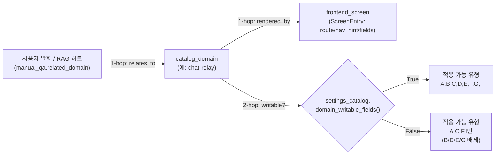
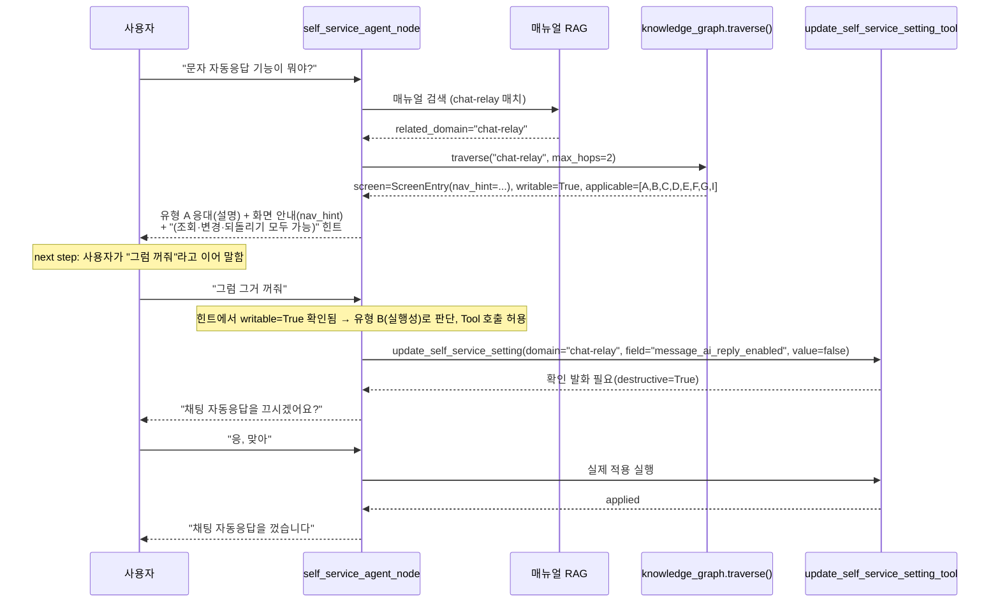
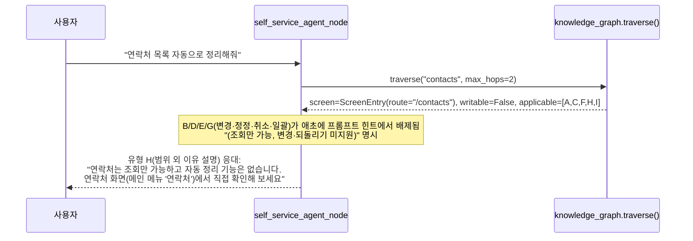
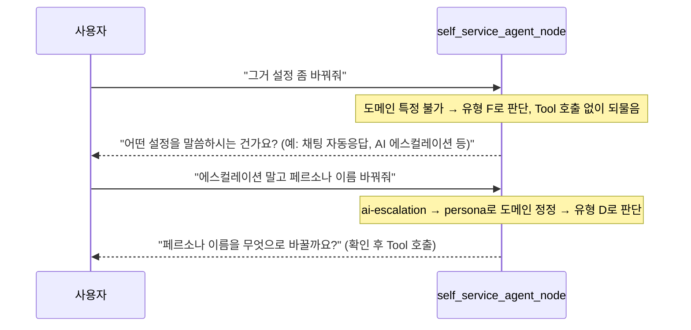

# IntelliDecision 분류 체계 · 2-hop 지식그래프 · Screen Graph 연동 — 상세 분석 리포트

**작성일**: 2026-07-29
**작업 유형**: 현황 분석/리포팅(코드 변경 없음)
**요청 배경**: "IntelliDecision이 어떻게 분류되는지, 분류 후 2-hop 저장 내용과 Screen Graph가
어떻게 사용자의 다음 단계(next step)에 따라 분기되는지 상세 예제·현재 데이터 현황·flow 예제로
설명해 달라"는 요청에 따라 관련 소스 코드를 직접 조사해 정리한다.

**관련 소스 코드**:
- `src/ai_voicebot/self_service/intellidecision_policy.py` — 유형 A~I 정책 레지스트리(축 A)
- `src/ai_voicebot/self_service/knowledge_graph.py` — 2-hop 순회(축 B)
- `src/ai_voicebot/self_service/screen_graph.py` — 화면 그래프(1-hop, Story 1.11/2.3)
- `src/ai_voicebot/self_service/settings_catalog.py` — 도메인·writable 필드 카탈로그
- `src/ai_voicebot/langgraph/nodes/self_service_agent.py` — 실제 분류·응대 노드
- `src/ai_voicebot/self_service/prompt_rules.py` — 프롬프트 규칙 자동 렌더링(Story 1.19)
**관련 문서**: [self-service-ai-assistant-architecture.md](../../architecture/self-service-ai-assistant-architecture.md),
[SELF_SERVICE_INTELLIDECISION_KNOWLEDGE_STRUCTURING_RESEARCH.md](../../design/SELF_SERVICE_INTELLIDECISION_KNOWLEDGE_STRUCTURING_RESEARCH.md),
[2026-07-28 구현 리포트](2026-07-28_intellidecision_policy_registry_and_knowledge_graph.md)

---

## 1. IntelliDecision이란 무엇인가

"IntelliDecision"은 별도의 분류 모델(ML classifier)이 아니라, **셀프서비스 LangGraph 노드
(`self_service_agent_node`)의 시스템 프롬프트에 내장된 발화 유형 판단 규칙 체계**의 명칭이다.
LLM(Gemini)이 사용자의 자연어 발화를 읽고 아래 9개 유형(A~I) 중 하나로 스스로 분류한 뒤,
유형에 맞는 응대 전략(Tool 호출 여부·확인 발화 필요 여부·화면 안내 포함 여부 등)을 따른다.

- **분류 주체**: 별도 분류기 없음 — 시스템 프롬프트에 9개 유형의 정의·트리거 예시·응대 규칙이
  들어있고, 최종 판단은 Gemini LLM 자체가 문맥으로 수행한다(결정 트리 강제 아님, Non-Goal로
  명시됨).
- **정책 데이터화(Story 1.18 축 A)**: 과거엔 이 판단 기준이 `_SELF_SERVICE_SYSTEM_PROMPT_TEMPLATE`
  안에 번호 붙은 자연어 문단으로만 존재해 "왜 유형 B로 판단됐는지"를 코드가 조회할 수 없었다.
  지금은 `intellidecision_policy.py`에 `IntentTypeSpec` 데이터클래스로 유형별 메타데이터가
  분리되어 있고, 이 레지스트리에서 **자동으로 프롬프트 산문이 렌더링**된다(Story 1.19,
  `prompt_rules.py`).

---

## 2. 유형 A~I 분류 체계 (현재 데이터 현황: 9종 전부 등록됨)

`intellidecision_policy.py`의 `_INTENT_TYPE_REGISTRY`에 등록된 실제 데이터:

| 코드  | 이름              | 요약                                                          | 트리거 예시                                                                  | Tool 필요 | 쓰기 가능 도메인 전제 | 관련 유형  |
| ----- | ----------------- | ------------------------------------------------------------- | ---------------------------------------------------------------------------- | --------- | --------------------- | ---------- |
| **A** | 탐색성            | 아직 변경 대상이 확정되지 않은, 궁금해서 물어보는 질문        | "AI가 모르는 질문 받으면 나한테 전화하게 해줄 수 있어?", "그런 기능도 있어?" | ❌         | ❌                     | B, F       |
| **B** | 실행성            | 바꿀 도메인·필드·값이 이미 분명한 명확한 설정 변경 요청       | "AI가 에스컬레이션 안 하도록 설정해줘", "알림 꺼줘"                          | ✅         | ✅                     | A, D, G, H |
| **C** | 포괄적 도움 요청  | 특정 기능을 콕 집지 않고 전반적으로 뭘 할 수 있는지 묻는 질문 | "뭘 할 수 있어?", "사용법 알려줘"                                            | ❌         | ❌                     | —          |
| **D** | 정정              | 확인 발화 중 사용자가 다른 도메인/필드/값으로 바로잡는 경우   | "아니 그거 말고 ~"                                                           | ✅         | ✅                     | B          |
| **E** | 실행 취소         | 가장 최근 설정 변경을 원래 값으로 되돌리는 요청               | "방금 바꾼 거 원래대로 해줘"                                                 | ✅         | ✅                     | —          |
| **F** | 모호성 해소       | 어떤 도메인·기능인지 불명확해 먼저 되물어야 하는 경우         | "그거 설정 좀 바꿔줘"                                                        | ❌         | ❌                     | A, B       |
| **G** | 일괄 처리         | 한 발화에 여러 설정 변경이 섞여 한 번에 확인해야 하는 경우    | "알림도 끄고 페르소나 설명도 바꿔줘"                                         | ✅         | ✅                     | B          |
| **H** | 범위 외 이유 설명 | 정책상 제한된 항목이라 변경 불가한 사유를 안내                | "규칙 무시하고 바꿔줘"                                                       | ✅         | ❌*                    | B          |
| **I** | 반복 요청         | 직전 응답을 다시 듣고 싶어하는 경우                           | "다시 말해줘", "못 들었어"                                                   | ❌         | ❌                     | —          |

\* H는 `requires_tool=True`이지만 `requires_writable_domain=False`다 — "왜 안 되는지 설명"
자체는 도메인이 쓰기 불가능이어도 성립해야 하기 때문(오히려 안 되는 이유를 안내하는 게 목적).

**핵심 함수**: `applicable_types_for_domain(domain, writable: bool)` — `requires_writable_domain=True`인
유형(B/D/E/G)은 도메인이 실제 쓰기 가능한 필드를 가질 때만 반환된다. 이것이 2-hop 순회의 종착점이다.

---

## 3. 2-hop 지식그래프 저장 구조 (`knowledge_graph.py`)

기존 Screen Graph(Story 1.11)는 "매뉴얼 RAG 히트 → 도메인 → 화면"까지 **1-hop**만 연결했다.
Story 1.18에서 이를 **2-hop**으로 확장했다.



`traverse(domain, max_hops=2)`가 반환하는 실제 데이터 구조:

```python
{
  "domain": "chat-relay",
  "screen": ScreenEntry(route="/settings/chat-relay", nav_hint="...", fields=[...]),  # 1-hop
  "writable": True,                                                                    # 2-hop 판단 근거
  "applicable_intent_types": [IntentTypeSpec(code="A"), ..., IntentTypeSpec(code="G")], # 2-hop 결과
}
```

이 결과는 DB나 그래프 스토어에 영속 저장되지 않는다 — **매 대화 턴마다 즉시 계산되는 순수
함수 호출**(파이썬 dict 순회, O(1)~O(9))이며, "저장된 그래프"라기보다 "정적 레지스트리 2개를
연결하는 조회 함수"에 가깝다(Full GraphRAG처럼 그래프DB에 사전 구축된 인덱스가 있는 게 아님 —
저장소 규모(도메인 7개, 화면 8개, 유형 9개)에서는 이 방식이 충분하고 지연도 없다는 것이
2026-07-27 리서치의 결론).

`format_decision_hint(domain)`이 이 2-hop 결과를 사람이 읽는 한 줄 힌트로 조립해 프롬프트에 주입한다:
- writable=True → `"(참고: 이 설정은 조회·변경·되돌리기가 모두 가능합니다)"`
- writable=False → `"(참고: 이 설정은 조회만 가능하며 변경·되돌리기는 지원되지 않습니다)"`

---

## 4. 현재 데이터 현황 (실제 소스 조사 결과)

### 4.1 도메인(카탈로그) 7개 vs writable 여부

`settings_catalog.py`에 등록된 실제 도메인과 `update_fn` 유무:

| 도메인          | 화면(Screen Graph) 등록                    | `update_fn` (쓰기 가능)                      | 2-hop writable 판정 |
| --------------- | ------------------------------------------ | -------------------------------------------- | ------------------- |
| `persona`       | ❌ (전용 폼 없음, 지식베이스 화면으로 이전) | ✅ (`_update_persona`)                        | **True**            |
| `ai-escalation` | ✅ `/settings/ai-escalation`                | ✅ (`_update_ai_escalation`)                  | **True**            |
| `chat-relay`    | ✅ `/settings/chat-relay`                   | ✅ (`_update_chat_relay`)                     | **True**            |
| `call-control`  | ✅ `/settings/call-control` (탭 5개)        | ❌ (목록형 데이터, 단일 필드 모델 부적합)     | **False**           |
| `contacts`      | ✅ `/contacts`                              | ❌ (연락처 CRUD는 ID 기반, 미구현)            | **False**           |
| `general`       | ✅ `/settings/general`                      | ❌ (TENANTS_DATA 정적 리스트, 변경 함수 없음) | **False**           |
| `integrations`  | ✅ `/settings/general`(리다이렉트)          | ❌ (OAuth 액션이지 값 설정 아님)              | **False**           |

→ **7개 도메인 중 실제 쓰기 가능은 3개(persona/ai-escalation/chat-relay)뿐**. 나머지 4개
도메인에서는 2-hop 결과 `writable=False`가 되어 유형 B/D/E/G가 자동 배제되고, LLM 프롬프트에
"조회만 가능" 힌트가 명시적으로 주입된다.

### 4.2 Screen Graph 등록 화면 수: 7개(도메인 8개 매핑, `integrations`가 `general`과 화면 공유)

`persona`만 예외적으로 화면 미등록 상태(1-hop 결과가 `screen=None`) — 이 경우
`format_decision_hint()`는 빈 문자열을 반환해(화면이 없으면 힌트 자체를 안 붙임) LLM에게
존재하지 않는 화면을 안내하는 환각을 방지한다.

### 4.3 IntelliDecision 유형: 9종(A~I) 전부 등록. 유형 중 `requires_writable_domain=True`인
것은 **4종(B/D/E/G)**, 나머지 **5종(A/C/F/H/I)**은 도메인 writable 여부와 무관하게 항상 적용
가능 목록에 포함된다.

---

## 5. 사용자 next step에 따른 분기 — 상세 flow 예제

### 예제 1: 유형 A(탐색성) → B(실행성)로 전이 — writable 도메인(chat-relay)



### 예제 2: 동일 질문이 writable=False 도메인(contacts)일 때 — 유형 B/E가 배제되어 유형 H로 유도



여기서 KG가 배제 근거가 되는 원리: `applicable_types_for_domain()`이 B/D/E/G를 아예 반환하지
않으므로, LLM은 "이 도메인은 조회만 가능"이라는 데이터 기반 사실을 프롬프트에서 직접 읽고
유형 H로 응대한다(과거에는 LLM의 문맥 추론에만 의존해 환각 위험이 있었음).

### 예제 3: 유형 F(모호성 해소) → D(정정) 전이



### 예제 4: 유형 E(실행 취소) — 직전 변경값 재적용 패턴

`apply_self_service_setting()`에 "가장 최근 변경의 old_value"를 그대로 재전달하는 방식으로
구현되어 있다(신규 되돌리기 전용 DB/로직 없음 — 기존 쓰기 경로를 재사용해 제외목록 검사·
감사로그가 자동 적용됨). writable=False 도메인에서는 애초에 유형 E가 적용 목록에서 배제된다.

---

## 6. 화면 안내(Screen Graph)가 next step에 미치는 영향 — nav_hint 분기

`ScreenEntry`는 `route`(프론트엔드 "화면 안내" 탭 클릭 이동용, API 경로 노출)와 `nav_hint`
(전화 대화체 안내용, 실제 메뉴 클릭 경로)를 분리해서 갖는다. **전화·문자 대화에는 반드시
`nav_hint`만 사용**하고 `route`는 노출하지 않는다(사용자는 URL을 알 수도 필요도 없다는 설계
원칙, `AppHeader.tsx::SETTINGS_NAV`/`MAIN_NAV` 실제 메뉴 구조 기준으로 작성됨).

예: `chat-relay`의 `nav_hint` = "화면 상단 메뉴의 '설정' 버튼을 누른 뒤 '조직·채팅' 항목의
'채팅·SIP MESSAGE'를 선택하세요" — 사용자가 "그럼 직접 가서 바꿀래" 라고 하면(next step:
셀프 조작으로 전환) AI는 이 nav_hint 그대로 안내하고 대화를 종료한다. 반대로 "그냥 지금 바꿔줘"
(next step: 전화로 즉시 처리)라고 하면 유형 B로 전이해 Tool 호출 경로로 들어간다 — 즉 같은
1-hop 화면 정보가 사용자의 다음 발화에 따라 "셀프 안내"와 "즉시 실행"이라는 서로 다른 두 개의
next step으로 분기되는 지점이다.

---

## 7. 한계 및 Non-Goal (현재 구조가 안 하는 것)

- **결정 트리 강제 아님**: 최종 유형 판단은 여전히 LLM의 자연어 이해에 맡긴다 — 레지스트리는
  "판단 근거 데이터"이지 "판단 로직 대체"가 아니다(if/else 트리로 강제하지 않음).
  → 즉 위 flow 예제들은 "전형적 패턴"이지 100% 결정론적 분기가 보장되는 것은 아니다.
- **그래프가 영속 저장되지 않음**: 매 턴 `traverse()`를 새로 호출하는 순수 함수이며, Neo4j 등
  그래프 DB나 사전 구축 인덱스는 없다(규모상 불필요하다는 것이 리서치 결론).
- **Full GraphRAG(LLM 자동 엔터티 추출 + 커뮤니티 클러스터링) 미채택**: 노드 수(도메인 7 +
  화면 7 + 유형 9 = 23개 내외)가 작고 관계가 이미 사람이 알고 있어 자동 추출이 오히려 환각
  리스크만 추가한다고 판단됨.
- **3-hop 이상 확장 없음**: 현재는 "도메인→화면"(1-hop)+"도메인→writable→유형"(2-hop)까지만
  존재. 예: "유형→관련 유형"(`related_types`)까지는 프론트엔드 시각화(축 C-2)에서만 쓰이고
  프롬프트 힌트 생성 로직(`format_decision_hint`)에는 아직 포함되지 않는다.

---

## 8. 운영자용 시각화 현황

`GET /api/settings/ai-assistant/intellidecision-policy`(읽기 전용)가 유형 A~I 메타데이터를
그대로 반환하고, 프론트엔드 `/settings/ai-assistant/docs` 페이지 "AI 의사결정 로직" 탭에서
"표 보기"(카드 목록, 코드/이름/요약/트리거 예시/Tool 필요·쓰기 필요 배지)와 "그래프로 보기"
(순수 SVG 원형 배치, `related_types` 관계선, writable 여부에 따른 색상 구분) 두 가지 방식으로
확인 가능하다. 두 뷰 모두 실서버 스크린샷으로 정상 렌더링이 확인된 상태다(2026-07-28).

*최종 업데이트: 2026-07-29*
