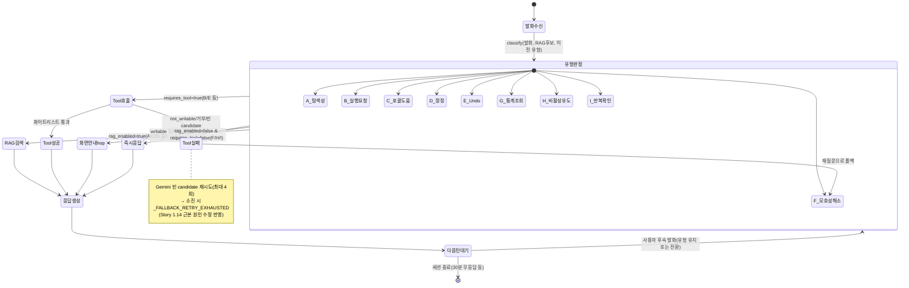

# Epic 4(FR35) 계획 리포트 — 플랫폼 성숙화·UX 투명성 전면 개편 + 중간 점검

**작성일**: 2026-08-06
**작성자**: Copilot (BMAD PM/Architect 역할)
**상태**: 계획 수립(코드 변경 없음) — PRD/architecture/Story 문서 증분 반영, 사용자 검토 대기
**관련 선행 문서**: [FR33 계획](2026-08-04_fr33_upload_unification_and_knowledge_base_platform_planning.md),
[FR34 계획](2026-08-05_epic3_domain_agnostic_agent_platform_planning.md),
[MCP vs Client-Centric 리서치](../../design/MCP_VS_CLIENT_CENTRIC_UNIVERSAL_AGENT_MARKET_RESEARCH.md),
[RAG·IntelliDecision 고도화 리서치](../../design/SELF_SERVICE_RAG_INTELLIDECISION_ADVANCEMENT_RESEARCH.md)

> **이 리포트는 계획 문서다.** 아래 UI 미리보기는 최종 디자인 확정이 아니라 검토용 초안이며,
> 사용자 승인 후 Story 착수·구현에 들어간다(신규 하네스 규칙 §1.5).

---

## 0. 요청 요약

사용자가 두 갈래 요청을 동시에 제시했다:

1. **Epic 3(FR34) 완료 이후에도 남은 개선 요구 6가지**: ①업로드 통합(설정관리 탭+지식업로드 탭
   이원화 해소) ②진짜 도메인 비종속 자동 지식베이스 구성(업로드만으로 이 시스템이 아닌 임의
   REST-API 시스템도 응대 가능) ③테넌트/도메인 공통 고정 콘텐츠(IntelliDecision 유형 등) 유지
   ④응답 시뮬레이터+AI 의사결정 로직 통합 고도화(유형별 탭+질문 예시+RAG/hop 시각화+멀티턴)
   ⑤(4번 완료 시) 유형 C 하이브리드 RAG 처리 방안 ⑥Copilot 동작 가이드에 "계획 리포트에 UI
   미리보기 포함" 규칙 추가.
2. **중간 점검 리포트**: 개발 배경·경위 회고, 레퍼런스/다이어그램 부족 지적, Frontend 실제
   구현 상태에 대한 의문(4가지 구체 사례), 메인 기능 수동 테스트 방법 안내, 향후 검토 기능
   (데이터 작성 가이드, MCP 서버 게이트웨이) 제안.

이 리포트는 두 갈래를 하나의 계획으로 통합해 다룬다 — 점검에서 발견한 문제를 신규 FR로
전환하고, 구현 전 UI 미리보기까지 포함해 사용자 승인을 받는다.

---

## 1. 개발 배경 회고(정리 — 향후 유저 친화적 소개 문서의 소재)

사용자가 직접 서술한 3단계 발전 과정을 다음과 같이 정리한다(추후 프로젝트 소개 문서 작성 시
"왜 이렇게 설계했는가" 섹션의 뼈대로 재사용 가능):

| 단계               | 동기                                                                                                                                                                                                                          | 산출물                                                                                                      |
| ------------------ | ----------------------------------------------------------------------------------------------------------------------------------------------------------------------------------------------------------------------------- | ----------------------------------------------------------------------------------------------------------- |
| **1. 문제 인식**   | 고객센터에 서비스 이용법 문의·UI 개편 후 혼란이 집중 — 전화/문자/웹채팅에서 AI가 설정 변경·통계 조회까지 대신 처리하면 고객 경험이 개선될 것이라는 가설                                                                       | Epic 1(Story 1.1~1.19) — self_service_agent, 설정 카탈로그, Screen Graph, IntelliDecision 유형 A~I          |
| **2. 범용화 전환** | "이 도메인에만 묶이지 말고, REST-API가 있는 모든 서비스가 업로드만으로 AI 도우미를 쓸 수 있게 하자"는 재정의. 시장조사 결과 client-centric 접근의 선행 연구/상용 사례(RestGPT, GPT Actions, mcp-link 등)가 이미 존재함을 확인 | Epic 2(카탈로그/Screen Graph 동적화), FR32/FR33(Story 1.26~1.33) — 문서 업로드→지식베이스 자동 구성         |
| **3. 투명성 전환** | 지식베이스가 커질수록 "AI가 왜 이렇게 답했는가"가 블랙박스화되는 문제를 인식 — 신뢰 확보와 "데이터만 바꾸면 AI 응대가 바뀐다"는 사용자 통제감을 동시에 원함                                                                   | Epic 3(FR34, Story 1.34~1.40) — IntelliDecision 정책 레지스트리, hop 시각화, 실제 채팅 패널, 세션 flowchart |

**핵심 진단**: 이 회고 자체가 이미 "왜 지금의 아키텍처가 이런 모양인지"에 대한 좋은 서술이다.
다만 현재는 이 서술이 대화 기록에만 존재하고 문서화되어 있지 않다 — §9(FR35-H)에서 별도
Story로 문서화를 제안한다.

---

## 2. 부족한 부분 진단(사용자 지적 4개 항목을 코드/문서로 직접 재확인)

### 2.1 레퍼런스 파편화 (사용자 지적 ①)

`docs/design/`에 레퍼런스 자료가 있는 문서는 확인 결과 다음과 같이 분산되어 있다:

- `MCP_VS_CLIENT_CENTRIC_UNIVERSAL_AGENT_MARKET_RESEARCH.md`(GPT Actions/RestGPT/mcp-link 등)
- `SELF_SERVICE_RAG_INTELLIDECISION_ADVANCEMENT_RESEARCH.md`(Anthropic Contextual Retrieval,
  Fin.ai, Glean, Semantic Router, Dialogflow CX, Lex V2, Zendesk, Alexa 표준 인텐트, GraphRAG,
  Mixed-Initiative Dialogue 등 §3.1~3.13)
- `INTENT_TAXONOMY_RESEARCH.md`(사회적 의도 분류 연구)

**문제**: 이 문서들은 "조사 시점에 무엇을 발견했는가"의 기록이지, **"우리 코드의 어느 부분이
어느 레퍼런스를 근거로 그렇게 설계됐는가"를 코드/모듈 단위로 역참조하는 인덱스가 없다.** 예를
들어 `intellidecision_policy.py`가 Alexa 표준 인텐트(§3.10)·GraphRAG Local Search(§3.11)·
Mixed-Initiative Dialogue(§3.12) 3개 레퍼런스와 어떻게 대응하는지는 리서치 문서에 흩어져 있고
코드 옆에는 없다.

**개선 방향(FR35-H, §9)**: 신규 `docs/design/REFERENCE_TRACEABILITY.md` — "핵심 모듈 ↔ 근거
레퍼런스 ↔ 채택/변형/기각 사유" 3열 표 하나로 통합. 유저 친화적 소개 문서 작성 시 "이 로직은
이 연구를 참고해 신뢰성을 높였다"는 서술의 1차 소스가 된다.

### 2.2 다이어그램 부재 (사용자 지적 ②)

`intellidecision_policy.py`/`self_service_agent.py`의 유형 판정·복구 흐름은 텍스트 프롬프트
규칙(`prompt_rules.py`)으로만 존재하고, **상태 전이(유형 간 전환) + 예외 복구(재시도/폴백)를
한 장의 다이어그램으로 정리한 자료가 실제로 없음**을 확인했다(grep 결과 `docs/architecture/`,
`docs/design/` 어디에도 mermaid stateDiagram 형태의 IntelliDecision 다이어그램 없음).

**개선 방향**: 아래 §5에 이번 리포트에서 직접 최초 버전을 작성한다(이후 architecture 문서에도
반영). 이것이 "diagram 필요성"에 대한 실제 응답이자 향후 문서 작성 표준(모든 핵심 로직은
mermaid로 상태/흐름을 표현)의 첫 사례가 된다.

### 2.3 Frontend 개편 실제 반영 여부 재점검 (사용자 지적 ③)

`frontend/app/settings/ai-assistant/docs/page.tsx`를 직접 확인한 결과:

```
type Tab = "qa" | "catalog" | "screen" | "policy" | "kb" | "upload" | "chat";
```

- **사실 확인**: Story 1.30이 "설정 관리(catalog/screen 다운로드·업로드·버전 이력)"와 "지식
  업로드(kb 문서 CRUD)"를 **UX 진입점만** 통합했을 뿐(세그먼트 토글), **tab 자체는 여전히
  `catalog`/`screen`/`kb`/`upload` 4개로 나뉘어 있다** — 사용자가 "설정 관리 탭과 지식 업로드
  탭에서 업로드가 이원화되어 수행된다"고 지적한 것이 **정확하다**. Story 1.30 완료 리포트가
  "통합 완료"라고 적었지만 실제로는 진입점(같은 상위 탭 안 세그먼트)만 합쳤을 뿐 데이터/업로드
  폼 자체는 분리된 채로 남아있다(NFR8이 "데이터 모델 분리 유지"였는데, 이게 업로드 폼 UX까지
  분리된 채로 남는 것을 정당화하는 근거로 잘못 쓰인 것 — **재검토 필요**).
- **`qa` 탭("이용 매뉴얼 Q&A")**: 사용자가 "vector 정보가 그대로 있다"고 지적한 부분 — 코드
  확인 결과 `HelpDocItem`이 `id`/`question`/`answer`/`section_title`/`related_domain`/
  `created_at`만 반환해 원시 vector 값 자체를 노출하진 않으나, **화면에는 이 Q&A가 "몇 번 실제
  응대에 쓰였는지"·"어떤 대화에 매칭됐는지"가 전혀 연결되지 않은, ChromaDB 색인 결과의 원시
  나열**이라는 지적은 정확하다(Story 1.23의 "지식베이스 현황" 탭도 도메인별 청크 수 집계일
  뿐, "실제 응대 이력과의 매칭"은 Story 1.38의 세션 flowchart 쪽에만 있고 서로 연결되지 않음).
- **`catalog` 탭("AI 변경 가능 설정")**: Tool 정보(도메인/writable 필드)만 있고, "이 Tool이
  실제로 몇 번 호출됐는지·최근 어떤 대화에서 호출됐는지"는 없다는 지적도 정확 — Story 1.38
  세션 flowchart의 Tool 사용 여부(④)와 연결되지 않은 별개 화면.

**결론**: 사용자의 의문(③)은 **타당하다**. Epic 3는 "지식베이스/응대이력 각각의 투명성"은
확보했지만, **"지식베이스 항목 하나 ↔ 그것이 실제로 어떤 응대에 쓰였는가"를 서로 잇는 교차
탐색(cross-navigation)은 설계에 없었다.** 이것을 FR35-F(§9)로 신설한다.

### 2.4 UX 원문 그대로 노출 문제 (사용자 지적 ④)

사용자가 제시한 두 예시를 그대로 검증했다:

1. `GET /intellidecision-policy` hop 경로 텍스트(`kb_99c645446a0645c9), RAG · graph_local(...)`
   `--rendered_by(hop1)-->` 등)는 **디버그/개발자용 원시 grep 판 문자열**이지 사용자 응대 화면
   문구가 아니다. `page.tsx`의 hop 시각화가 이 raw 문자열을 그대로 렌더링하고 있음을 코드로
   확인.
2. "턴 1 · 2026-08-05 10:46:32 / ① 유형: F / ② RAG: 2건 매칭 / ③ 화면안내/hop: 있음 /
   ④ Tool: 미사용 / ⑤ 응답: 1.75초" 형식도 **개발자 QA 로그 포맷을 그대로 UI에 노출**한
   것으로 확인(Story 1.38 구현 당시 "실제 로그값을 그대로 노출"에 집중해 사용자 친화적 문구
   변환 단계가 빠짐).

**결론**: **사용자 지적이 정확하다.** 이 화면들은 "개발자가 디버깅할 때 보는 뷰"이지 "일반
테넌트 관리자가 봤을 때 신뢰를 느끼는 뷰"가 아니다. 이는 Epic 3가 "데이터를 노출했다"는
사실에만 집중하고 "사람이 읽고 이해할 수 있는 형태로 번역했는가"를 별도 요구사항으로 명시하지
않았기 때문 — FR35-D/F(§9)에서 이 번역 계층을 명시적 요구사항으로 신설한다.

---

## 3. 메인 기능 테스트 가이드(사용자 질문 ⑤ 답변)

업로드한 데이터가 실제로 어떻게 반영됐는지 프론트엔드에서 확인하는 절차:

1. **로그인/테넌트 설정**: 브라우저 개발자 콘솔에서 `localStorage.setItem('tenant_id','9001')`
   실행 후 새로고침(이 앱은 쿼리 파라미터가 아니라 `localStorage.tenant_id`로 owner를 읽음).
2. **AI 에이전트 메뉴 진입**: 상단 내비게이션의 "AI 에이전트"(Story 1.36, `/ai-agent`) →
   "지식베이스" 섹션 카드 클릭, 또는 직접 `/settings/ai-assistant/docs` 접속.
3. **업로드**: "지식 업로드" 탭 → 파일 선택(매뉴얼 마크다운/PDF/OpenAPI 스펙) → 업로드.
4. **반영 확인 3곳**:
   - **`kb`(지식베이스 현황) 탭**: 방금 업로드한 문서가 카드로 나타나는지, 청크 수·도메인
     태그가 기대한 값인지 확인. OpenAPI라면 "쓰기 승인"(Story 1.34) 배지·hop 경로 토글도 확인.
   - **`qa`(이용 매뉴얼 Q&A) 탭**: 업로드한 매뉴얼에서 추출된 Q&A 항목이 실제로 리스트업되는지.
   - **`catalog`(AI 변경 가능 설정) 탭**: OpenAPI 업로드였다면 자동 분류된 writable 설정 항목
     (Story 1.31 `auto_assembled`)이 표에 나타나는지.
5. **실제 응대 검증(가장 중요)**: "실제 채팅"(Story 1.39) 탭 또는 `/chat` 페이지에서 업로드한
   내용과 관련된 질문을 자기 자신에게 SIP MESSAGE로 보내 AI 응답을 직접 받아본다(현재 환경
   제약상 등록된 SIP UA/소프트폰이 있어야 실제 응답 수신까지 확인 가능 — 2026-08-05 IV에서
   확인된 제약).
6. **응대 이력 역추적**: "AI 의사결정 로직" 탭에서 방금 나눈 대화가 세션으로 묶여 flowchart로
   나타나는지, 유형·RAG 매칭·hop 사용 여부가 방금 업로드한 데이터와 일치하는지 확인.

**개선 필요성**: 4번과 6번을 잇는 절차가 지금은 사용자가 수동으로 "이 Q&A가 그 대화에 쓰였을
것"이라고 추측해야 한다 — FR35-F가 이 갭을 메운다.

---

## 4. IntelliDecision 상태 전이 다이어그램 (신규 작성 — §2.2 대응)



이 다이어그램은 Story 1.38이 실제로 만든 "세션 내 여러 턴의 유형 전환" 데이터 구조와도 대응
된다 — architecture 문서에도 그대로 옮겨 반영할 예정(§9 Story 1.44에서 코드로 구현되는 화면의
데이터 소스이기도 함).

---

## 5. 신규 FR35 정의(6가지 요청 반영 + 점검에서 발견한 갭 포함)

| FR         | 제목                                                      | 요청 대응      | 우선순위          |
| ---------- | --------------------------------------------------------- | -------------- | ----------------- |
| **FR35-A** | 업로드 진입점/폼 완전 통합                                | 요청①, §2.3    | 1                 |
| **FR35-B** | 데이터 작성 가이드 문서 제공                              | 향후 검토①, §7 | 2                 |
| **FR35-C** | 테넌트/도메인 공통 고정 콘텐츠 명시화                     | 요청③          | 3(경량)           |
| **FR35-D** | IntelliDecision×시뮬레이터 통합 고도화 UI                 | 요청④          | 4(최대)           |
| **FR35-E** | 유형 C 하이브리드 RAG 시각화 보강                         | 요청⑤          | 5                 |
| **FR35-F** | 지식베이스 ↔ 응대이력 교차 탐색 + 사용자 친화적 문구 번역 | §2.3/§2.4      | 6                 |
| **FR35-G** | MCP 서버 게이트웨이(범용 클라이언트 확장)                 | 향후 검토②     | 7(별도 Epic 후보) |
| **FR35-H** | 레퍼런스 추적표 + 개발 배경 소개 문서                     | §2.1/§1        | 8(문서 전용)      |

### FR35-A 상세: 업로드 완전 통합

**요청**: "설정 관리 탭과 지식 업로드 탭에서 업로드를 수행하는데 하나의 지식 업로드로 수행"

**설계 방향**: `catalog`/`screen` 설정(구조화된 JSON 카탈로그 export/import, Epic 2)과 `kb`
문서(매뉴얼/PDF/OpenAPI, Story 1.26) 업로드는 파일 형식과 백엔드 API가 근본적으로 다르다
(전자는 JSON 스키마 검증+diff 미리보기, 후자는 파서 어댑터+RAG 색인). **데이터 모델을 합치는
것은 과설계**(FR33-A 결론 재확인)이므로, 이번에도 **단일 업로드 화면 + 자동 파일 유형 판별**로
해결한다:

- 사용자는 파일을 하나의 드롭존에 올리기만 하면 됨 — 확장자/MIME/내용(`openapi:`/`swagger:`
  키 존재 여부)으로 자동 판별해 내부적으로 올바른 어댑터(OpenAPI/PDF/Markdown/카탈로그 JSON)로
  라우팅.
- 결과 확인도 하나의 "업로드 결과" 패널에서 통합 표시(문서면 청크 수, 카탈로그 JSON이면 diff
  미리보기).

### FR35-B 상세: 데이터 작성 가이드 문서

**요청**: "유저가 API 문서나 설명을 우리 양식에 맞는 데이터로 만들 수 있도록 안내"

- `/ai-agent/knowledge-base/guide`(가칭) 페이지 신설 — ①지원 파일 형식(OpenAPI 3.x, Markdown
  Q&A 섹션 태그 형식(`{domain: xxx}`, Story 2.8), PDF) ②각 형식의 최소 예시 파일 다운로드
  ③"화면 안내(hop)"를 만들려면 어떤 메타데이터가 필요한지(Story 1.28 그래프 노드 요구사항)
  ④업로드 후 자동 분류 규칙 설명(Story 1.31 `classify_setting_item` 로직을 사람이 읽는 표로).

### FR35-C 상세: 공통 고정 콘텐츠 명시화

**요청**: "테넌트/도메인 공통으로 쓸 수 있는 내용은 고정으로 사용해도 좋다(예: 유형 I)"

- 이미 `intellidecision_policy.py`의 유형 A~I 레지스트리가 이 "공통 고정 콘텐츠" 역할을 하고
  있음을 재확인(테넌트별 업로드 데이터와 무관하게 항상 존재). **신규 코드 불필요** — 다만
  이것이 "테넌트 데이터"와 "플랫폼 공통 자산"이라는 두 계층이라는 개념을 문서·UI 라벨에
  명시적으로 드러내지 않고 있었으므로, `/ai-agent` IA에 "플랫폼 공통(고정)" vs "테넌트별 업로드"
  배지를 추가하는 저비용 UI 작업만 Story 1.43으로 편성.

### FR35-D 상세: IntelliDecision×시뮬레이터 통합 고도화 UI (핵심, 최대 작업량)

사용자가 제시한 5단계 요구사항을 그대로 설계에 반영:

1. A~I 유형별 탭
2. 유형별 질문 예시 리스트(선택 가능) — `trigger_examples`(이미 존재) 재사용
3. 질문마다 RAG/Tool 필요 여부를 지식베이스 기반으로 표시 — `rag_enabled`/`requires_tool`/
   `rag_source_scope`(이미 존재) 재사용
4. 질문 선택 시 유형 연결·RAG 매칭·hop 활용을 **투명하게, 사람이 읽을 수 있는 문구로** 시각화
5. 응답 확인 후에도 같은 화면에서 이어서 질문 가능(멀티턴)

**중요한 설계 결정**: Story 1.39에서 "응답 시뮬레이터"(실제 LLM 미호출, 사전 예측 표시)는
이미 **폐지 확정**되었고 "실제 채팅 패널"로 대체됐다. 사용자의 이번 요청 4번은 폐지된
시뮬레이터의 재도입처럼 보이지만, **실제로는 다르다** — 이번 요청은 "실제 채팅에 들어가기
전, 이 유형은 이렇게 처리될 것"이라는 **사전 안내판(preview)** 이지 "가짜 응답을 생성해서
보여주는 시뮬레이터"가 아니다. 이 차이를 명확히 하기 위해 신규 화면명을 **"응대 유형 탐색기
(Intent Explorer)"**로 정하고, 다음 원칙을 지킨다:

- **LLM 응답 텍스트를 미리 생성하지 않는다**(Story 1.40의 "시뮬레이션 금지" 원칙 계승) — 대신
  질문을 선택하면 ①매칭될 RAG 문서 후보(실제 벡터 검색 실행, `knowledge_base_simulate.py`
  재사용) ②hop 경로 ③예상 유형 을 투명하게 보여준다. 이는 "예측"이지 "가짜 응답 생성"이 아니다.
- 탐색기에서 "이대로 실제로 물어보기" 버튼을 누르면 Story 1.39의 실제 채팅 패널로 그 질문이
  그대로 전달되어 **진짜** AI 응답을 받는다 — 탐색과 실제 대화가 한 화면 흐름으로 이어진다.
  이렇게 하면 사용자 요구사항 5번("질문 후에도 계속 입력 가능")이 "실제 채팅"의 멀티턴 특성을
  그대로 물려받아 자동 충족된다(신규 멀티턴 상태 관리 코드 불필요).

#### UI 미리보기(검토용 초안)

```
┌─────────────────────────────────────────────────────────────────────┐
│  AI 에이전트 › 응대 투명성 › 응대 유형 탐색기                         │
├─────────────────────────────────────────────────────────────────────┤
│ [A 탐색성] [B 실행요청] [C 포괄도움] [D 정정] [E Undo] [F 모호성]     │
│ [G 통계조회] [H 비활성유도] [I 반복확인]           ← 유형 탭(요구①)   │
├─────────────────────────────────────────────────────────────────────┤
│  유형 A · 탐색성 질문                                                 │
│  "이런 질문이 오면 AI는 지식베이스를 검색해 답합니다"                  │
│                                                                       │
│  질문 예시 (실제 업로드 데이터 기반):              필요 자원 배지      │
│  ┌───────────────────────────────────────┐                          │
│  │ ○ "채팅 자동응답 어떻게 켜?"            │  [RAG 필요] [Tool 불필요]│
│  │ ○ "통화 이력 몇 건 있어?"               │  [RAG 필요] [Tool 필요] │  ← 요구②③
│  │ ○ "화면 안내가 필요한 질문 예시..."     │  [RAG 필요] [hop 2단계]│
│  └───────────────────────────────────────┘                          │
│                                                                       │
│  [질문 선택 시 아래 미리보기 카드 표시]                                │
│  ┌───────────────────────────────────────────────────────────────┐ │
│  │ 🔍 이 질문은 이렇게 처리될 예정이에요                            │ │
│  │                                                                 │ │
│  │  1) 관련 지식 문서 검색 결과                                     │ │
│  │     📄 "채팅 자동응답 설정 방법" (매뉴얼, 관련도 92%)            │ │
│  │     📄 "chat-relay 설정 항목" (업로드 문서, 관련도 78%)          │ │
│  │                                                                 │ │
│  │  2) 이어서 참고하는 화면/설정                                    │ │
│  │     설정 메뉴 → 조직·채팅 → 채팅·SIP MESSAGE 화면 안내           │ │
│  │     (2단계 연결: 화면 → 이 화면에서 바꿀 수 있는 항목)            │ │
│  │                                                                 │ │
│  │  ※ 이건 예측이며 실제 답변은 실제 대화에서 확인하세요            │ │
│  │                                                                 │ │
│  │        [ 이대로 실제로 물어보기 → ]  ← 실제 채팅 패널로 이동     │ │
│  └───────────────────────────────────────────────────────────────┘ │
└─────────────────────────────────────────────────────────────────────┘
                              │ 클릭
                              ▼
┌─────────────────────────────────────────────────────────────────────┐
│  실제 채팅 (Story 1.39, GlobalSmsDock)                                │
│  나: 채팅 자동응답 어떻게 켜?                                          │
│  AI: (실제 LLM이 생성한 진짜 응답)                                     │
│  나: [추가 질문 계속 입력 가능]  ← 요구⑤ (기존 기능 재사용, 무수정)    │
└─────────────────────────────────────────────────────────────────────┘
```

### FR35-E 상세: 유형 C 하이브리드 RAG 시각화 보강

**요청**: "RAG가 hybrid로 필요한 type C는 어떻게 해야 할지 방안 수립"

Story 1.33이 이미 백엔드 로직(`search_hybrid_multi_domain`, 여러 도메인 병렬 검색+병합)을
구현해뒀고, Story 1.38이 텍스트 배지로만 노출 중임을 재확인(§2.3의 "AC9 병렬 분기 시각화
미구현" 잔여 항목과 동일). 위 탐색기 미리보기 카드에 유형 C를 선택했을 때 다음을 추가 표시:

```
  1) 관련 지식 문서 검색 결과 (하이브리드 · 4개 도메인 병렬 검색)
     📄 operator-status 도메인:  "운영자 상태 안내" (관련도 81%)
     📄 ai-escalation 도메인:    "상담원 연결 방법" (관련도 74%)
     📄 call-control 도메인:     "착신 규칙 설정"   (관련도 69%)
     📄 chat-relay 도메인:       "문자 자동응답"     (관련도 65%)
     ※ 포괄적 질문이라 여러 영역을 동시에 참고했어요
```

즉 "hybrid"라는 기술 용어를 UI에 노출하지 않고 "여러 영역을 동시에 참고했다"는 사람이 이해할
문구로 번역 — FR35-F의 "번역 계층" 원칙을 유형 C 사례에 구체 적용한 것.

### FR35-F 상세: 교차 탐색 + 문구 번역

- `qa`/`catalog`/`kb` 각 항목에 "최근 이 항목이 쓰인 대화 보기" 링크 추가 → Story 1.38 세션
  API를 `related_domain`/`doc_id`로 필터링해 재사용(신규 백엔드 쿼리 최소화, 기존 API에
  필터 파라미터만 추가).
- hop 경로 원시 문자열(`--rendered_by(hop1)-->`)을 사람이 읽는 화살표 카드 UI로 교체(이미
  Story 1.32의 그래프 시각화 컴포넌트가 있으므로 재사용, 신규 문자열 렌더링만 추가).
- 세션 flowchart의 "① 유형: F · ② RAG: 2건..." 번호 나열을 아이콘+한 줄 요약 카드로 교체(예:
  "🔍 지식 2건을 참고해 F(모호성 해소) 방식으로 1.75초만에 답했어요").

### FR35-G 상세: MCP 서버 게이트웨이

**향후 검토 제안**: "REST-API만 있으면 전화/문자/웹채팅"에 "Gemini 등 MCP client가 있는 모든
웹/앱"을 추가.

- Story 1.35가 이미 구현한 `dynamic_api_tool.py`(승인된 메서드만 실행+Undo)를 MCP 서버의
  Tool 목록으로 그대로 노출하는 방향이 유력 — 화이트리스트/승인 원칙(FR34-A)이 이미 MCP의
  "서버가 노출하는 Tool 집합"과 개념적으로 동일해 재사용 가능성 높음.
- **범위가 크고 별도 Epic 후보**이므로 이번 리포트에서는 Story 파일을 만들지 않고 방향만
  기록(Epic 5로 분리 제안, 사용자 우선순위 확인 후 착수).

### FR35-H 상세: 레퍼런스 추적표 + 개발 배경 문서

- `docs/design/REFERENCE_TRACEABILITY.md` 신설 — "모듈 ↔ 레퍼런스 ↔ 채택/변형/기각" 표.
- `docs/SYSTEM_OVERVIEW.md`에 "개발 배경(왜 이렇게 만들었는가)" 절 추가 — §1의 3단계 표를
  재사용.
- 순수 문서 작업, 코드 변경 없음. 향후 "유저 친화적 프로젝트 소개 문서"의 1차 소스.

---

## 6. Non-Goal(이번 계획의 명시적 범위 제외)

- FR35-A는 업로드 **UX**만 통합하고 백엔드 데이터 모델(카탈로그 JSON vs 지식 문서)은 계속 분리
  유지(NFR8 원칙 재확인, 과설계 방지).
- FR35-D의 "응대 유형 탐색기"는 **가짜 응답을 생성하지 않는다** — Story 1.39/1.40의 "시뮬레이션
  금지" 원칙을 그대로 계승. 실제 응답은 항상 실제 채팅 패널에서만 발생.
- FR35-G(MCP 서버)는 이번 Story 목록에 포함하지 않음 — 별도 Epic 승인 필요.
- 실시간 통화(음성) 세션에서의 탐색기 노출은 Non-Goal 유지(Story 1.39와 동일 이유 — barge-in
  상호작용 리스크 미검증).

---

## 7. BMAD Story 목록 및 착수 순서 권고

| Story | 제목                                            | FR     | 선행조건             |
| ----- | ----------------------------------------------- | ------ | -------------------- |
| 1.41  | 업로드 진입점/폼 완전 통합(자동 파일유형 판별)  | FR35-A | Story 1.30           |
| 1.42  | 데이터 작성 가이드 문서 페이지                  | FR35-B | Story 1.26/1.31      |
| 1.43  | 플랫폼 공통 vs 테넌트 데이터 배지 UI            | FR35-C | Story 1.36           |
| 1.44  | 응대 유형 탐색기(IntelliDecision×실제채팅 연계) | FR35-D | Story 1.32/1.39/1.40 |
| 1.45  | 유형 C 하이브리드 RAG 탐색기 표시 보강          | FR35-E | Story 1.44           |
| 1.46  | 지식베이스↔응대이력 교차 탐색 + 문구 번역 계층  | FR35-F | Story 1.38           |
| 1.47  | (문서 전용) 레퍼런스 추적표 + 개발 배경 소개    | FR35-H | 없음                 |

**권장 순서**: 1.41(가장 간단, 사용자가 매일 쓰는 업로드 UX 즉시 개선) → 1.44(핵심 요청,
가장 큼) → 1.45(1.44 완료 직후 자연 확장) → 1.46(투명성 마무리) → 1.43(경량) → 1.42(문서
가이드) → 1.47(문서 전용, 언제든 병행 가능). FR35-G(MCP)는 위 7개 완료 후 별도 논의.

---

## 8. 다음 단계

1. 사용자가 위 §5 UI 미리보기(특히 §5 FR35-D 와이어프레임)를 검토·승인한다.
2. 승인되면 PRD FR35/architecture 증분(본 리포트 §5~6 요약을 그대로 옮김)을 확정하고, Story
   1.41부터 순서대로 Draft→구현 착수한다.
3. 문서 전용 항목(FR35-H, Story 1.47)은 코드 작업과 무관하게 언제든 병행 가능 — 사용자가 원하면
   이번 세션에 바로 착수 가능.

*최종 업데이트: 2026-08-06*
