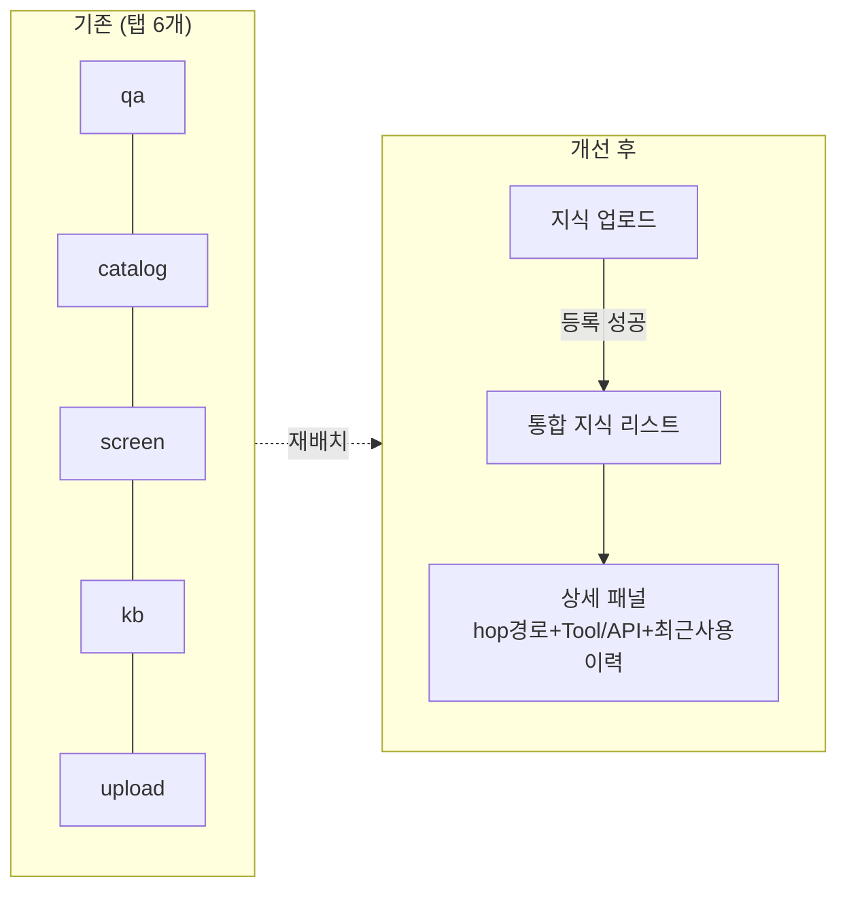
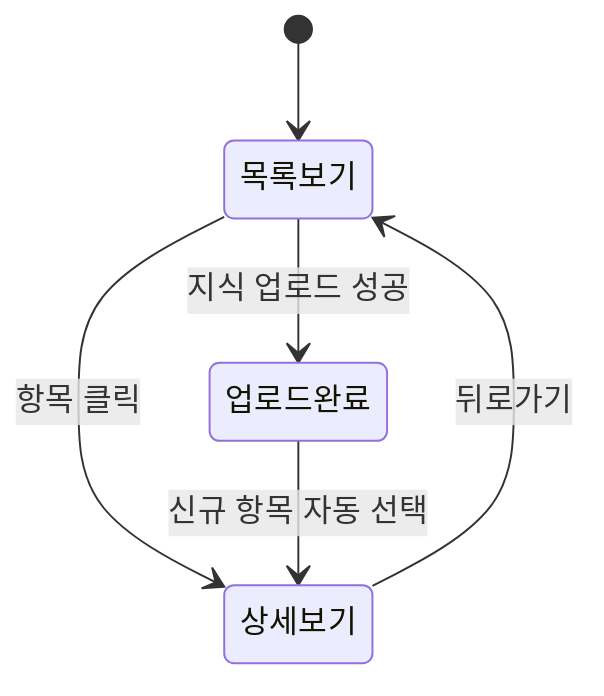

# 셀프서비스 AI 도우미 지식베이스 — 탭 통합·가독성 개선 계획 (재검토판)

- 작성일: 2026-08-06
- 상태: 계획 초안(코드 변경 없음, 승인 대기) — 이전 계획(raw JSON exposure plan) 범위 정정판
- 관련 문서: [2026-08-06_frontend_ia_and_kb_ux_review.md](2026-08-06_frontend_ia_and_kb_ux_review.md) §2,
  [2026-08-06_kb_upload_panel_duplicate_fetch_fix.md](2026-08-06_kb_upload_panel_duplicate_fetch_fix.md),
  [docs/product/self-service-ai-assistant-prd.md](../../product/self-service-ai-assistant-prd.md)

## 0. 범위 정정 — 두 지식베이스 API를 혼동하지 않는다

| 구분             | `/knowledge`(레거시)                            | `/ai-agent` → 설정 → 지식베이스(`/settings/ai-assistant/docs`)                                                |
| ---------------- | ----------------------------------------------- | ------------------------------------------------------------------------------------------------------------- |
| 용도             | 실시간 통화 응대용 RAG(페르소나·인사말·잡담 등) | **셀프서비스 AI 도우미**가 참고하는 매뉴얼/OpenAPI/설정 지식                                                  |
| 엔드포인트       | `KNOWLEDGE_CATEGORIES` 계열 API                 | `/api/knowledge-base/documents`, `/api/settings/ai-assistant/catalog-config/*`, `knowledge_base_inventory` 등 |
| 이번 계획의 대상 | 아님                                            | **이번 계획의 유일한 대상**                                                                                   |

바로 이전 턴에서 작성한 [2026-08-06_raw_json_exposure_improvement_plan.md](2026-08-06_raw_json_exposure_improvement_plan.md)는
통화 중 CDR 디버그(RAG 검색 추적) 화면에 대한 계획으로, **셀프서비스 AI 도우미 지식베이스와는
무관한 별개 화면**이다(사용자가 지적한 "이상하다"는 지점 — 확인 결과 대상 자체가 이번 요청과
달랐음). 그 계획은 별도 사안으로 남겨두고, 이번 문서는 사용자가 실제로 원한 아래 2가지에만
집중한다.

1. 업로드한 데이터가 실제로 "도우미 지식베이스"로 잘 구성되는지
2. 도우미 지식베이스 화면이 탭이 너무 많고 raw 데이터 위주라 가독성이 나쁨 → 통합·정리된 UI

## 1. 현황 재확인 (코드 기준)

`sip-pbx/frontend/app/settings/ai-assistant/docs/page.tsx`:

```tsx
type Tab = "qa" | "catalog" | "screen" | "policy" | "kb" | "upload";
```

- **1번(업로드→도우미 지식베이스 구성)**: `handleUploadDocument` 성공 시 `/api/knowledge-base/documents`에
  등록되고 `loadKbDocuments()`로 즉시 재조회 — 데이터 흐름 자체는 정상 동작 확인됨(오늘자
  [2026-08-06_kb_upload_panel_duplicate_fetch_fix.md](2026-08-06_kb_upload_panel_duplicate_fetch_fix.md)에서
  중복 조회로 인한 "Failed to fetch" 표시 버그만 수정, 데이터 적재 자체는 문제 없었음). 이 항목은
  **버그 수정 완료 상태이며 이번 UI 개편과 별도로 이미 해결**된 것으로 간주한다.
- **2번(탭 파편화·raw 데이터)**: 6개 탭(`qa`/`catalog`/`screen`/`policy`/`kb`/`upload`)이 각자
  독립 데이터셋을 별개 화면에 나열. `kb`(지식베이스 현황) 탭은 청크 수·섹션 수 등 내부 지표
  위주였고, 실제로 유용한 "이 지식이 어떤 Tool/API/화면과 연결되는지"는 `upload` 탭 하단에
  분리되어 있어 위치가 어긋나 있음(리뷰 §2 표 참고).

## 2. 설계 방향 — "지식 항목 통합 리스트 + 상세 패널"

리뷰 문서 §2에서 제시한 방향을 그대로 채택하되, 이번에 실제 착수 가능한 단위로 구체화한다.

### 2-1. 신규 최상위 뷰: "지식베이스" (탭 6개 → 리스트+상세 2단 구조)

- 좌측: 문서(업로드된 매뉴얼/OpenAPI) + 설정 카탈로그 항목 + 화면 안내 노드를 **하나의 리스트**로
  합쳐 보여준다. 각 행에는 유형 배지(문서/설정/화면안내), 제목, 도메인 태그만 표시(raw 필드 없음).
- 우측(또는 클릭 시 패널): 선택한 항목의 상세—
  - 원문 요약(Q&A 본문 또는 API 설명)
  - 연결된 화면/도메인 경로 (`HopPathTrail` 그대로 재사용)
  - 연결된 Tool/REST-API(메서드·엔드포인트·쓰기 가능 여부)
  - "최근 이 항목이 쓰인 대화 보기" 링크(이미 `qa`/`catalog` 탭에 구현되어 있는 것을 재사용)
- `qa`/`catalog`/`screen`/`upload`/`kb` 탭에 흩어져 있던 상세 렌더링 로직(hop 경로, 최근 사용
  이력 링크, Tool/API 카드)은 신규 로직을 만들 필요 없이 **위치만 통합 상세 패널로 이동**.
- `policy`(의도 유형·수동 케이스·의사결정 세션) 탭은 지식"항목"이 아니라 운영 정책/이력 성격이
  강해 통합 리스트에 억지로 합치지 않고 별도 탭으로 유지(과설계 방지).

### 2-2. 통계는 요약 배지로 격하

"지식베이스 현황" 탭의 총 청크 수/섹션 수/최근 색인 시각은 삭제하지 않고, 통합 뷰 상단의
작은 요약 배지(3~4개 숫자)로 축소 배치한다. 클릭 시에만 상세 통계를 펼치는 정도로 부가 정보화.

### 2-3. 업로드 → 등록 직후 상세로 바로 이동

`upload` 탭에서 업로드 성공 시, 방금 등록된 항목의 상세 패널로 자동 포커스 이동(현재는
목록 테이블에 나타나기만 하고 별도 탭 이동 필요 없음 — 이 부분은 이미 같은 탭 안이라 큰 문제
아니었으나, 통합 리스트로 바뀌면 "방금 만든 항목 강조 표시"로 자연스럽게 이어짐).

## 3. UI 미리보기(검토용 초안)

### 3-1. 전체 레이아웃 와이어프레임

```
┌─ 지식베이스 (AI 도우미) ──────────────────────────────────────────────┐
│ 총 42건 문서 · 8건 설정 · 최근 색인 3분 전            [+ 지식 업로드]  │
├───────────────┬────────────────────────────────────────────────────┤
│ 필터: [전체 ▾]│  선택 항목 상세                                     │
│ ─────────────│  ──────────────────────────────────────────────    │
│ 📄 배송 정책   │  📄 배송 정책 Q&A                                  │
│ 📄 환불 절차   │  "배송은 평균 2~3일 소요되며..."                    │
│ ⚙ POST /orders│  ─ 연결 경로: 예약관리 > 배송 설정                  │
│ ⚙ PUT /status │  ─ 연결 Tool/API: GET /orders (읽기전용)            │
│ 🗺 화면: 대시보드│  ─ 최근 이 항목이 쓰인 대화 보기 →                 │
│ ...           │  [+ 원본 보기]                                      │
└───────────────┴────────────────────────────────────────────────────┘
```

### 3-2. 탭→통합 리스트 전환 흐름



### 3-3. 상태: 목록 선택 → 상세 표시



> 위 미리보기는 방향성 검토용 초안이며 최종 디자인이 아니다.

## 4. 영향 범위·회귀 위험

- 백엔드 API 변경 없음(기존 `/api/knowledge-base/documents`, catalog-config, screen_graph,
  kb_inventory 응답 그대로 재사용) — 순수 프론트엔드 정보구조(IA) 개편.
- `policy` 탭 데이터(의도 유형/수동 케이스/의사결정 세션)는 이번 통합 대상에서 제외해 회귀
  위험을 최소화.
- 리스트+상세 2단 레이아웃 전환은 규모가 있는 리팩터링이므로, 기존 탭별 데이터 로딩 훅
  (`loadQa`, `loadCatalog`, `loadScreens`, `loadKbDocuments`, `loadKbInventory`)은 그대로 두고
  **표시 레이어만 재구성**하는 것을 권장(로딩 로직 재작성 최소화로 회귀 위험 추가 감소).

## 5. 다음 단계 (BMAD)

1. **PRD 반영**: `docs/product/self-service-ai-assistant-prd.md`에 "지식베이스 통합 뷰(리스트+
   상세)" FR 추가 — 기존 탭별 FR(Story 1.26/1.30/1.41/1.46 등)을 대체하는 것이 아니라 그
   위에 프레젠테이션 계층을 추가하는 것임을 명시.
2. **아키텍처 반영**: `docs/architecture/frontend-architecture.md`에 `settings/ai-assistant/docs`
   페이지의 신규 컴포넌트 구조(통합 리스트 컴포넌트, 상세 패널 컴포넌트) 추가.
3. **Story 분할 제안**:
   - Story A: 통합 리스트 뷰(문서+설정+화면안내 항목 병합, 필터/검색)
   - Story B: 상세 패널(hop 경로/Tool·API 카드/최근 사용 이력 통합, 기존 로직 재배치)
   - Story C: 업로드 완료 → 신규 항목 자동 포커스, 통계 배지 축소
4. 승인 시 위 순서로 PRD→architecture→story 진행하겠다.

---

*최종 업데이트: 2026-08-06*
