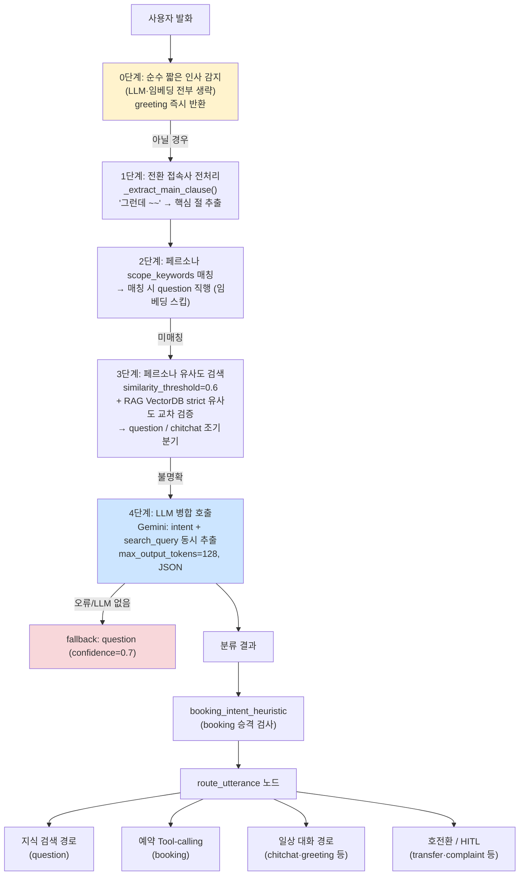
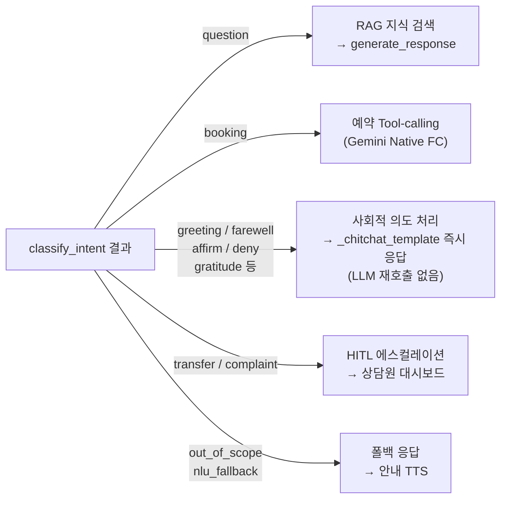
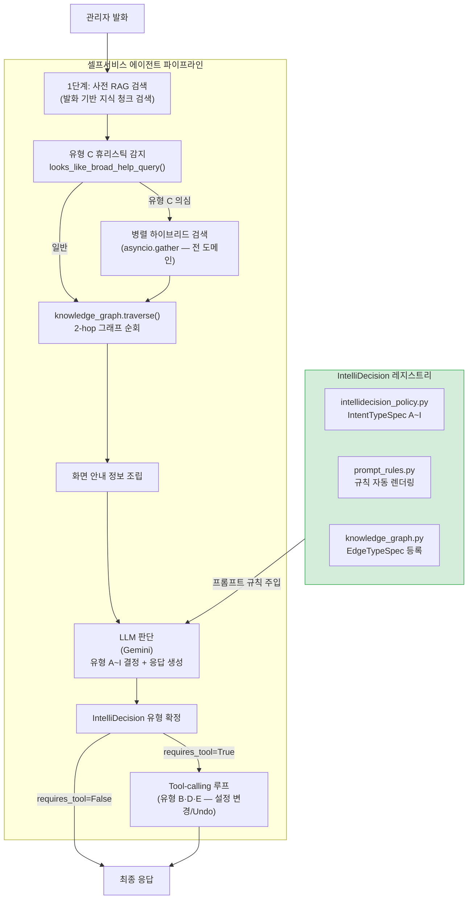
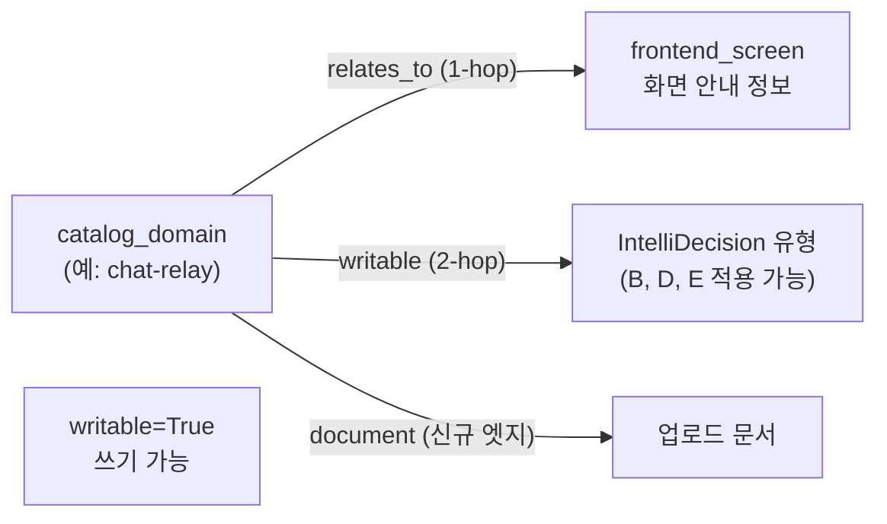
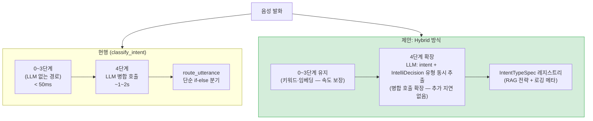

# Intent 분류 방식 vs IntelliDecision 방식 — 심층 비교 리포트

**작성일**: 2026-08-12  
**버전**: 1.0  
**상태**: 완료  
**관련 문서**:
- [INTENT_HANDLING_DESIGN.md](../design/INTENT_HANDLING_DESIGN.md)
- [AI_RESPONSE_HUMANLIKE_DESIGN.md](../design/AI_RESPONSE_HUMANLIKE_DESIGN.md)
- [SELF_SERVICE_INTELLIDECISION_KNOWLEDGE_STRUCTURING_RESEARCH.md](../design/SELF_SERVICE_INTELLIDECISION_KNOWLEDGE_STRUCTURING_RESEARCH.md)
- `src/ai_voicebot/langgraph/nodes/classify_intent.py`
- `src/ai_voicebot/self_service/intellidecision_policy.py`

---

## 목차

1. [개요 및 비교 프레임](#1-개요-및-비교-프레임)
2. [기존 방식: classify_intent 파이프라인](#2-기존-방식-classify_intent-파이프라인)
3. [개선 방식: IntelliDecision 레지스트리](#3-개선-방식-intellidecision-레지스트리)
4. [시장 조사 및 레퍼런스 비교](#4-시장-조사-및-레퍼런스-비교)
5. [장단점 비교](#5-장단점-비교)
6. [우위 판정 및 근거](#6-우위-판정-및-근거)
7. [현재 시스템 적용 가능성 검토](#7-현재-시스템-적용-가능성-검토)
8. [결론 및 권고사항](#8-결론-및-권고사항)

---

## 1. 개요 및 비교 프레임

본 리포트는 동일한 시스템 내에서 **서로 다른 레이어에 적용된 두 가지 의도 분류 방식**을 비교한다.

| 구분          | 기존: classify_intent                        | 개선: IntelliDecision                       |
| ------------- | -------------------------------------------- | ------------------------------------------- |
| **적용 위치** | 음성 통화 · 문자 메인 파이프라인             | 셀프서비스 AI 도우미 (관리자 응대)          |
| **분류 목적** | 통화 흐름 라우팅 (예약/지식검색/잡담/호전환) | 관리자 발화의 목적 유형 판단 (A~I)          |
| **핵심 철학** | **키워드 → 통계 → LLM** 단계적 축소          | **LLM 기반 유형 분류 + 데이터 레지스트리**  |
| **출력**      | 단일 intent 레이블 + confidence              | 유형 코드 (A~I) + RAG 전략 + Tool 필요 여부 |

> ⚠️ 두 방식은 **경쟁 관계가 아니라 적용 도메인이 다르다.** 이 리포트는 각 방식의 설계 철학과
> 한계를 분석하고, IntelliDecision 방식의 우위가 인정되는 시나리오에서 classify_intent에도
> 동일 철학을 적용할 수 있는지 검토한다.

---

## 2. 기존 방식: classify_intent 파이프라인

### 2.1 구조 및 동작 원리

음성 통화 및 SIP MESSAGE에서 사용자 발화의 **라우팅 경로**를 결정하는 5단계 파이프라인.



### 2.2 분류 가능한 Intent 목록 (17종)

```
사회적 의도 (Social):
  greeting, farewell, affirm, deny, gratitude, doubt,
  positive_reaction, negative_reaction

대화 관리 (Dialogue Management):
  chitchat, repeat, clarification, help

업무 의도 (Task):
  question, complaint, transfer, out_of_scope, nlu_fallback
```

### 2.3 최적화 설계 (실제 코드 기반)

**최적화 4.4 — LLM 병합 호출**

기존 2회 LLM 호출(`classify_intent` + `rewrite_query`)을 단일 호출로 통합.

```python
# LLM 프롬프트 (단일 JSON 응답)
prompt = "의도 분류 + 검색 쿼리 변환기. JSON으로 답하세요: {intent, search_query}"

# LLM 응답 예시
{"intent": "question", "search_query": "기상감정서 발급 방법"}
```

**booking_intent_heuristic — 예약 레인 승격**

classify_intent 결과가 `question`이더라도 `booking_context`가 활성 상태이면 예약 레인으로 승격. `booking_context.last_activity_at` 기준 15분 초과 시 만료.

**conversation_history 오염 방지 (2026-07-29 수정)**

`classify_intent` / `rewrite_query` / `knowledge_service` 등 **내부 전용 LLM 호출**은 `generate_response(update_history=False)`로 대화 히스토리 오염 차단.

### 2.4 라우팅 분기 결과



---

## 3. 개선 방식: IntelliDecision 레지스트리

### 3.1 구조 및 동작 원리

셀프서비스 AI 도우미에서 관리자의 발화가 **어떤 목적인지**를 LLM이 판단하고, 해당 유형의 메타데이터(RAG 전략, Tool 필요 여부, hop 경로 등)를 **코드가 참조 가능한 데이터**로 관리하는 방식.



### 3.2 유형 A~I 메타데이터 레지스트리

```python
@dataclass
class IntentTypeSpec:
    code: str               # "A" ~ "I"
    name: str               # 유형 이름
    summary: str            # 사람 가독 설명 (시각화·로깅)
    trigger_examples: list  # 예시 발화 (응대 유형 탐색기에서 재사용)
    requires_tool: bool     # Tool-calling 필요 여부
    requires_writable_domain: bool  # 쓰기 가능 도메인에서만 성립
    related_types: list     # 관련 유형 코드
    rag_enabled: bool       # RAG 검색 실행 여부
    rag_source_scope: str   # 검색 범위
    rag_strategy_hint: str  # "vector" | "graph_local" | "hybrid_multi_domain" | "none"
```

| 유형  | 이름             | 예시 발화               | RAG | Tool | 전략                  |
| ----- | ---------------- | ----------------------- | --- | ---- | --------------------- |
| **A** | 탐색성           | "그런 기능도 있어?"     | ✅   | ✗    | `graph_local`         |
| **B** | 실행성           | "알림 꺼줘"             | ✅   | ✅    | `vector`              |
| **C** | 포괄적 도움 요청 | "뭘 할 수 있어?"        | ✅   | ✗    | `hybrid_multi_domain` |
| **D** | 정정             | "아니 그거 말고 ~"      | ✗   | ✅    | `none`                |
| **E** | 실행 취소        | "방금 바꾼 거 원래대로" | ✗   | ✅    | `none`                |
| **F** | 모호성 해소      | "그거 설정 바꿔줘"      | ✅   | ✗    | `vector`              |
| **G** | 확인 요청        | "그 기능 켜져 있어?"    | ✅   | ✗    | `vector`              |
| **H** | 반복 요청        | "다시 말해줘"           | ✅   | ✗    | `vector`              |
| **I** | 부정적 응대      | "됐어, 필요 없어"       | ✗   | ✗    | `none`                |

### 3.3 프롬프트 자동 렌더링 (Story 1.19)

번호가 붙은 규칙을 하드코딩하던 문제를 해결하는 `prompt_rules.py`:

```python
# 기존 방식 (하드코딩 — 번호 재조정 함정)
"""
규칙 7. 유형 C: ...
규칙 8. 유형 F: ...
규칙 10. 유형 C(7번)처럼... ← 교차 참조가 번호에 의존
"""

# 개선 방식 (자동 렌더링)
_register_base("type_c", "유형 C: ...")
_register_base("type_f", "유형 F: ...")
_register_base("ref_example", "유형 C(<<REF:type_c>>번)처럼...")
# ← 렌더링 시 <<REF:type_c>>가 실제 번호로 자동 치환
```

### 3.4 2-hop 그래프 순회 (knowledge_graph.py)



---

## 4. 시장 조사 및 레퍼런스 비교

### 4.1 classify_intent 방식의 시장 레퍼런스

#### Google Dialogflow CX (State Machine 기반 Intent)

> **공식 문서**: "흐름(Flow)과 페이지(Page), 라우트(Route)로 대화를 설계. 인텐트가 매칭되면 특정 페이지로 전환."

- **방식**: 인텐트 이름 목록 + 학습 문구 예시(training phrases) 사전 등록
- **분류 엔진**: 머신러닝 기반 NLU + 폴백 인텐트
- **장점**: 복잡한 다단계 대화 흐름 설계가 용이
- **단점**: 대화 경로 증가 시 관리 복잡도 급증, 텍스트 매칭에 의존해 의미 이해 한계

```
classify_intent ≈ Dialogflow CX NLU
(둘 다 사전 정의 레이블 목록 중 하나로 분류)
```

#### Amazon Alexa Built-in Intents (표준 인텐트 카탈로그)

> "스킬 인증을 위해 AMAZON.HelpIntent, AMAZON.CancelIntent, AMAZON.StopIntent를 반드시 처리해야 한다."

- 업계 표준으로 검증된 분류 체계: Help / Cancel / Stop / Repeat / FallbackIntent
- classify_intent의 `help`, `repeat`, `out_of_scope`, `transfer` 등과 1:1 대응 구조

#### Amazon Lex V2 (Assisted NLU)

> "Assisted NLU 기능으로 FAQ 업로드 시 인텐트 자동 생성"

- 사전 학습 문구 없이 FAQ 기반 NLU 자동 생성
- classify_intent의 페르소나 유사도 검색과 개념적으로 유사

#### Semantic Router (aurelio-labs, 3.8k ★)

> "콜센터 10ms 저지연 라우팅 실사례, IEEE GlobeCom 2024 5G 통신망 의도 분류 실용"

- 임베딩 기반 빠른 라우팅 — classify_intent의 2~3단계(유사도 검색)와 동일 원리
- **단점**: "어떤 유형으로 라우팅됐는지"에 대한 설명가능성(Explainability) 없음

---

### 4.2 IntelliDecision 방식의 시장 레퍼런스

#### Anthropic "Building Effective Agents" (2024-12)

> **원문**: "Routing workflow: Classify an input and direct it to a specialized followup task."
> "Good routing systems should make it easy to inspect and debug classification decisions."

- **번역**: 라우팅 워크플로우: 입력을 분류하여 전문화된 후속 작업으로 연결. 좋은 라우팅 시스템은 분류 결정을 쉽게 검사하고 디버그할 수 있어야 한다.
- IntelliDecision 레지스트리의 핵심 설계 원칙(유형 데이터화, 시각화)과 정확히 일치

#### Rasa "Happy/Unhappy Path" (오픈소스 대화 프레임워크)

> **공식 문서**: "대화가 예상 경로를 벗어났을 때(chitchat, mind_change, context_switch) 처리하는 Unhappy Path 관리"

- 유형 D(정정), 유형 F(모호성 해소), 유형 I(부정적 응대)가 Rasa Unhappy Path와 구조적으로 동일
- **차이**: Rasa는 슬롯 채우기(slot filling) 기반, IntelliDecision은 LLM + 레지스트리 메타데이터

#### Jurafsky & Martin "Speech and Language Processing" — Mixed-Initiative Dialogue

> **교과서 원문**: "In mixed-initiative dialogue, either the user or the system can take the initiative at various points in the conversation."

- 시스템 주도(System-Initiative): 유형 F(되묻기), 유형 B 실행 전 확인 요청
- 사용자 주도(User-Initiative): 유형 A(탐색), 유형 C(포괄 도움)
- 혼합 주도(Mixed): 유형 D(정정), 유형 E(취소)
- **IntelliDecision A~I는 학술적 혼합 주도 대화 분류를 실제 시스템으로 구현한 사례**

#### Microsoft GraphRAG — 유형별 검색 전략 매칭

> "Local Search: 특정 엔터티와 직접 연결된 정보를 중심으로 탐색. Global Search: 전체 지식 그래프의 클러스터 요약을 활용."

- `rag_strategy_hint="graph_local"` (유형 A) — GraphRAG Local Search 개념 차용
- `rag_strategy_hint="hybrid_multi_domain"` (유형 C) — GraphRAG Global Search와 유사한 전체 도메인 탐색
- **차이**: Full GraphRAG(엔터티 자동추출 + Leiden 클러스터링) 없이 경량 dict 기반 구현

#### Google Dialogflow CX (Page/Route 상태머신) vs IntelliDecision

```
Dialogflow CX Route: "인텐트 X가 발생하면 페이지 Y로 전환"
IntelliDecision:     "유형 X 발화가 들어오면 RAG 전략 Y + Tool Z 실행"
```

차이: Dialogflow CX는 **경로 전환(State Transition)** 중심, IntelliDecision은 **응대 행동(Action Policy)** 중심

#### Fin.ai / Zendesk AI 에이전트 — 유형별 응대 정책

> Zendesk(Forethought 기반): "복잡한 질문은 에스컬레이션, 단순 FAQ는 자동 응답"

- 유형 B(실행) → Tool 직접 실행
- 유형 A(탐색) → RAG 검색 응답
- 유형 F(모호) → 되묻기
- 이 3가지 분기는 Zendesk AI, Fin.ai 모두 채택하는 업계 표준 응대 분기

---

## 5. 장단점 비교

### 5.1 classify_intent — 장점

| 장점                   | 상세                                                    |
| ---------------------- | ------------------------------------------------------- |
| **처리 속도**          | 0~3단계는 LLM 없이 처리 → 평균 응답 지연 최소화         |
| **예측 가능성**        | 키워드/임베딩 기반이라 동일 입력에 동일 결과 보장       |
| **실시간 음성 최적화** | 짧은 발화(순수 인사 등)의 LLM 스킵으로 TTFT 단축        |
| **멀티 intent 처리**   | booking_intent_heuristic로 예약 레인 승격 등 복합 처리  |
| **대화 히스토리 통합** | `LLMClient.conversation_history`와 통합된 컨텍스트 유지 |

### 5.2 classify_intent — 단점

| 단점                   | 상세                                                       | 실제 발생 사례                                                  |
| ---------------------- | ---------------------------------------------------------- | --------------------------------------------------------------- |
| **레이블 고정**        | VALID_INTENTS 17종 고정 → 새 유형 추가 시 코드 배포 필요   | `help` intent가 유형 C에 해당하는 다양한 발화를 포괄 못 함      |
| **응대 행동 분리**     | intent 레이블만 반환, "어떻게 응답할지"는 별도 노드가 결정 | 단일 intent가 여러 다른 응대 방식으로 이어져 일관성 부족        |
| **설명가능성 없음**    | "왜 이 intent로 분류됐는가"를 코드가 알 수 없음            | QA 시 분류 실패 원인 파악이 어려워 디버깅 비용 증가             |
| **RAG 전략 연동 없음** | intent에 따라 RAG 범위/전략을 달리 적용하는 구조 없음      | 모든 question이 동일한 단일 벡터 검색으로 처리됨                |
| **다중 도메인 한계**   | 단일 intent 결과로는 복합 질문(여러 도메인 혼합) 표현 불가 | "뭘 할 수 있어?"를 `help`로 분류 → 풍부한 다중 도메인 응답 불가 |

### 5.3 IntelliDecision — 장점

| 장점                            | 상세                                                                   |
| ------------------------------- | ---------------------------------------------------------------------- |
| **응대 행동 내포**              | 유형 코드 하나로 RAG 전략·Tool 필요 여부·hop 경로가 결정됨             |
| **설명가능성 (Explainability)** | 레지스트리가 "왜 이 응대를 했는가"의 단일 소스로 기능                  |
| **시각화 가능**                 | `intellidecision_policy.py` 메타데이터를 API로 노출 → 관리자 투명성 UI |
| **동적 확장**                   | 새 유형 추가 시 `_register()` 1줄 추가 → 프롬프트 자동 반영            |
| **유형별 RAG 전략 분화**        | A=graph_local, B=vector, C=hybrid_multi_domain — 질문 성격에 맞는 검색 |
| **세션 순서도 추적**            | `self_service_decision_log`에 유형 전환 이력 저장 → A→C→E 흐름 시각화  |
| **Undo 설계 통합**              | 유형 E가 레지스트리 수준에서 "실행 취소"로 정의 → 실행기와 일관성      |

### 5.4 IntelliDecision — 단점

| 단점                    | 상세                                                                 | 현재 상태                                                         |
| ----------------------- | -------------------------------------------------------------------- | ----------------------------------------------------------------- |
| **LLM 의존 증가**       | 유형 분류 전 RAG 검색이 선행, 항상 LLM 호출 발생                     | 음성 경로에 그대로 적용 시 지연 우려                              |
| **간헐적 빈 응답**      | Gemini가 빈 candidate를 반환할 때 `_FALLBACK_RETRY_EXHAUSTED` 발동   | 재시도 로직(최대 4회) + 근본 원인 수정(Any 타입 스키마 버그) 완료 |
| **Tool-calling 멀티턴** | 확인→긍정 2턴 흐름에서 이전 턴 컨텍스트가 없으면 Tool 미실행         | `self_service_tool_messages` 상태로 해결 완료                     |
| **유형 사전 확정 불가** | RAG 검색이 유형 확정 전에 실행되어 `rag_enabled=False` 유형도 검색됨 | Dev Notes에 한계로 명시, 설계 제약으로 수용                       |
| **음성 경로 미적용**    | 현재는 셀프서비스(텍스트) 도우미에만 적용                            | 음성 경로 확장 가능성이 본 리포트의 핵심 검토 대상                |

### 5.5 비교 매트릭스

```
                     classify_intent    IntelliDecision
                     ───────────────    ───────────────
처리 속도                  ★★★★★              ★★★
예측 가능성                ★★★★               ★★★★
설명가능성                 ★★                 ★★★★★
응대 행동 통합             ★★                 ★★★★★
RAG 전략 분화              ★★                 ★★★★★
동적 확장성                ★★                 ★★★★
세션 추적                  ★★                 ★★★★★
음성 최적화                ★★★★★              ★★★
실시간 음성 적합성          ★★★★★              ★★★
```

---

## 6. 우위 판정 및 근거

### 6.1 결론

> **IntelliDecision 방식이 "응대 행동 결정" 측면에서 우위**이며,  
> **classify_intent는 "실시간 음성 라우팅" 측면에서 여전히 우위**이다.

두 방식은 **서로 다른 문제를 풀고 있다.** 그러나 IntelliDecision의 핵심 설계 철학 — **"분류 레이블이 응대 행동까지 내포해야 한다"** — 는 classify_intent가 현재 갖고 있는 구조적 한계를 해소할 수 있는 방향이다.

### 6.2 IntelliDecision 우위 근거 4가지

**근거 1. Anthropic "Building Effective Agents" 원칙과 일치**

> "Good routing systems should make it easy to inspect and debug classification decisions."

classify_intent는 분류 결과(`question`, `chitchat` 등)를 반환할 뿐, **왜 그렇게 분류됐는지**를 코드가 참조할 수 없다. IntelliDecision은 레지스트리가 단일 소스 역할을 해 분류 결정의 검사·디버깅이 구조적으로 가능하다.

**근거 2. 유형별 RAG 전략 분화가 응답 품질을 결정적으로 개선**

```
classify_intent → "question" → 단일 벡터 유사도 검색 → 응답

IntelliDecision → 유형 A → graph_local (관련 도메인 그래프 순회 포함)
               → 유형 C → hybrid_multi_domain (전 도메인 병렬 검색)
               → 유형 B → vector (명확한 타깃 도메인 직접 검색)
```

실제 검증 (2026-08-05): 유형 C("뭘 할 수 있어?") 발화에서 hybrid_multi_domain 전략으로 4개 도메인(operator-status/ai-escalation/call-control/chat-relay)의 청크를 동시에 획득해 풍부한 응답 생성.

**근거 3. 세션 단위 추적 → 서비스 품질 개선 루프 가능**

IntelliDecision은 `self_service_decision_log`에 유형 전환 이력을 저장해 "A→C→B" 같은 세션 흐름을 분석할 수 있다. classify_intent에는 이에 해당하는 구조가 없어, 통화 품질 개선을 위한 데이터가 쌓이지 않는다.

**근거 4. Mixed-Initiative Dialogue 학술 기반**

Jurafsky & Martin의 혼합 주도 대화 이론에서 정립된 "시스템 주도/사용자 주도/혼합 주도" 분류가 유형 A~I로 실체화되어 있다. classify_intent의 17종 레이블은 이 이론적 프레임 없이 경험적으로 증가한 목록으로, 이론적 완결성이 낮다.

---

## 7. 현재 시스템 적용 가능성 검토

### 7.1 음성 통화 경로에 IntelliDecision 방식 적용 시나리오



### 7.2 적용 가능성 분석

#### 시나리오 A: LLM 병합 호출 확장 (저비용, 권고)

현행 4단계 LLM 병합 호출(`intent + search_query`)에서 `intent_type` 필드를 추가 추출하는 방식.

```python
# 현행
{"intent": "question", "search_query": "기상감정서 발급 방법"}

# 확장 제안
{
  "intent": "question",
  "search_query": "기상감정서 발급 방법",
  "intent_detail": "A"   # IntelliDecision 유형 코드 (선택)
}
```

**장점**:
- 기존 LLM 호출 1회 안에 추가 추출 → 추가 지연 없음
- `intent` 레이블(기존 라우팅)과 `intent_detail`(응대 행동 정책) 분리
- classify_intent 코드 변경 최소화

**단점**:
- 음성 통화 도메인의 유형 A~I 정의를 별도로 수립해야 함 (현재는 셀프서비스 전용)
- LLM이 두 분류를 동시에 정확히 반환할지 실증 필요

#### 시나리오 B: classify_intent에 레지스트리 패턴 도입 (중간 비용)

`VALID_INTENTS` 고정 리스트 대신 `IntentSpec` 레지스트리로 전환.

```python
# 현행 (고정 리스트)
VALID_INTENTS = {"greeting", "farewell", "question", "booking", ...}

# 개선 제안
@dataclass
class VoiceIntentSpec:
    code: str
    aliases: list[str]      # LLM이 반환할 수 있는 표현들
    rag_enabled: bool
    hitl_trigger: bool      # HITL 에스컬레이션 트리거 여부
    log_category: str       # call_data_record 로깅 카테고리
```

**장점**:
- 새 intent 추가 시 `_register()` 1줄 → 코드 배포 없이 프롬프트 자동 반영
- `hitl_trigger=True` 메타데이터로 HITL 조건을 코드에서 분리

**단점**:
- 기존 17종 intent와 새 레지스트리 간 마이그레이션 비용
- 음성 경로는 속도가 critical하므로 레지스트리 조회 오버헤드 측정 필요

#### 시나리오 C: 전면 교체 (고비용, 현재 비권고)

음성 통화 경로 전체를 IntelliDecision A~I 방식으로 교체.

**문제점**:
- 음성 경로는 TTFT(Time To First Token) 1~3초가 목표 — RAG 검색 선행 + LLM 유형 판단의 추가 지연 발생
- 예약 흐름(booking_context, booking_intent_heuristic)이 IntelliDecision 유형 B와 충돌 가능
- 실시간 통화 중 `asyncio.gather` 하이브리드 검색은 latency spike 위험

### 7.3 적용 가능성 판정표

| 시나리오                    | 구현 비용 | 지연 영향      | 기존 기능 유지 | 권고도 |
| --------------------------- | --------- | -------------- | -------------- | ------ |
| **A: LLM 병합 호출 확장**   | 낮음      | 없음           | ✅              | ★★★★★  |
| **B: 레지스트리 패턴 도입** | 중간      | 무시 가능      | ✅              | ★★★★   |
| **C: 전면 교체**            | 높음      | 지연 증가 위험 | ⚠️ 부분 영향    | ★★     |

### 7.4 구체적 구현 계획 (시나리오 A)

**Phase 1: VoiceIntentTypeSpec 레지스트리 정의** (코드 변경 없음)

```python
# src/ai_voicebot/langgraph/voice_intent_policy.py (신규)
@dataclass
class VoiceIntentTypeSpec:
    code: str           # 기존 VALID_INTENTS 값 ("question", "booking" 등)
    rag_enabled: bool
    rag_strategy: str   # "vector" | "graph_local" | "none"
    hitl_risk: str      # "low" | "medium" | "high"
    log_tag: str        # call_data_record 로깅 태그

_register(VoiceIntentTypeSpec("question",    rag_enabled=True,  rag_strategy="vector",     hitl_risk="low",    log_tag="knowledge_query"))
_register(VoiceIntentTypeSpec("booking",     rag_enabled=False, rag_strategy="none",       hitl_risk="low",    log_tag="booking_action"))
_register(VoiceIntentTypeSpec("transfer",    rag_enabled=False, rag_strategy="none",       hitl_risk="high",   log_tag="escalation"))
_register(VoiceIntentTypeSpec("complaint",   rag_enabled=True,  rag_strategy="graph_local",hitl_risk="high",   log_tag="complaint_query"))
_register(VoiceIntentTypeSpec("out_of_scope",rag_enabled=False, rag_strategy="none",       hitl_risk="medium", log_tag="out_of_scope"))
# ... 나머지 17종
```

**Phase 2: call_data_record 로깅에 레지스트리 메타 추가**

```python
# classify_intent.py 수정 (최소 침습)
spec = get_voice_intent_spec(result_intent)
log_call_data(call_id, "intent_classify", ...,
    rag_strategy=spec.rag_strategy,   # 추가
    hitl_risk=spec.hitl_risk,          # 추가
)
```

**Phase 3: RAG 검색 전략 분기 적용**

```python
# rag_processor.py 또는 generate_response.py
spec = get_voice_intent_spec(state.intent)
if spec.rag_strategy == "graph_local":
    docs = await rag.search_with_graph_traverse(query)
elif spec.rag_strategy == "vector":
    docs = await rag.search(query)
```

---

## 8. 결론 및 권고사항

### 8.1 결론 요약

```
┌─────────────────────────────────────────────────────────────────┐
│  classify_intent: 실시간 음성 라우팅에 최적화된 경량 방식         │
│  IntelliDecision: 응대 행동 정책까지 포함한 구조화된 방식         │
│                                                                 │
│  IntelliDecision의 핵심 철학이 우위:                             │
│  "분류 결과가 응대 행동과 검색 전략까지 내포해야 한다"             │
│                                                                 │
│  → 음성 경로에는 시나리오 A(LLM 병합 호출 확장)로 점진 적용 권고  │
└─────────────────────────────────────────────────────────────────┘
```

### 8.2 즉시 적용 가능한 개선 (코드 변경 최소)

1. **`VoiceIntentTypeSpec` 레지스트리 파일 생성** → `classify_intent.py`의 VALID_INTENTS를 데이터로 분리
2. **call_data_record 로깅에 `rag_strategy` 필드 추가** → 어떤 intent가 어떤 RAG 전략으로 처리됐는지 추적 시작
3. **`complaint` intent에 graph_local 전략 적용** → HITL 전 자동 응대 품질 개선

### 8.3 중기 개선 (다음 Epic 후보)

4. **`question` intent를 IntelliDecision A~D 서브유형으로 세분화** — "탐색성 질문 vs 확인 요청 vs 모호한 질문"을 구분해 RAG 전략 분화
5. **음성 통화 세션 단위 intent 전환 추적** — classify_intent 결과를 세션별로 집계해 `question→question→transfer` 패턴 식별 → HITL 예측 모델 입력

### 8.4 권고 우선순위

```
즉시 (1~2일): VoiceIntentTypeSpec 레지스트리 파일 + 로깅 필드 추가
단기 (1주):   complaint intent graph_local 전략 + rag_processor 분기
중기 (1달):   question → A/F/G 서브유형 세분화 + 세션 추적
장기 (검토):  전면 IntelliDecision 교체는 음성 지연 실측 후 결정
```

---

*최종 업데이트: 2026-08-12*
