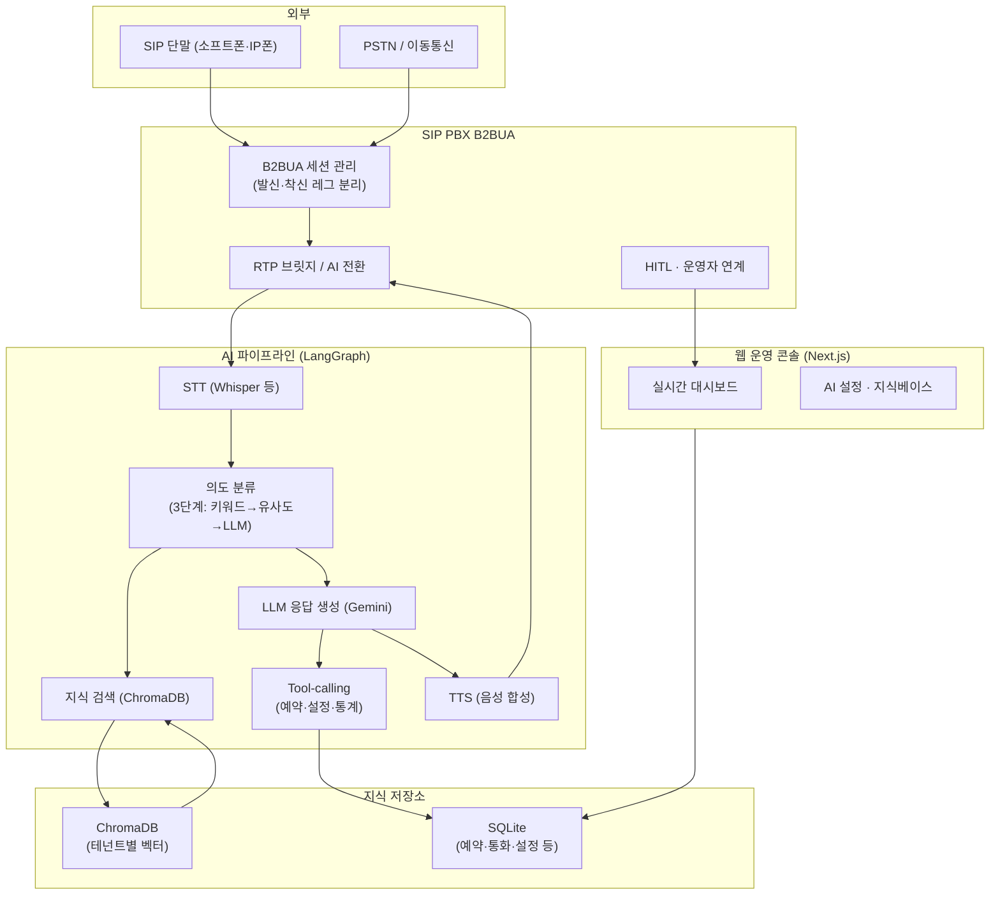
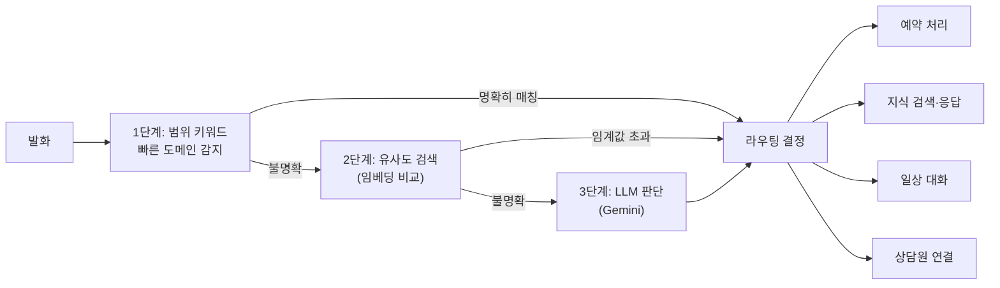
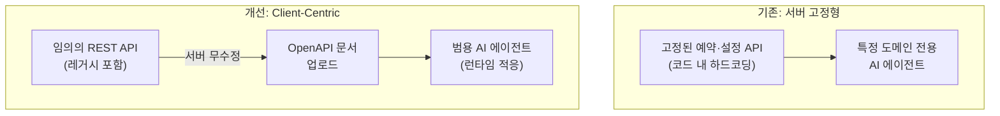
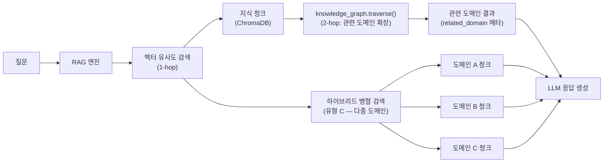
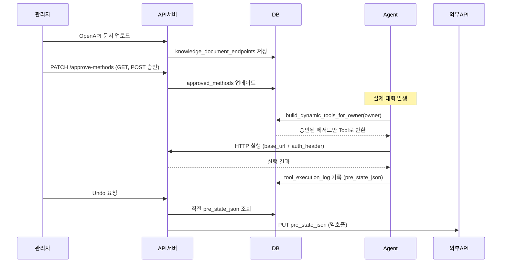
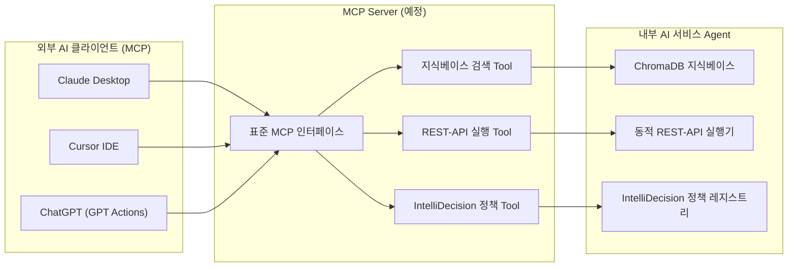
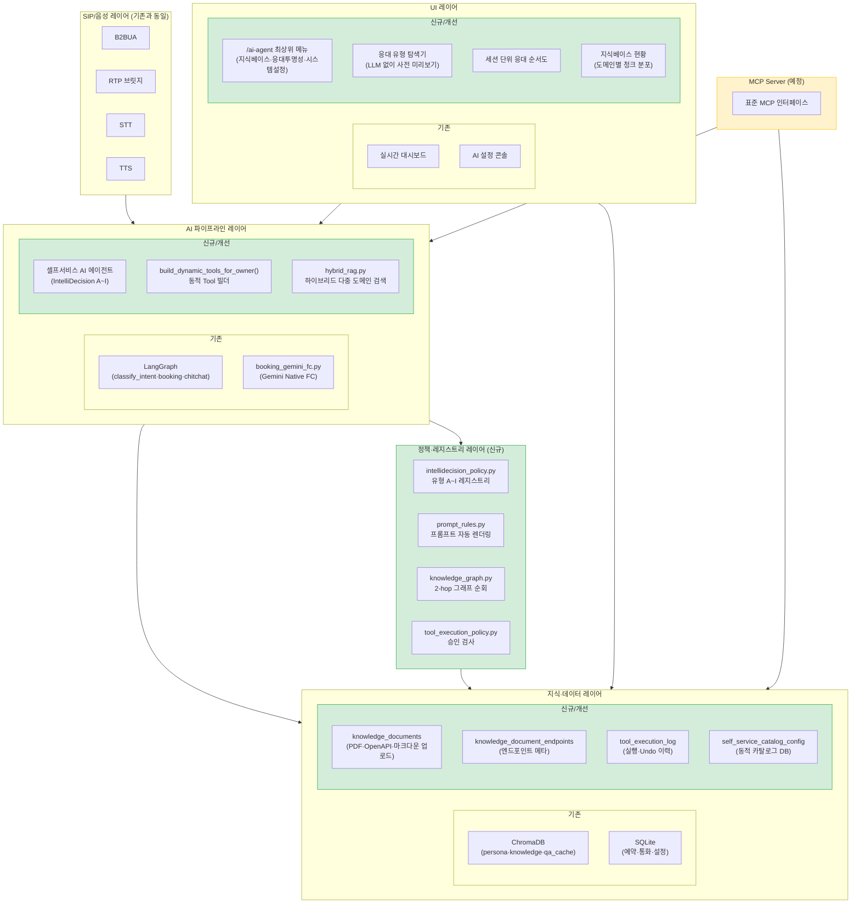
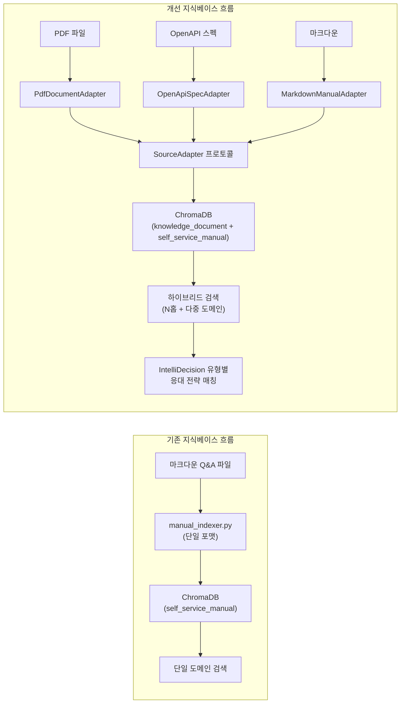
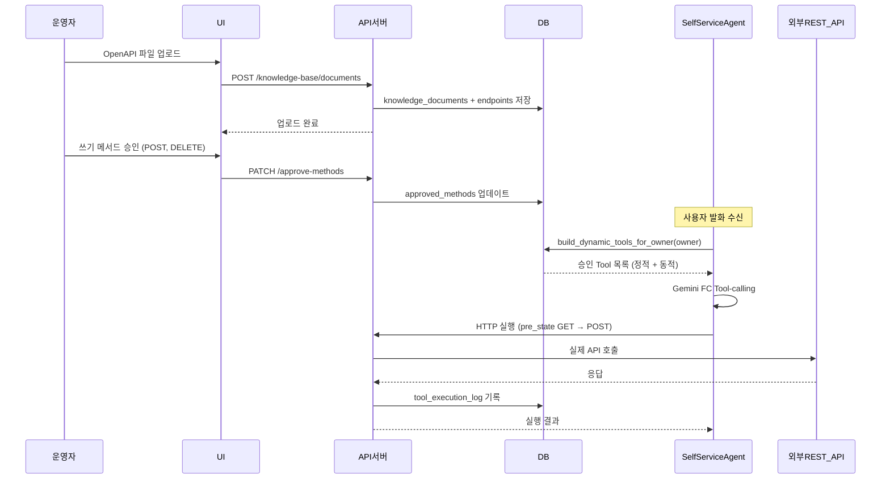

# SIP PBX AI Agent → AI 서비스 Agent 비교 리포트

**작성일**: 2026-08-12  
**버전**: 1.0  
**상태**: 완료  
**관련 문서**: [SYSTEM_OVERVIEW.md](../SYSTEM_OVERVIEW.md), [MCP_VS_CLIENT_CENTRIC_UNIVERSAL_AGENT_MARKET_RESEARCH.md](../design/MCP_VS_CLIENT_CENTRIC_UNIVERSAL_AGENT_MARKET_RESEARCH.md), [SELF_SERVICE_RAG_INTELLIDECISION_ADVANCEMENT_RESEARCH.md](../design/SELF_SERVICE_RAG_INTELLIDECISION_ADVANCEMENT_RESEARCH.md)

---

## 목차

1. [기존 SIP PBX AI Agent 개요](#1-기존-sip-pbx-ai-agent-개요)
2. [기존 AI Agent 주요 기능](#2-기존-ai-agent-주요-기능)
3. [개선판 AI 서비스 Agent 주요 기능](#3-개선판-ai-서비스-agent-주요-기능)
4. [아키텍처 다이어그램 (변경 범위 포함)](#4-아키텍처-다이어그램)
5. [개선 기능 활용 예시](#5-개선-기능-활용-예시)
6. [요약 비교표](#6-요약-비교표)

---

## 1. 기존 SIP PBX AI Agent 개요

### 1.1 시스템 정의

**AI SIP PBX**는 Python 기반 **SIP B2BUA(Back-to-Back User Agent)** 위에 **실시간 음성 AI**, **웹 운영 콘솔**, **지식·연락처·문자·예약**을 한데 묶은 통합 플랫폼이다.

기존 시나리오형 콜봇의 한계(높은 초기 구축비, 수동 스크립트 의존, ARS 트리형 고정 흐름)를 극복하기 위해 설계되었다. 핵심은 **LLM + RAG + Tool-calling**을 통해 자연어 수준의 통화·문자 응대를 수행하는 것이다.



### 1.2 설계 배경 — 기존 콜봇의 3가지 한계

| 문제         | 기존 방식                        | AI PBX 해결 방향                 |
| ------------ | -------------------------------- | -------------------------------- |
| 높은 고정비  | 시나리오 작성에 수개월·수백만 원 | 자연어 기반 LLM으로 대화 처리    |
| 변경 비용    | 스크립트 단위 재작업             | KB 업데이트만으로 응대 즉시 반영 |
| 의도 외 문의 | ARS 트리 이탈 시 처리 불가       | 의도 분류 → 폴백 / 에스컬레이션  |

---

## 2. 기존 AI Agent 주요 기능

### 2.1 업로드를 통한 지식베이스 구성

#### 구현 방식

테넌트(운영자)가 마크다운 형식의 Q&A 파일을 업로드하면, 시스템이 자동으로 **벡터 임베딩 후 ChromaDB**에 색인한다.

```
파일 형식 (Markdown):
**Q: 운영 시간이 어떻게 되나요?**
A: 평일 09:00~18:00 운영합니다.

**Q: 예약은 어떻게 하나요?**
A: 전화 또는 홈페이지를 통해 예약 가능합니다.
```

- `manual_indexer.py`가 Q&A 단위로 파싱 → `{domain: xxx}` 섹션 태그로 도메인 자동 분류
- 색인된 청크는 ChromaDB `knowledge` 컬렉션에 **테넌트(owner) 메타데이터**와 함께 저장
- 이후 RAG 검색 시 동일 테넌트 청크만 필터링하여 지식 격리 보장

#### 시장 조사 및 레퍼런스

**Zendesk AI 에이전트 (Forethought 기반)**
> "Hello Sugar는 Zendesk AI 도입 후 자동화율 66% 달성, TeamSystem 80%, Babbel 해결률 50%+, Action Property 80% 자동화/처리시간 81% 단축"
> — Zendesk 공식 한국어 페이지

**Glean (기업 내부 검색 AI)**
> "Knowledge graph와 vector search를 결합해 'explainability and reasoning'을 제공 — AI가 왜 이 답을 내놨는지 설명할 수 있는 구조"
> — [Glean 공식 블로그](https://www.glean.com/blog/knowledge-graph-vs-vector-database)

**Amazon Lex V2**
- 폴백 인텐트 개념으로 KB가 답하지 못하는 질문을 처리
- "Assisted NLU"(LLM 보조 규칙 기반)로 FAQ 업로드만으로 응대 가능

---

### 2.2 Intent 분류 기반 자연어 처리

#### 구현 방식

3단계 파이프라인으로 발화 유형을 분류한다.



- **booking_context 활성 시** fast-path 비활성화 → LLM 3차 분류 보장 (맥락 유지)
- `booking_context.last_activity_at` 기준 15분 초과 시 만료 처리
- 분류 결과는 LangGraph 노드로 연결되어 Tool-calling / RAG / TTS 경로로 분기

#### 시장 조사 및 레퍼런스

**Amazon Alexa 표준 내장 인텐트 (스킬 인증 필수)**
- `AMAZON.HelpIntent` → 유형 C(포괄적 도움 요청)
- `AMAZON.FallbackIntent` → 유형 F(모호성 해소)
- `AMAZON.RepeatIntent` → 유형 I(반복 요청)
- `AMAZON.CancelIntent` → 유형 D/E(취소·철회)
> "스킬 인증 필수 요구사항으로 규정된 패턴 — 임의 분류가 아니라 **업계 표준 검증된 패턴**이라는 강한 근거"

**Google Dialogflow CX**
- 흐름(Flow)/페이지(Page)/라우트(Route) 상태 머신 개념
- "어떤 의도가 어떤 다음 단계로 이어지는가"를 시각적으로 설계하는 표준 방법론
- [공식 아키텍처 다이어그램](https://cloud.google.com/static/dialogflow/cx/docs/images/cx-flow.svg)

**Semantic Router (aurelio-labs, GitHub 3.8k stars)**
> "콜센터 10ms 저지연 라우팅" 실사례, IEEE GlobeCom 2024에서 5G 통신망 의도 분류에 실용
> — 실시간 음성 도메인에서의 라우팅 기술 검증 사례

---

### 2.3 기타 주요 기능

#### 2.3.1 실시간 음성 처리 (STT·TTS·VAD)

- **Pipecat 파이프라인**: VAD(Voice Activity Detection) → STT → LangGraph → TTS의 실시간 처리
- **스마트 바지인 (Smart Barge-in)**: 사용자 발화 중 AI 응답 중단 — 3단계 판정(키워드/맞장구·단어수·LLM)
- **Smart Turn v3.2**: pipecat의 `TurnAnalyzerUserTurnStopStrategy`(문법·억양·속도 기반 발화 완료 모델)가 암묵적으로 활성화되어 발화 중 일시정지를 종료로 오인하지 않음
- **Gemini SDK 마이그레이션**: `google-generativeai` → `google-genai`로 전환해 **Thinking 비활성화** 적용, TTFT(Time To First Token) 6~9초 → 약 1~3초로 개선

#### 2.3.2 예약 Tool-calling (Gemini Native Function Calling)

- **booking_gemini_fc.py**: LangChain Tool → GLM Tool 변환 → Gemini Native FC 호출
- 예약 조회·생성·취소·수정을 자연어 한 문장으로 처리
- Undo 기능: 직전 변경의 `old_value`를 재적용하는 방식으로 되돌리기 구현

#### 2.3.3 HITL (Human-in-the-Loop) 상담원 연계

- AI 신뢰도 낮은 발화 → 대시보드에 질문 에스컬레이션
- 운영자가 채팅(텍스트)으로 답변 입력 → TTS로 자연어 변환 후 음성 응대
- 운영자 Away 모드: 부재 시 자동 처리 정책

#### 2.3.4 아웃바운드 통화 자동화

- 미션(질문셋)을 사전 정의하고 아웃바운드 발신 후 자동 인터뷰 수행
- `OutboundCallManager`가 SIP INVITE를 발신, AI가 통화 중 답변 수집

#### 2.3.5 착신 제어 및 스케줄

- DB 기반 착신 규칙: 직접 연결 / 지연 AI / 즉시 AI / 전달 / 그룹 5가지 모드
- 스케줄 기반 자동 전환 (업무 시간 외 AI 자동 투입 등)

#### 2.3.6 멀티채널 (SIP MESSAGE · 문자)

- SIP MESSAGE 수신 시 동일 AI 에이전트가 텍스트 응대
- `GlobalSmsDock`: 관리자가 자기 자신에게 문자를 보내 AI 응대를 실시간으로 테스트하는 패널

---

## 3. 개선판 AI 서비스 Agent 주요 기능

### 3.1 Client-Centric 범용 설계

#### 개념

기존 SIP PBX AI Agent가 **특정 도메인(음성 통화·예약·설정 조회) 고정 스크립트**에 의존했다면, 개선판은 **어떤 도메인이든 API 문서만 업로드하면 AI 도우미가 적응**하는 Client-Centric 범용 구조로 전환되었다.



#### 시장 조사 및 레퍼런스

**OpenAI GPT Actions**
> "GPT Actions empower ChatGPT users to interact with external applications via RESTful APIs calls outside of ChatGPT simply by using natural language. They convert natural language text into the json schema required for an API call."
> — [OpenAI 공식 문서](https://developers.openai.com/api/docs/actions/introduction)
>
> "개발자는 API 호출의 스키마를 기술하고, 인증을 설정하고, ChatGPT가 자연어와 API 계층 사이의 다리 역할을 한다."

**차이점**: GPT Actions는 정적 사전 등록 필요, 우리 시스템은 **런타임 업로드 즉시 반영** (더 유연한 동적 적응)

**RestGPT (arXiv:2306.06624, 서울대·MS Research)**
> "도메인 비종속 Tool-Augmented LLM"의 표준 학술 연구 주제 — OpenAPI 스키마로부터 LLM이 자동으로 API 호출 계획 수립

**GoEx (ToolBench)**
> "undo/damage confinement" 철학: AI가 실행한 API 호출을 안전하게 되돌릴 수 있어야 한다
> — 우리 Story 1.17(Undo Tool)·Story 1.34(실행 승인) 설계와 동일한 원칙

**GitHub 오픈소스 생태계 (openapi-to-mcp 검색 결과)**
- `oomol-lab/open-connector`: 4,300+ ★ (Composio보다 더 많은 스타)
- `janwilmake/openapi-mcp-server`: 900+ ★
- `automation-ai-labs/mcp-link`: 622+ ★, "Zero Code Modification"(원본 API 무수정) 핵심 가치
> → **437개 저장소**가 "OpenAPI → AI 도구" 변환을 목표로 개발 중 (GitHub 직접 검색 실증)

---

### 3.2 업로드를 통한 N홉 RAG 구성

#### 기존 vs 개선

| 항목        | 기존                       | 개선                                 |
| ----------- | -------------------------- | ------------------------------------ |
| 색인 단위   | 마크다운 Q&A (도메인 고정) | PDF·OpenAPI·마크다운 다형식          |
| 검색 전략   | 단순 벡터 유사도           | N홉 그래프 순회 + 하이브리드         |
| 도메인 범위 | 시스템 설정 전용           | 임의 REST-API 도메인 (도메인 비종속) |
| 색인 주체   | 코드 재배포 필요           | UI에서 파일 업로드 즉시 반영         |

#### N홉 RAG 구조



#### 핵심 컴포넌트

- **`SourceAdapter` 프로토콜**: `MarkdownManualAdapter` / `PdfDocumentAdapter` / `OpenApiSpecAdapter` — 다형 소스 지원
- **`knowledge_graph.traverse()`**: `related_domain` 메타데이터 기반 2-hop 순회
  - 1-hop: 질문 매칭 문서 → `related_domain` 태그 추출
  - 2-hop: 도메인의 `writable` 여부 → 적용 가능한 IntelliDecision 유형 연결
- **하이브리드 검색 (`hybrid_rag.py`)**: 유형 C(포괄적 도움 요청) 감지 시 `asyncio.gather`로 전 도메인 병렬 조회
- **지식베이스 자동 구성 (`knowledge_base_assembler.py`)**: OpenAPI 업로드 시 엔드포인트 메타데이터 자동 추출 → 설정 항목 분류 → writable 여부 자동 판정

#### 시장 조사 및 레퍼런스

**Microsoft GraphRAG의 Local/Global/DRIFT/Basic Search**
> "질문 유형에 따라 다른 그래프 순회 전략을 매칭" — 우리 `rag_strategy_hint`(hop 전략 메타데이터)와 동일한 설계 원칙
> — [GraphRAG 공식 문서](https://microsoft.github.io/graphrag/)

**Anthropic Contextual Retrieval**
> "20개 청크를 컨텍스트화한 재색인이 검색 실패율을 49% 감소"
> — [Anthropic 공식 블로그](https://www.anthropic.com/news/contextual-retrieval)

**Fin.ai (Intercom AI)**
> 지식베이스를 업로드한 내용만으로 AI 응대 자동 구성. 사용자 입력 없이 FAQ 문서 → 대화 엔진 변환

---

### 3.3 유연한 확장형 Tool 구성

#### 기존 vs 개선

| 항목      | 기존                                 | 개선                                       |
| --------- | ------------------------------------ | ------------------------------------------ |
| Tool 정의 | Python 코드에 하드코딩 (재배포 필요) | DB 기반 동적 생성 (런타임 변경)            |
| Tool 범위 | 예약·설정·통계 고정                  | 업로드된 OpenAPI 엔드포인트 자동 변환      |
| 승인 제어 | 없음                                 | 메서드별 화이트리스트 (`approved_methods`) |
| Undo      | 없음                                 | `tool_execution_log` 스냅샷 기반 역호출    |

#### 동적 Tool 생성 흐름



#### 보안 설계 원칙

- **화이트리스트 방식**: 미승인 메서드는 Tool 목록에 아예 포함되지 않아 LLM이 존재 자체를 모름 (Epic 2 RCE 방지 원칙 계승)
- **`tool_execution_policy.py`**: 실행 전 승인 상태 검사 → 미승인 시 즉시 거부
- **owner 강제 치환**: 동적 Tool 실행 시에도 Tool-calling 루프 외부에서 owner 강제 바인딩

#### 시장 조사 및 레퍼런스

**GoEx (ToolBench, 2024)**
> "undo/damage confinement" — AI 에이전트가 실행한 API 호출을 되돌릴 수 있도록 pre-state 스냅샷 기록
> — [GoEx 논문](https://arxiv.org/abs/2401.11062)

**Composio (1,000+ 서비스 사전 통합형 중개 SaaS)**
- 사전 등록 기반 Tool 카탈로그 방식 — 우리 시스템은 런타임 업로드로 더 동적임
- 화이트리스트 승인 구조는 Composio의 "Actions permission" 개념과 유사

**LangChain Tool / LlamaIndex Tool**
- `@tool` 데코레이터로 정적 Tool 등록 — 코드 재배포 없이 Tool을 추가하는 동적 방식이 업계 과제
- 우리 `build_dynamic_tools_for_owner()`는 이 한계를 DB 기반 런타임 생성으로 극복

---

### 3.4 MCP Server 구조

#### 개념 및 위치

**MCP(Model Context Protocol)**: Anthropic이 주도하는 오픈소스 표준. AI 클라이언트가 어떤 MCP 서버든 표준 인터페이스로 붙일 수 있다.

현재 시스템은 **Client-Centric 방향**(서버 무수정, 클라이언트 적응)을 우선 구현했으나, MCP Server 노출을 통해 외부 AI 클라이언트(Claude Desktop, Cursor 등)가 우리 시스템의 지식베이스·Tool·IntelliDecision 정책을 표준 방식으로 활용할 수 있도록 확장 계획(Epic 4/FR35-G)이 수립되어 있다.



#### 시장 조사 및 레퍼런스

**Anthropic MCP 공식 문서**
> "MCP is an open-source standard for connecting AI applications to external systems. Think of MCP like a USB-C port for AI applications."
> — [modelcontextprotocol.io](https://modelcontextprotocol.io/introduction)

**Zapier → mcp.zapier.com 리다이렉트 실증**
- Zapier의 자연어 자동화(NLA) 서비스가 MCP 서버로 전환됨 — "Client-Centric → MCP 서버 표준화"로 시장이 수렴하는 트렌드

**GitHub OpenAPI → MCP 변환 생태계 (437개 저장소)**
- `mcp-link`: "Zero Code Modification" — 기존 REST API를 MCP 서버로 노출 (서버 무수정)
- `openapi-mcp-server`: 900+ ★ — OpenAPI 스펙만으로 MCP 서버 자동 생성

---

### 3.5 기타 주요 개선사항

#### 3.5.1 IntelliDecision 정책 레지스트리

**기존**: `self_service_agent.py`의 거대한 번호 매긴 프롬프트 산문으로 하드코딩 → 번호 재조정 시 전체 파일 수동 수정 필요

**개선**: `intellidecision_policy.py` — 유형 A~I를 메타데이터 레지스트리로 데이터화, 프롬프트는 자동 렌더링

```python
# intellidecision_policy.py (개선)
@dataclass
class IntentTypeSpec:
    code: str                    # "A", "B", ..., "I"
    label: str
    rag_enabled: bool            # RAG 검색 여부
    rag_source_scope: str        # "all_domains" | "specific"
    rag_strategy_hint: str       # "direct" | "hybrid_multi_domain" | ...
    requires_tool: bool
    trigger_examples: list[str]
    related_types: list[str]
```

| 유형 | 의미             | RAG                        | Tool     |
| ---- | ---------------- | -------------------------- | -------- |
| A    | 탐색성 질문      | ✅                          | ✗        |
| B    | 실행 요청        | ✅                          | ✅        |
| C    | 포괄적 도움 요청 | ✅ (하이브리드 다중 도메인) | ✗        |
| D    | 취소/정정        | ✗                          | ✅ (Undo) |
| E    | 철회             | ✗                          | ✅        |
| F    | 모호성 해소      | ✅                          | ✗        |
| G    | 확인 요청        | ✅                          | ✗        |
| H    | 반복 요청        | ✅                          | ✗        |
| I    | 부정적 응대      | ✗                          | ✗        |

#### 3.5.2 응대 투명성 UI (응대 순서도·탐색기)

- **세션 단위 응대 순서도** (`/decision-log/sessions`): 동일 `call_id`로 묶인 멀티턴 대화의 유형 전환(A→C→E)을 flowchart로 시각화
- **응대 유형 탐색기** (`/intellidecision-manual/preview`): 질문을 입력하면 LLM 호출 없이 벡터 검색+hop 경로만 사전 표시 → "이대로 실제로 물어보기" 버튼으로 실제 채팅 연결

#### 3.5.3 설정 카탈로그·Screen Graph 동적화

- **기존**: Python dict 하드코딩 → 코드 재배포 없이 변경 불가
- **개선**: `self_service_catalog_config` DB 테이블 + `catalog_config_loader.py` (버전 비교 기반 캐시 자동 갱신, 재시작 없이 즉시 반영)
- Import/Export/Rollback API로 운영자가 직접 설정 카탈로그 관리 가능

#### 3.5.4 지식베이스 현황 투명성

- **지식베이스 인벤토리** (`/knowledge-base/inventory`): 도메인별 청크 분포, 자동 구성 현황 실시간 조회
- **지식베이스↔응대이력 교차 탐색**: 특정 문서가 실제로 어떤 대화에서 참조됐는지 역추적 가능
- **hop 경로 시각화**: `HopPathTrail` 컴포넌트로 raw hop 문자열을 "N단계 · 소스 → 타깃" 자연어로 번역

---

## 4. 아키텍처 다이어그램

### 4.1 전체 아키텍처 변경 범위



### 4.2 지식베이스 처리 흐름 (기존 → 개선)



### 4.3 동적 Tool-calling 흐름 (신규)



---

## 5. 개선된 기능 활용 예시

### 5.1 예시: 의류 쇼핑몰 관리자 AI 도우미

**시나리오**: 의류 쇼핑몰 운영자가 자사 재고 관리 시스템(사내 REST API)에 AI 도우미를 붙이려 한다.

**기존 방식 (코드 재배포 필요)**
1. 개발자가 재고 API 연동 코드 직접 작성
2. Tool 함수 Python 코드로 하드코딩
3. 코드 리뷰 → 배포 → QA (수 일~수 주 소요)

**개선판 방식 (런타임 업로드)**

```
1. 운영자가 재고 API의 OpenAPI 스펙 업로드 (5분)
   → 자동으로 엔드포인트 메타데이터 추출
   → "GET /products/{id}" (조회), "PATCH /products/{id}/stock" (재고 수정) 자동 분류

2. 운영자가 쓰기 메서드 승인 (PATCH 허용, DELETE 미허용)
   → 화이트리스트에 명시적으로 등록 (RCE 방지)

3. 전화/문자로 AI 도우미에게 질문:
   "001번 상품 재고가 얼마야?" → GET /products/001 자동 호출 → "현재 재고는 47개입니다"
   "001번 재고 100개로 바꿔줘" → PATCH /products/001/stock {stock: 100} 호출 + 스냅샷 기록
   "방금 바꾼 거 되돌려줘" → Undo: pre_state 스냅샷으로 역호출 자동 수행
```

### 5.2 예시: 다중 도메인 질문 처리 (유형 C 하이브리드 RAG)

**발화**: "뭘 할 수 있어?"

**기존**: 특정 도메인 FAQ만 검색 → 제한적 응답

**개선**: 유형 C 감지 → 전 도메인 병렬 검색 (`asyncio.gather`)

```
매칭 결과:
- operator-status 도메인: "AI 도우미가 설정 조회를 대신할 수 있어요"
- ai-escalation 도메인: "상담원 연결 기준을 설정할 수 있어요"  
- call-control 도메인: "착신 시간표를 설정할 수 있어요"
- chat-relay 도메인: "채팅 자동응답 ON/OFF를 설정할 수 있어요"

hop_path: 4개 도메인 간선 포함 (시각화 가능)
응답: "저는 설정 조회, 상담원 연결 기준, 착신 시간표, 채팅 자동응답 등을 도와드릴 수 있어요. 어떤 부분이 궁금하세요?"
```

### 5.3 예시: 응대 투명성 — 관리자가 AI 판단 이력 확인

**시나리오**: 고객이 "예약 취소해줘 → 아 잠깐, 예약 시간 변경이 되나? → 그럼 6시로 바꿔줘"라고 말했을 때

**세션 단위 응대 순서도 UI**:

```
통화 세션 #A3B2 (2026-08-12 14:23)
─────────────────────────────────────
턴 1: "예약 취소해줘"
  └─ 유형 D (취소 요청) → booking_cancel Tool 실행 → 취소 확인
턴 2: "아 잠깐, 예약 시간 변경이 되나?"  
  └─ 유형 G (확인 요청) → RAG 검색 [예약 변경 가능 여부] → "변경 가능합니다"
턴 3: "그럼 6시로 바꿔줘"
  └─ 유형 B (실행 요청) → booking_update Tool 실행 → 6시로 변경 완료
  
유형 전환: D → G → B
```

**응대 유형 탐색기 UI**:

```
질문 미리 입력: "예약 변경 가능해?"
→ LLM 호출 없이:
  - 예측 유형: G (확인 요청)
  - 매칭 문서: "예약 변경 정책 FAQ" (booking 도메인, 유사도 0.91)
  - hop 경로: booking → writable:true → 유형 B/D/E 적용 가능
  - [이대로 실제로 물어보기] 버튼 → 실제 AI 채팅 연결
```

### 5.4 예시: MCP 서버를 통한 외부 클라이언트 연동

**시나리오**: 회사의 Claude Desktop 사용 개발자가 SIP PBX 지식베이스를 검색하거나 API를 실행하고 싶다.

**기존**: SIP PBX 시스템에 별도 접속 필요

**개선 (MCP Server 구현 후)**:

```
[Claude Desktop]
"우리 회사 콜센터 설정에서 착신 규칙 목록 보여줘"
→ MCP Tool 호출: search_knowledge_base(query="착신 규칙", owner="9001")
→ SIP PBX ChromaDB 검색 결과 반환 → Claude가 자연어로 요약
```

---

## 6. 요약 비교표

| 기능 영역            | 기존 SIP PBX AI Agent            | 개선판 AI 서비스 Agent                            |
| -------------------- | -------------------------------- | ------------------------------------------------- |
| **지식베이스 구성**  | 마크다운 Q&A 단일 포맷           | PDF·OpenAPI·마크다운 다형식 SourceAdapter         |
| **RAG 전략**         | 단일 도메인 벡터 유사도          | N홉 그래프 순회 + 하이브리드 다중 도메인          |
| **Intent 분류**      | 3단계 파이프라인 (고정 유형)     | IntelliDecision 유형 A~I 레지스트리 (동적 렌더링) |
| **Tool 구성**        | Python 코드 하드코딩             | 업로드 OpenAPI → 런타임 동적 Tool 자동 생성       |
| **API 실행**         | 예약·설정 전용 고정 API          | 임의 REST-API (승인 화이트리스트 + Undo)          |
| **설정 변경**        | 코드 재배포 필요                 | DB 기반 카탈로그, 재시작 없이 즉시 반영           |
| **도메인 범위**      | SIP PBX 전용                     | 도메인 비종속 (Client-Centric)                    |
| **응대 투명성**      | 없음                             | 세션 순서도 + 응대 유형 탐색기 + hop 시각화       |
| **MCP 연동**         | 없음                             | MCP Server 노출 계획 (Epic 4/FR35-G)              |
| **음성 지연 (TTFT)** | 6~9초 (Thinking 비활성화 미작동) | 1~3초 (google-genai SDK + Thinking 비활성화)      |
| **Smart Barge-in**   | 기본 기준 (단어 수)              | 3단계 판정 + Smart Turn v3.2 (억양·문법 기반)     |

---

*최종 업데이트: 2026-08-12*
