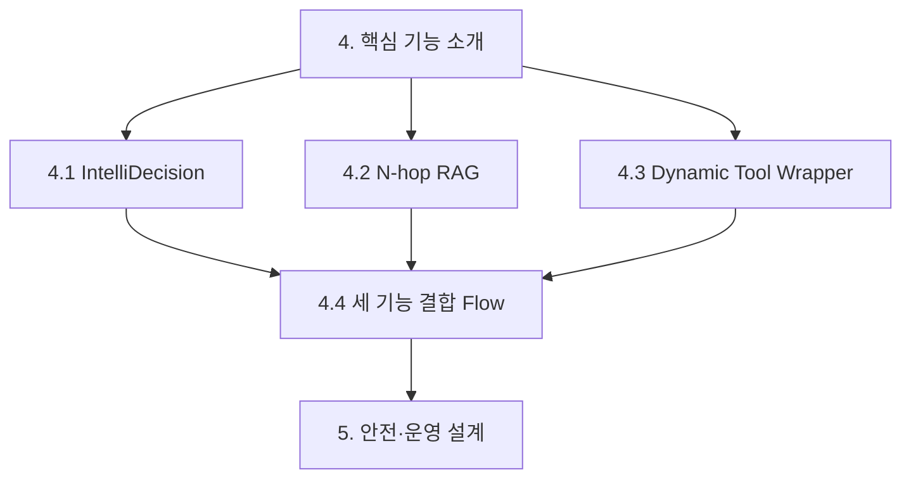
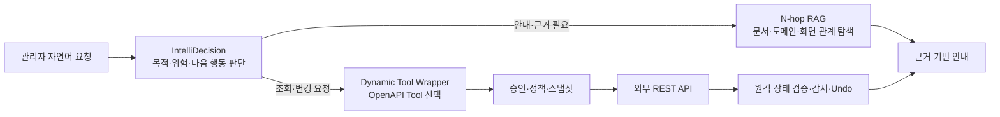

# AI Service Agent 핵심 기능 소개 재구성 검토

**작성일**: 2026-09-02
**버전**: 1.1
**상태**: 본문 개편 완료
**관련 문서**: [정식 서비스 소개서](../../AI_SERVICE_AGENT_SERVICE_INTRODUCTION.md) | [기술 아키텍처](../../architecture/self-service-ai-assistant-architecture.md) | [지식베이스·IntelliDecision 연구](../../design/SELF_SERVICE_RAG_INTELLIDECISION_ADVANCEMENT_RESEARCH.md) | [MCP·Universal API Agent 시장 조사](../../design/MCP_VS_CLIENT_CENTRIC_UNIVERSAL_AGENT_MARKET_RESEARCH.md)

---

## 검토 목적

정식 소개서의 4번 장을 다음 세 가지 동등한 핵심 기능 중심으로 재구성할 수 있는지 검토한다.

1. IntelliDecision
2. N-hop RAG
3. Dynamic Tool Wrapper

## 현황과 판단

현재 4번 장에는 세 기능의 설명과 Mermaid 자료가 이미 있으나, IntelliDecision 중심으로 시작한 뒤 시장·연구 자료를 한 표에 모으고 N-hop RAG와 Dynamic Tool Wrapper를 하위 절로 배치한다. 이 구조는 기능 간의 제품적 동등성과 각 기능의 시장 검증·구현 근거를 충분히 드러내지 못한다.

재구성은 타당하다. 안전·권한 통제와 MCP는 세 핵심 기능을 가로지르는 공통 운영 계층이므로 핵심 기능 목록에 포함시키기보다 5번 장의 안전·운영 설계 및 4번 장의 통합 흐름에서 다루는 것이 적절하다.

## 권장 장 구조

각 기능 절은 동일한 순서로 구성한다.

1. 고객·운영 문제와 기능 정의
2. 작동 방식과 범위
3. 현재 시스템의 구현 방식
4. Mermaid 흐름도 또는 관계도
5. 선행 시장 사례 2개와 적용 시사점
6. 적용 한계와 안전 조건

### 4.1 IntelliDecision

- **역할**: 발화의 목적, 맥락, 위험도, 다음 행동을 A-I 유형으로 판단하고 안내·조회·실행·복구·이관 경로를 선택한다.
- **권장 시각 자료**: 현재의 상태 전이도를 유지하되, `질문 -> 유형 판단 -> RAG/Tool/보완 질문 -> 결과·Undo·이관`의 사업 언어 레이블로 단순화한다.
- **시장 사례**: Anthropic Routing과 Google Dialogflow CX를 사용한다. 전자는 고객 문의를 후속 전문 처리 경로로 분리하는 오케스트레이션 근거이고, 후자는 Flow/Page/Route로 대화 상태를 관리하는 상용 구현 사례다.
- **현재 구현 근거**: `intellidecision_policy.py`의 A-I 정책 레지스트리, 유형별 RAG/Tool 메타데이터, 세션 내 정정·Undo 흐름이다.

### 4.2 N-hop RAG

- **역할**: 유사 문서를 찾는 데서 멈추지 않고, 문서 -> 업무 도메인 -> 화면 안내 -> 적용 가능한 판단 정책을 따라가 답변과 다음 행동의 근거를 만든다.
- **권장 시각 자료**: 현재의 선형 도식을 `문서/FAQ/OpenAPI -> 도메인 -> 화면/권한 -> IntelliDecision -> 응답 또는 Tool` 관계도로 확대한다. 실제 연결된 `document` 경로와 향후 확장 가능한 `api_endpoint`/`procedure_step` 경로는 시각적으로 구분한다.
- **시장 사례**: Glean의 지식 그래프와 벡터 검색 결합, Microsoft GraphRAG의 질문 유형별 Local/Global 탐색 전략을 사용한다.
- **현재 구현 근거**: `knowledge_graph.traverse_graph()`와 `rag_strategy_hint`, 유형 C의 다중 도메인 병렬 검색이다.
- **표현 주의**: 현재 `document` 노드는 실제 연결됐지만 `api_endpoint`와 `procedure_step`은 확장 예약 상태다. 이 차이를 소개서에서 숨기면 안 된다.

### 4.3 Dynamic Tool Wrapper

- **역할**: OpenAPI 명세를 실행 가능한 Dynamic Tool 후보로 변환하고, 인증·허용 메서드·파라미터·사전 상태·감사 정보를 결합해 조회와 승인된 변경을 수행한다.
- **권장 시각 자료**: `OpenAPI 업로드 -> endpoint/parameter 추출 -> 승인 정책 적용 -> Tool 노출 -> 사용자 재확인 -> 외부 API 실행 -> 원격 상태 대조/Undo` 흐름을 새 Mermaid sequenceDiagram으로 제시한다.
- **시장 사례**: OpenAI GPT Actions와 Composio를 사용한다. 전자는 자연어와 REST API 스키마를 연결하는 대표 상용 사례이며, 후자는 의도 기반 Tool 선택과 위임 인증을 제품화한 사례다. RestGPT와 Gorilla/GoEx는 본문 주석 또는 부록의 기술 연구 근거로 유지한다.
- **현재 구현 근거**: `build_dynamic_tools_for_owner(owner)`, `dynamic_api_tool.py`, OpenAPI endpoint 메타데이터, 승인 메서드 allowlist, 실행 로그와 Undo 경로다.
- **표현 주의**: OpenAPI 등록만으로 모든 REST API가 무조건 실행되는 것은 아니다. base URL, 인증, 승인 메서드, 업무 규칙, 원격 상태 검증이 충족돼야 한다.

### 4.4 세 기능 결합 Flow

세 기능의 가치가 가장 잘 드러나는 공통 흐름을 1개 추가한다.

## 추가로 넣을 내용

- **기능별 1행 비교표**: 입력, 판단/탐색/실행 결과, 사용자 가치, 운영 통제 항목을 한 표로 요약한다.
- **통화매니저 단일 시나리오 관통 예시**: 예를 들어 "MAC 주소 초기화" 요청에서 세 기능이 각각 어떤 역할을 하는지 한 화면에서 연결한다. 기능을 따로 설명한 다음 통합 가치가 자연스럽게 이해된다.
- **증거의 계층 분리**: 시장 사례는 "선행 기업의 활용 방식", 아키텍처·코드는 "우리의 구현 범위", KPI는 "파일럿 검증 대상"으로 분리한다. 외부 사례의 수치를 우리 효과로 전용하지 않는다.
- **MCP의 위치 조정**: MCP는 네 번째 핵심 기능이 아니라 Dynamic Tool Wrapper의 결과를 외부 AI 클라이언트에도 재사용하는 확장 채널로 간결하게 연결한다.

## 반영 결과

권장 구조를 정식 소개서 4번 장에 반영했다. 본문은 각 기능의 시장 사례를 2개씩 상세 설명하고, 선행 기업의 실제 처리 흐름을 Mermaid 도식으로 함께 제시한다. 세 기능 결합 Flow는 장의 첫머리에 배치했으며, 통화매니저 착신전환 문의가 화면 안내에서 승인된 API 실행으로 전환되는 관통 예시를 포함한다.

N-hop RAG의 현재 연결 범위(`document`)와 확장 예약 범위(`api_endpoint`, `procedure_step`)를 명시해 구현 범위와 향후 모델을 구분했다. Dynamic Tool Wrapper도 OpenAPI 외에 인증·허용 메서드·업무 정책·원격 상태 검증이 필요함을 명확히 했다.

*최종 업데이트: 2026-09-02*
